In einer Universellen App können Sie beliebig viele **Seiten** und **Ordner** erstellen, um die Daten in einer Base für eine bestimmte Nutzergruppe zugänglich zu machen, zu ordnen und ansprechend aufzubereiten. Es gibt dazu eine Vielzahl an [Seitentypen](), die Sie schon von anderen Stellen in SeaTable kennen und mit nur wenigen Klicks in Ihrer Universellen App anlegen können.



## Eine neue Seite in einer Universellen App anlegen

1. Öffnen Sie eine **Base**, der Sie bereits eine Universelle App hinzugefügt haben.
2. Klicken Sie im Base-Header auf **Apps**.
   4. Fahren Sie mit der Maus über die Universelle App und klicken Sie auf das **Stift-Symbol** .
   6. Klicken Sie auf **Seite oder Ordner hinzufügen** und wählen Sie im Anschluss **Seite hinzufügen** aus.

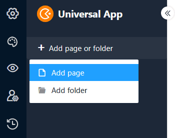 8. Wählen Sie einen der [Seitentypen]() aus und klicken Sie auf **Weiter**.

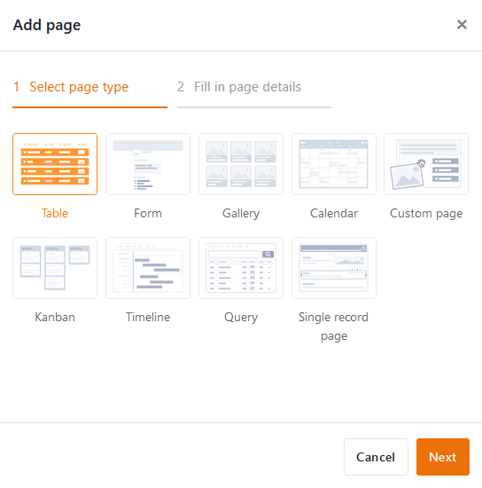 10. Geben Sie der Seite einen **Namen**, definieren Sie die zugrundeliegende **Tabelle** und legen Sie optional ein **Icon** für die Seite fest.

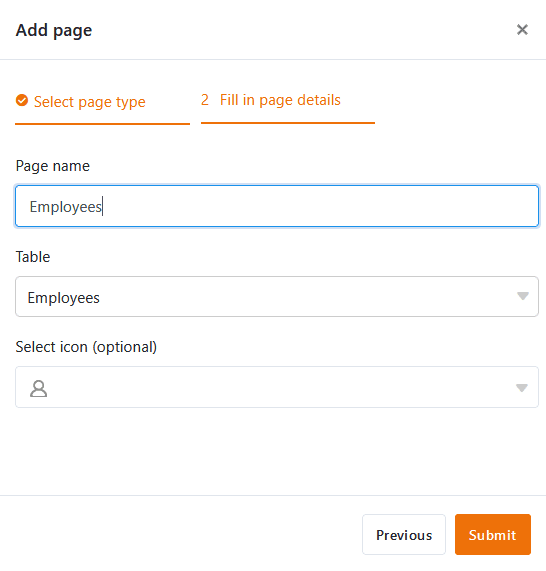 12. Bestätigen Sie mit **Abschicken**.

## Namen und Icon einer Seite bearbeiten

Oft muss es beim Anlegen neuer Seiten schnell gehen und man wählt spontan irgendeinen Namen, den man später wieder ändern möchte. Deshalb können Sie über die **drei Punkte** jederzeit **Seiten umbenennen** und auf diesem Weg auch das **Icon** der Seite anpassen.

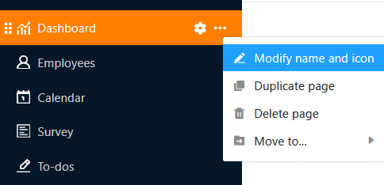

## Seite duplizieren

Die Konfiguration von Seiten im Universal App Builder kann – insbesondere bei individuellen Seiten wie Dashboards – viel Zeit in Anspruch nehmen. Für den Fall, dass Sie bereits Seiten erstellt haben, die Sie nur leicht abwandeln möchten, bietet der Universal App Builder eine Funktion, mit der Sie viel Zeit und Aufwand sparen: Klicken Sie auf die **drei Punkte** und wählen Sie **Seite duplizieren**. Die Kopie übernimmt alle Inhalte, Einstellungen und Berechtigungen eins zu eins von der ursprünglichen Seite.

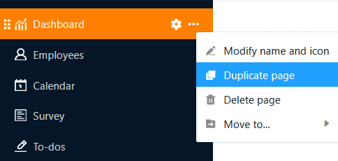

## Seite löschen

Nicht mehr benötigte Seiten können Sie jederzeit aus Ihrer Universellen App **löschen**. Beachten Sie dabei, dass die Löschung endgültig ist und gelöschte Seiten **nicht** wiederhergestellt werden können. Die **Daten** bleiben aber natürlich in der zugrundeliegenden Base **gespeichert**.

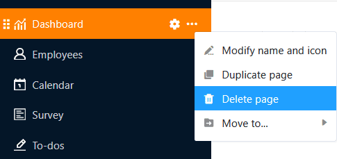

## Seite verschieben

Wenn Sie bereits einen **Ordner** in Ihrer Universellen App angelegt haben, können Sie Ihre Seiten über die **drei Punkte** in diesen verschieben.

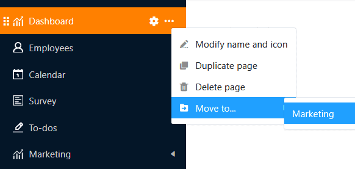

Alternativ können Sie Seiten auch **per Drag-and-Drop** verschieben. Halten Sie dazu die Maustaste auf den **sechs Punkten** vor dem Seiten-Icon gedrückt, ziehen Sie die Seite in der Navigation an die gewünschte Stelle und lassen Sie los.

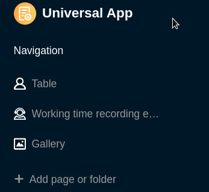

## Einen neuen Ordner in einer Universellen App anlegen

Bei einer großen Anzahl an Seiten sind **Ordner** hilfreich, um die Seiten thematisch zusammenzufassen und die Navigation für die Benutzer übersichtlicher zu gestalten.

1. Öffnen Sie eine **Base**, der Sie bereits eine Universelle App hinzugefügt haben.
2. Klicken Sie im Base-Header auf **Apps**.
   4. Fahren Sie mit der Maus über die Universelle App und klicken Sie auf das **Stift-Symbol** .
   6. Klicken Sie auf **Seite oder Ordner hinzufügen** und wählen Sie im Anschluss **Ordner hinzufügen** aus.

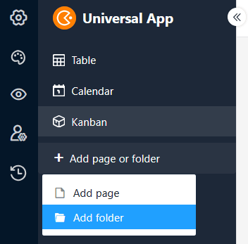 8. **Benennen** Sie den Ordner und wählen Sie optional ein passendes **Icon** für diesen aus.

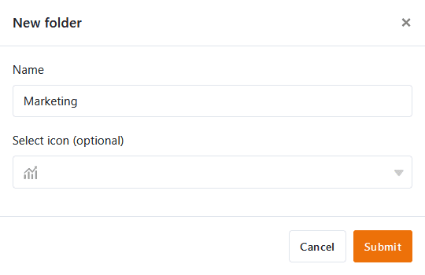 10. Bestätigen Sie mit **Abschicken**.

## Seite zum Ordner hinzufügen

Wenn Sie bereits einen Ordner in Ihrer Universellen App angelegt haben, können Sie in diesem auf die **drei Punkte** klicken und direkt eine **Seite hinzufügen**.

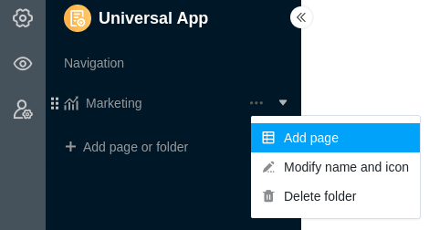

## Namen und Icon eines Ordners bearbeiten

Über die **drei Punkte** können Sie Ordner in Ihrer Universellen App jederzeit **umbenennen**. Zudem können Sie auf diesem Weg auch das **Icon** Ihres Ordners anpassen.

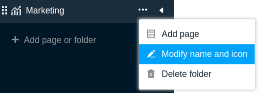

## Ordner löschen

Nicht mehr benötigte Ordner können Sie jederzeit aus Ihrer Universellen App **löschen**. Beachten Sie dabei, dass **alle Seiten**, die sich im Ordner befinden, ebenfalls **gelöscht** werden. Die Löschung ist endgültig. Das heißt: Sowohl der Ordner als auch die einzelnen Seiten können im Anschluss **nicht** wiederhergestellt werden.

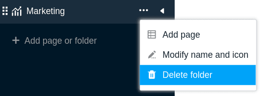

## Ordner verschieben

Ordner können Sie nur **per Drag-and-Drop** verschieben. Halten Sie dazu die Maustaste auf den **sechs Punkten** vor dem Ordner-Icon gedrückt, ziehen Sie den Ordner in der Navigation an die gewünschte Stelle und lassen Sie los.

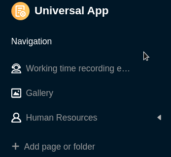
