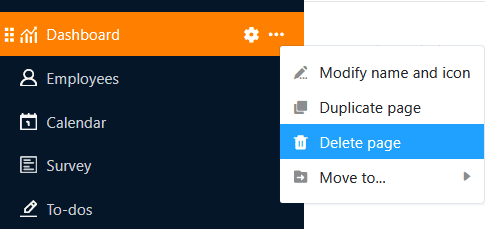
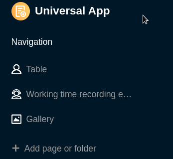
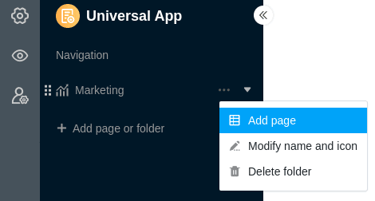

En una Universal App, puede crear tantas **páginas** y **carpetas** como desee para que los datos de una base sean accesibles a un grupo específico de usuarios, para organizarlos y presentarlos de forma atractiva. Hay una variedad de [tipos de páginas]() que ya conoce de otros lugares en SeaTable y que puede crear en su Universal App con sólo unos clics.



## Crear una nueva página en una aplicación universal

1. Abra una **Base** a la que ya haya añadido una aplicación universal.
2. Haga clic en **Aplicaciones** en la cabecera Base.

4. Pase el ratón por encima de la aplicación universal y haga clic en el **icono del lápiz** .

6. Haga clic en **Añadir página o Añadir carpeta** y, a continuación, seleccione **Añadir página**.

8. Seleccione uno de los [tipos de página]() y haga clic en **Siguiente**.

10. Dé un **nombre** a la página, defina la **tabla** subyacente y, opcionalmente, especifique un **icono** para la página.

12. Confirme con **Enviar**.

## Editar el nombre y el icono de una página

Cuando se crean páginas nuevas, a menudo hay que hacerlo rápidamente y se elige espontáneamente un nombre que luego se quiere cambiar. Por eso puede **cambiar el nombre de las páginas** en cualquier momento utilizando los **tres puntos** y también personalizar el **icono de** la página de esta manera.

## Página duplicada

Configurar páginas en Universal App Builder puede llevar mucho tiempo, especialmente en el caso de páginas personalizadas como los cuadros de mando. Si ya ha creado páginas que sólo desea modificar ligeramente, Universal App Builder ofrece una función que le ahorrará mucho tiempo y esfuerzo: Haga clic en los **tres puntos** y seleccione **Duplicar página**. La copia toma todo el contenido, la configuración y las autorizaciones de la página original.

## Borrar página

Puede **eliminar** las páginas que ya no necesite de su aplicación universal en cualquier momento. Tenga en cuenta que la eliminación es definitiva y que las páginas eliminadas **no** se pueden restaurar. Sin embargo, los **datos** permanecerán **guardados** en la base subyacente.

## Mover página

Si ya ha creado una **carpeta** en su aplicación universal, puede mover sus páginas a esta carpeta utilizando los **tres puntos**.

También puede mover las páginas **arrastrándolas y soltándolas**. Para ello, mantenga pulsado el botón del ratón sobre los **seis puntos** situados delante del icono de la página, arrastre la página en la navegación hasta la posición deseada y suéltelo.

## Crear una nueva carpeta en una aplicación universal

Si hay un gran número de páginas, **las carpetas** son útiles para agruparlas temáticamente y facilitar la navegación a los usuarios.

1. Abra una **Base** a la que ya haya añadido una aplicación universal.
2. Haga clic en **Aplicaciones** en la cabecera Base.

4. Pase el ratón por encima de la aplicación universal y haga clic en el **icono del lápiz** .

6. Haga clic en **Añadir página o Añadir carpeta** y, a continuación, seleccione **Añadir carpeta**.

8. **Asigne un nombre a la** carpeta y, opcionalmente, seleccione un **icono** adecuado para ella.

10. Confirme con **Enviar**.

## Añadir página a carpeta

Si ya ha creado una carpeta en su aplicación universal, puede hacer clic en los **tres puntos** de esta carpeta y **añadir** una página directamente.

## Editar el nombre y el icono de una carpeta

Puede **cambiar el nombre de** las carpetas de su Universal App en cualquier momento utilizando los **tres puntos**. También puede personalizar así el **icono de** su carpeta.

## Eliminar carpeta

Puede **eliminar** las carpetas que ya no necesite de su aplicación universal en cualquier momento. Tenga en cuenta que también se **eliminarán** **todas las páginas** de la carpeta. La eliminación es definitiva. Esto significa que ni la carpeta ni las páginas individuales podrán **restaurarse** posteriormente.

## Mover carpeta

Sólo puede mover carpetas **arrastrándolas y soltándolas**. Para ello, mantenga pulsado el botón del ratón sobre los **seis puntos** situados delante del icono de la carpeta, arrastre la carpeta en la navegación hasta el lugar deseado y suéltelo.

