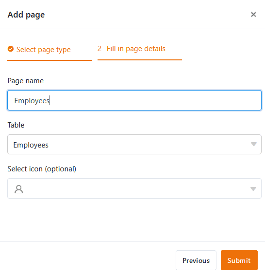

Dans une application universelle, vous pouvez créer autant de **pages** et **de dossiers** que vous le souhaitez afin de rendre les données d'une base accessibles à un groupe d'utilisateurs spécifique, de les organiser et de les présenter de manière attrayante. Il existe à cet effet un grand nombre de [types de pages]() que vous connaissez déjà d'autres endroits dans SeaTable et que vous pouvez créer en quelques clics dans votre application universelle.



## Créer une nouvelle page dans une application universelle

1. Ouvrez une **base** à laquelle vous avez déjà ajouté une application universelle.
2. Cliquez sur **Apps** dans l'en-tête de la base.

4. Passez la souris sur l'application universelle et cliquez sur l'**icône en forme de crayon** .

6. Cliquez sur **Ajouter une page ou un dossier**, puis sélectionnez **Ajouter une page**.

8. Sélectionnez l'un des [types de pages]() et cliquez sur **Suivant**.

10. Donnez un **nom** à la page, définissez le **tableau** sous-jacent et déterminez éventuellement une **icône** pour la page.

12. Confirmez en cliquant sur **Envoyer**.

## Modifier le nom et l'icône d'une page

Souvent, il faut aller vite lors de la création de nouvelles pages et on choisit spontanément un nom quelconque que l'on souhaite changer plus tard. C'est pourquoi les **trois points** permettent de **renommer les pages** à tout moment et d'adapter l'**icône de** la page de cette manière.

## Dupliquer la page

La configuration des pages dans l'Universal App Builder peut prendre beaucoup de temps, en particulier pour les pages personnalisées comme les tableaux de bord. Dans le cas où vous avez déjà créé des pages que vous ne souhaitez que légèrement modifier, l'Universal App Builder propose une fonction qui vous permettra d'économiser beaucoup de temps et d'efforts : Cliquez sur les **trois points** et sélectionnez **Dupliquer la page**. La copie reprend un à un tous les contenus, paramètres et autorisations de la page d'origine.

## Supprimer la page

Vous pouvez **supprimer** à tout moment les pages dont vous n'avez plus besoin dans votre application universelle. Notez que la suppression est définitive et que les pages supprimées ne peuvent **pas** être restaurées. Les **données** restent toutefois naturellement **enregistrées** dans la base sous-jacente.

## Déplacer la page

Si vous avez déjà créé un **dossier** dans votre application universelle, vous pouvez y déplacer vos pages à l'aide des **trois points**.

Vous pouvez également déplacer les pages **par glisser-déposer**. Pour ce faire, maintenez le bouton de la souris enfoncé sur les **six points** devant l'icône de la page, faites glisser la page dans la navigation jusqu'à l'endroit souhaité et relâchez.

## Créer un nouveau dossier dans une application universelle

Si le nombre de pages est important, **les dossiers** sont utiles pour regrouper les pages par thème et rendre la navigation plus claire pour les utilisateurs.

1. Ouvrez une **base** à laquelle vous avez déjà ajouté une application universelle.
2. Cliquez sur **Apps** dans l'en-tête de la base.

4. Passez la souris sur l'application universelle et cliquez sur l'**icône en forme de crayon** .

6. Cliquez sur **Ajouter une page ou un dossier**, puis sélectionnez **Ajouter un dossier**.

8. **Nommez** le dossier et choisissez éventuellement une **icône** appropriée pour celui-ci.

10. Confirmez en cliquant sur **Envoyer**.

## Ajouter une page au dossier

Si vous avez déjà créé un dossier dans votre application universelle, vous pouvez cliquer sur les **trois points** dans ce dossier et y **ajouter** directement une **page**.

## Modifier le nom et l'icône d'un dossier

Les **trois points** vous permettent de **renommer** à tout moment des dossiers dans votre application universelle. Vous pouvez également personnaliser l'**icône de** votre dossier de cette manière.

## Supprimer un dossier

Vous pouvez à tout moment **supprimer** de votre application universelle les dossiers dont vous n'avez plus besoin. Notez que **toutes les pages** qui se trouvent dans le dossier seront également **supprimées**. La suppression est définitive. Cela signifie que le dossier et les pages individuelles ne peuvent **pas** être restaurés par la suite.

## Déplacer des dossiers

Vous ne pouvez déplacer les dossiers que **par glisser-déposer**. Pour ce faire, maintenez le bouton de la souris enfoncé sur les **six points** situés devant l'icône du dossier, faites glisser le dossier dans la navigation jusqu'à l'endroit souhaité et relâchez.

