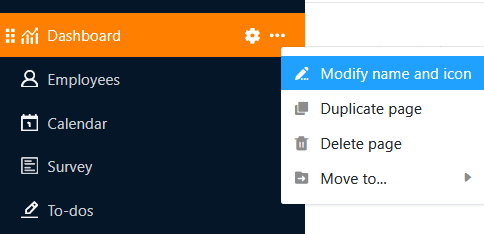
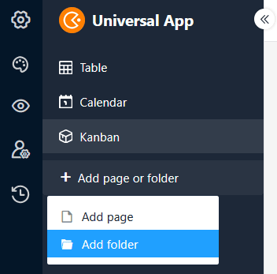
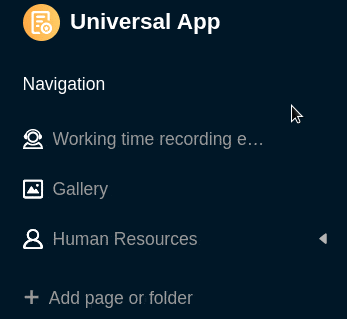

Numa aplicação universal, pode criar tantas **páginas** e **pastas** quantas desejar para tornar os dados de uma base acessíveis a um grupo de utilizadores específico, para os organizar e para os apresentar de forma apelativa. Existe uma variedade de [tipos de páginas]() que já conhece de outros locais no SeaTable e que pode criar na sua aplicação universal com apenas alguns cliques.



## Criar uma nova página numa aplicação universal

1. Abra uma **Base** à qual já tenha adicionado uma aplicação universal.
2. Clique em **Apps** no cabeçalho Base.

4. Coloque o cursor do rato sobre a aplicação universal e clique no **ícone de lápis** .

6. Clique em **Adicionar página ou Adicionar pasta** e seleccione **Adicionar página**.

8. Selecione um dos [tipos de página]() e clique em **Seguinte**.

10. Dê um **nome** à página, defina a **tabela** subjacente e, opcionalmente, especifique um **ícone** para a página.

12. Confirmar com **Submeter**.

## Editar o nome e o ícone de uma página

Quando se criam novas páginas, muitas vezes é necessário fazê-lo rapidamente e escolhe-se espontaneamente um nome que se quer alterar mais tarde. É por isso que pode mudar **o nome das páginas** em qualquer altura utilizando os **três pontos** e também personalizar o **ícone** da página desta forma.

## Página duplicada

A configuração de páginas no Universal App Builder pode demorar muito tempo - especialmente para páginas personalizadas, como painéis de controlo. Se já tiver criado páginas que apenas pretende modificar ligeiramente, o Universal App Builder oferece uma função que lhe poupará muito tempo e esforço: Clique nos **três pontos** e seleccione **Duplicar página**. A cópia assume todos os conteúdos, definições e autorizações, um a um, da página original.

## Eliminar página

Pode **eliminar** as páginas que já não são necessárias da sua aplicação universal em qualquer altura. Tenha em atenção que a eliminação é definitiva e que as páginas eliminadas **não podem** ser restauradas. No entanto, **os dados** permanecerão **armazenados** na base subjacente.

## Mover página

Se já tiver criado uma **pasta** na sua aplicação universal, pode mover as suas páginas para essa pasta utilizando os **três pontos**.

Em alternativa, também pode mover páginas **utilizando a função arrastar e largar**. Para tal, mantenha premido o botão do rato sobre os **seis pontos** em frente ao ícone da página, arraste a página na navegação para a posição pretendida e solte-a.

## Criar uma nova pasta numa aplicação universal

Se houver um grande número de páginas, **as pastas** são úteis para agrupar as páginas por temas e tornar a navegação mais clara para os utilizadores.

1. Abra uma **Base** à qual já tenha adicionado uma aplicação universal.
2. Clique em **Apps** no cabeçalho Base.

4. Coloque o cursor do rato sobre a aplicação universal e clique no **ícone de lápis** .

6. Clique em **Adicionar página ou Adicionar pasta** e, em seguida, seleccione **Adicionar pasta**.

8. **Dê um nome à** pasta e, opcionalmente, seleccione um **ícone** adequado para a mesma.

10. Confirmar com **Submeter**.

## Adicionar página à pasta

Se já tiver criado uma pasta na sua aplicação universal, pode clicar nos **três pontos** desta pasta e **adicionar** uma **página** diretamente.

## Editar o nome e o ícone de uma pasta

Pode **mudar o nome** das pastas na sua Universal App em qualquer altura utilizando os **três pontos**. Também pode personalizar o **ícone da** sua pasta desta forma.

## Eliminar a pasta

Pode **eliminar** as pastas que já não são necessárias na sua aplicação universal em qualquer altura. Tenha em atenção que **todas as páginas** da pasta também serão **eliminadas**. A eliminação é definitiva. Isto significa que nem a pasta nem as páginas individuais podem **ser** restauradas posteriormente.

## Mover pasta

Só é possível mover pastas **por arrastar e largar**. Para tal, mantenha premido o botão do rato sobre os **seis pontos** em frente ao ícone da pasta, arraste a pasta na navegação para a localização pretendida e solte-a.

