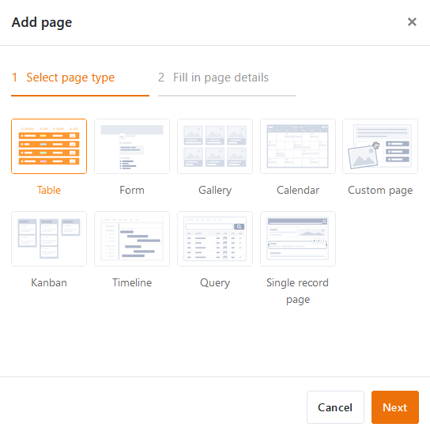
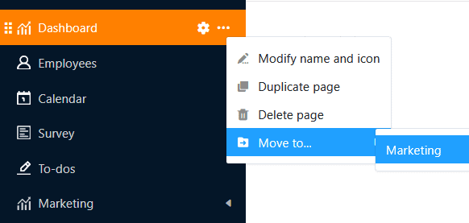
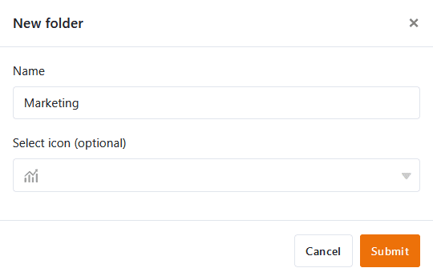
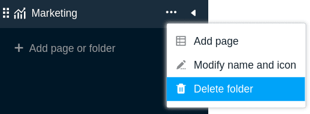

В универсальном приложении вы можете создавать сколько угодно **страниц** и **папок**, чтобы сделать данные в базе доступными для определенной группы пользователей, упорядочить их и представить в привлекательном виде. Существует множество [типов страниц](https://seatable.io/ru/docs/apps/seitentypen-in-der-universellen-app/), которые вы уже знаете в других местах SeaTable и можете создать в своем универсальном приложении всего несколькими щелчками мыши.



## Создание новой страницы в универсальном приложении

1. Откройте **базу**, в которую вы уже добавили универсальное приложение.
2. Нажмите **Приложения** в заголовке База.

4. Наведите курсор на универсальное приложение и нажмите на **значок карандаша** .

6. Нажмите **Добавить страницу или Добавить папку**, а затем выберите **Добавить страницу**.

8. Выберите один из [типов страниц](https://seatable.io/ru/docs/apps/seitentypen-in-der-universellen-app/) и нажмите кнопку **Далее**.

10. Дайте странице **имя**, определите **таблицу**, лежащую в ее основе, и, по желанию, укажите **значок** для страницы.

12. Подтвердите с помощью кнопки **Отправить**.

## Редактирование названия и значка страницы

При создании новых страниц часто приходится действовать быстро, и вы спонтанно выбираете имя, которое потом хотите изменить. Поэтому вы можете в любой момент **переименовать страницу** с помощью **трех точек**, а также настроить таким образом **значок** страницы.

## Дублирующая страница

Настройка страниц в Universal App Builder может занять много времени - особенно это касается пользовательских страниц, таких как панели управления. Если вы уже создали страницы, которые нужно лишь слегка изменить, в Universal App Builder есть функция, которая сэкономит вам много времени и сил: Нажмите на **три точки** и выберите **"Дублировать страницу"**. Копия перенимает все содержимое, настройки и полномочия один в один с оригинальной страницей.

## Удалить страницу

Вы можете в любой момент **удалить** из своего универсального приложения страницы, которые больше не нужны. Обратите внимание, что удаление является окончательным, и удаленные страницы **не могут** быть восстановлены. Однако **данные**, конечно же, **сохранятся** в базовой базе.

## Переместить страницу

Если вы уже создали **папку** в своем универсальном приложении, вы можете переместить свои страницы в эту папку с помощью **трех точек**.

Кроме того, можно перемещать страницы с помощью **перетаскивания**. Для этого, удерживая кнопку мыши на **шести точках** перед значком страницы, перетащите страницу в навигации в нужное место и отпустите.

## Создание новой папки в универсальном приложении

При наличии большого количества страниц полезно использовать **папки**, чтобы сгруппировать страницы по темам и сделать навигацию более понятной для пользователей.

1. Откройте **базу**, в которую вы уже добавили универсальное приложение.
2. Нажмите **Приложения** в заголовке База.

4. Наведите курсор на универсальное приложение и нажмите на **значок карандаша** .

6. Нажмите **Добавить страницу или Добавить папку**, а затем выберите **Добавить папку**.

8. **Назовите** папку и по желанию выберите для нее подходящий **значок**.

10. Подтвердите с помощью кнопки **Отправить**.

## Добавить страницу в папку

Если вы уже создали папку в своем универсальном приложении, вы можете нажать на **три точки** в этой папке и **добавить страницу** напрямую.

## Изменение имени и значка папки

Вы можете в любое время **переименовать** папки в универсальном приложении с помощью **трех точек**. Таким же образом можно настроить **значок** папки.

## Удалить папку

Вы можете в любой момент **удалить** из своего универсального приложения папки, которые больше не нужны. Обратите внимание, что **все страницы** в папке также будут **удалены**. Удаление является окончательным. Это означает, что ни папка, ни отдельные страницы впоследствии не могут **быть** восстановлены.

## Переместить папку

Папки можно перемещать только **методом перетаскивания**. Для этого, удерживая кнопку мыши на **шести точках** перед значком папки, перетащите папку в навигации в нужное место и отпустите.

