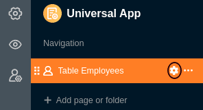



Um den **Zugriff auf Ihre Daten** genau zu steuern, können Sie für jede Seite, die Sie in einer Universellen App angelegt haben, **individuelle Seitenberechtigungen** festlegen. Die Bearbeitung der Berechtigungen erfolgt über die Seiteneinstellungen.



## Seitenberechtigungen festlegen und bearbeiten

1. Öffnen Sie eine **Base**, der Sie bereits eine Universelle App hinzugefügt haben.
2. Klicken Sie im Base-Header auf **Apps**.
   
3. Fahren Sie mit der Maus über die Universelle App und klicken Sie auf das **Stift-Symbol** .
   
4. Wählen Sie aus der Navigation am linken Seitenrand die gewünschte **Seite** aus und klicken Sie auf das **Zahnrad-Symbol** .
   
5. Legen Sie in den am rechten Seitenrand erschienenen **Seiteneinstellungen** die gewünschten **Berechtigungen** fest.
   
6. Die definierten Seitenberechtigungen werden **automatisch** gespeichert und **unmittelbar** übernommen.

## Welche Seitenberechtigungen es gibt

Folgende Seitenberechtigungen können Sie einstellen:

- Wer darf Zeilen hinzufügen?
- Wer darf Zeilen bearbeiten?
- Wer darf Zeilen löschen?
- Wer kann die Seite sehen?

Nicht alle Berechtigungen sind für alle [Seitentypen]() verfügbar. Hier ein Überblick:

| Seitentyp           | Zeilen hinzufügen                                             | Zeilen bearbeiten                                             | Zeilen löschen                                                | Seite sehen                                                   |
| ------------------- | ------------------------------------------------------------- | ------------------------------------------------------------- | ------------------------------------------------------------- | ------------------------------------------------------------- |
| Tabelle             |  |  |  |  |
| Formular            |                                    |                                    |                                    |  |
| Galerie             |  |  |  |  |
| Kalender            |  |  |                                    |  |
| Dashboard           |                                    |                                    |                                    |  |
| Kanban              |  |  |  |  |
| Zeitstrahl          |                                    |  |                                    |  |
| Abfrage             |                                    |                                    |                                    |  |
| Einzelner Datensatz |                                    |  |                                    |  |

## Welche Benutzergruppen Sie berechtigen können

Für jede Berechtigung stehen Ihnen folgende Optionen zur Auswahl, mit denen Sie den Personenkreis eingrenzen können: **Niemand**, **Administratoren**, **Bestimmte Rollen** und **Jeder**.

Wählen Sie die Option **Bestimmte Rollen** aus, um selbst definierte Rollen festzulegen. Dazu erstellen Sie zuvor in der [Benutzer- und Rollenverwaltung]() neue **Rollen** für einzelne Nutzergruppen, denen Sie auf jeder Seite der Universellen App individuell Berechtigungen zuweisen können.

