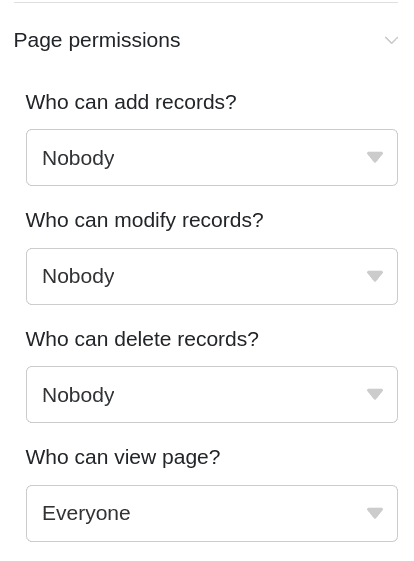
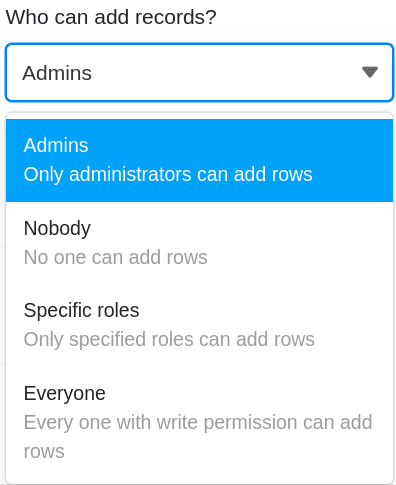

To precisely control **access to your data**, you can set **individual page permissions for** each page you have created in a Universal App. You edit the permissions through the page settings.

## Set and edit page permissions

1. Open a **Base** to which you have already added a Universal App.
2. Click **Apps** in the Base header.

4. Hover your mouse over the Universal App and click the **pencil icon** .

6. Select the desired **page** from the navigation on the left side of the page and click on the **gear icon** .

8. Set the desired **permissions** in the **page settings** that appeared on the right side of the **page**.

10. The defined page permissions are **automatically** saved and **immediately** applied.

## Which page authorizations are available

You can set the following page permissions:

- Who may add rows ?
- Who may edit rows ?
- Who may delete rows ?
- Who can see the page?

Not all page permissions are available for all [page types](https://seatable.io/en/docs/universelle-apps/seitentypen-in-der-universellen-app/). For example, on individual pages there is only the permission _"Who can see the page?"_ because users generally cannot add, edit or delete entries there.

## Which user groups you can authorize

For each permission, you can choose from the following options to narrow down the group of people: **Nobody**, **Administrators**, **Specific Roles** and **Everyone**.

Select the **Specific roles** option to define your own roles. To do this, create new **roles** for individual user groups in the [User and Role Management](https://seatable.io/en/docs/apps/benutzer-und-rollenverwaltung-einer-universellen-app/) beforehand, to which you can assign permissions individually on each page of the Universal App.

