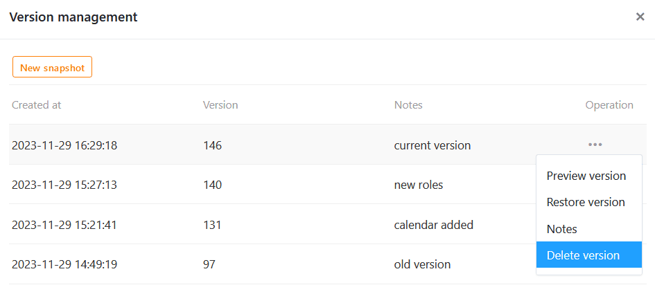

Mithilfe von **Snapshots** können Sie die aktuelle Version einer Universellen App speichern. Snapshots können Sie in der Versionsverwaltung des Universal App Builders **erstellen**, **ansehen**, **wiederherstellen** und **löschen**. Zudem können Sie **Hinweise** zu den einzelnen Snapshots notieren, um Informationen zu einer Version festzuhalten.



## Wann App Snapshots sinnvoll sind

App Snapshots sind **Momentaufnahmen** vom Zustand einer Universellen App und funktionieren ähnlich wie [Base Snapshots](). Mithilfe von App Snapshots können Sie die aktuelle Version einer Universellen App als Sicherheitskopie speichern, was zum Beispiel sinnvoll sein kann, wenn Sie umfangreiche Änderungen vornehmen und eventuell einen früheren Zustand wiederherstellen möchten.



### Was ein App Snapshot speichert

Ein App Snapshot speichert folgende Elemente und Einstellungen:

- [Einstellungen]() wie **Name**, **Icon** und **Farbschema** der App
- [Seiten und Ordner]() der App
- Einstellungen und [Berechtigungen]() für die einzelnen Seiten

### Was ein App Snapshot nicht speichert

Ein App Snapshot speichert nicht:

- die **benutzerdefinierte URL** einer App
- die **Daten** der zugrundeliegenden Base
- die **Kommentare** zu einzelnen Datensätzen
- die [Benutzerrollen und Einladungslinks]() der App

## App Snapshot erstellen

1. Öffnen Sie eine **Universelle App** im [Bearbeitungsmodus]().
   3. Klicken Sie am oberen linken Seitenrand auf  **Versionsverwaltung**.
   5. Ein Fenster öffnet sich. Erstellen Sie dort einen **neuen Snapshot**.
2. Optional können Sie dem Snapshot einen **Hinweis** hinzufügen.
3. Bestätigen Sie mit **Abschicken**.



Sobald Sie einen Snapshot angelegt haben, stehen Ihnen vier Operationen zur Auswahl:

- **Version anschauen**
- **Version wiederherstellen**
- **Hinweis**
- **Version löschen**

## App Snapshot anschauen

Bevor Sie einen Snapshot wiederherstellen und voreilig zu einer anderen Version zurückspringen, sollten Sie sich diese Version zunächst anschauen. Dazu nehmen Sie den gleichen Weg wie oben: Klicken Sie auf die **drei Punkte** am rechten Ende eines Snapshots und wählen Sie im Drop-down-Menü die Operation **Version anschauen** aus.

## App Snapshot wiederherstellen

Um einen App Snapshot wiederherzustellen, klicken Sie auf die **drei Punkte** und wählen im Drop-down-Menü die entsprechende Operation aus.



Sobald Sie einen Snapshot wiederherstellen, wird die App auf den Speicherstand dieser früheren Version zurückgesetzt. Alle **Änderungen**, die Sie seitdem an Seiten, Ordnern und Einstellungen der App vorgenommen haben, **gehen verloren**. Daher ist es ratsam, vor der Wiederherstellung eines Snapshots auch die aktuelle Version in einem Snapshot zu speichern. So können Sie zwischen verschiedenen Versionen hin- und herspringen.

## Hinweis bearbeiten

Falls Sie den Hinweis zu einer Version nachträglich hinzufügen, ändern oder löschen möchten, können Sie dies jederzeit tun. Sie öffnen das entsprechende Textfeld, indem Sie auf die **drei Punkte** am rechten Ende eines Snapshots klicken und im Drop-down-Menü **Hinweis** auswählen. Speichern Sie Ihre Änderungen mit **Abschicken**.

## App Snapshot löschen

Einen Snapshot, den Sie nicht mehr benötigen, können Sie jederzeit löschen. Klicken Sie auf die **drei Punkte** am rechten Ende eines Snapshots und wählen Sie im Drop-down-Menü die Operation **Version löschen** aus.


