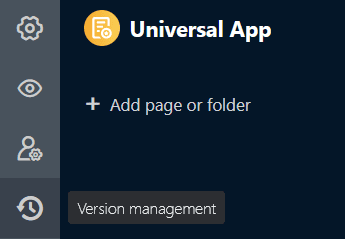
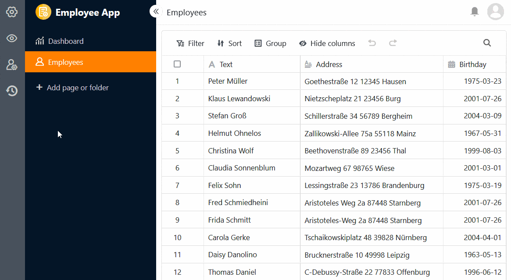
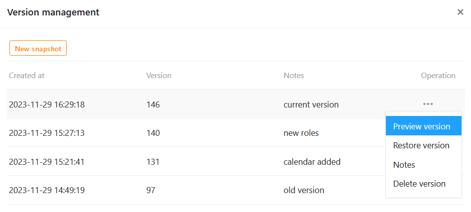
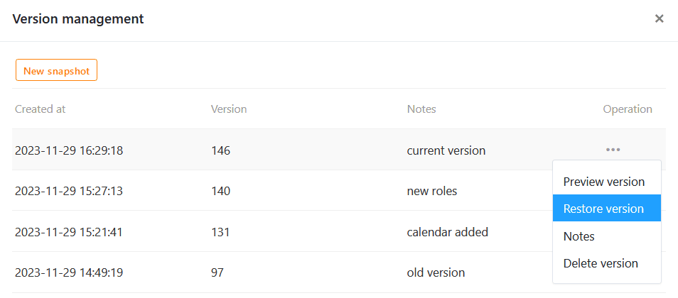
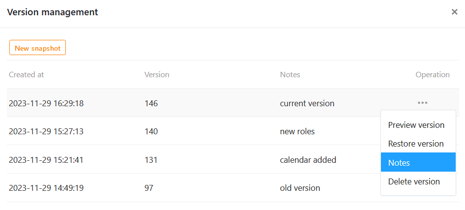
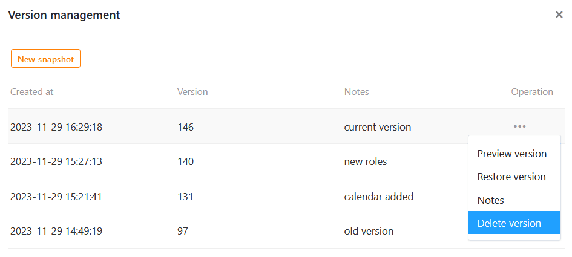

You can use **snapshots** to save the current version of a universal app. You can **create**, **view**, **restore** and **delete** snapshots in the version management of the Universal App Builder. You can also make **notes** on the individual snapshots to record information about a version.



## When app snapshots are useful

App snapshots are **snapshots** of the state of a universal app and work in a similar way to [base snapshots](). You can use app snapshots to save the current version of a universal app as a backup copy, which can be useful, for example, if you want to make extensive changes and possibly restore a previous state.



### What an app snapshot saves

An app snapshot saves the following elements and settings:

- [Settings]() such as **name**, **icon** and **color scheme** of the app
- [Pages and folders]() of the app
- Settings and [authorizations]() for the individual pages

### What an app snapshot does not save

An app snapshot does not save:

- the **user-defined URL** of an app
- the **data** of the underlying base
- the **comments** on individual data records
- the app's [user roles and invitation links]()

## Create app snapshot

1. Open a **universal app** in [edit mode]().

3. Click on  **Version management** at the top left of the page.

5. A window opens. Create a **new snapshot** there.
6. Optionally, you can add a **note** to the snapshot.
7. Confirm with **Submit**.



As soon as you have created a snapshot, you have four operations to choose from:

- **View version**
- **Restore version**
- **Note**
- **Delete version**

## View app snapshot

Before you restore a snapshot and hastily jump back to another version, you should first take a look at this version. To do this, follow the same procedure as above: Click on the **three dots** at the right-hand end of a snapshot and select the **View version** operation from the drop-down menu.

## Restore app snapshot

To restore an app snapshot, click on the **three dots** and select the corresponding operation from the drop-down menu.



As soon as you restore a snapshot, the app is reset to the memory status of this earlier version. Any **changes** you have made to pages, folders and settings in the app since then will be **lost**. It is therefore advisable to also save the current version in a snapshot before restoring a snapshot. This allows you to jump back and forth between different versions.

## Edit note

If you want to add, change or delete the note for a version at a later date, you can do this at any time. Open the corresponding text field by clicking on the **three dots** at the right-hand end of a snapshot and selecting **Note** from the drop-down menu. Save your changes by clicking **Submit**.

## Delete app snapshot

You can delete a snapshot that you no longer need at any time. Click on the **three dots** at the right-hand end of a snapshot and select the **Delete version** operation from the drop-down menu.


