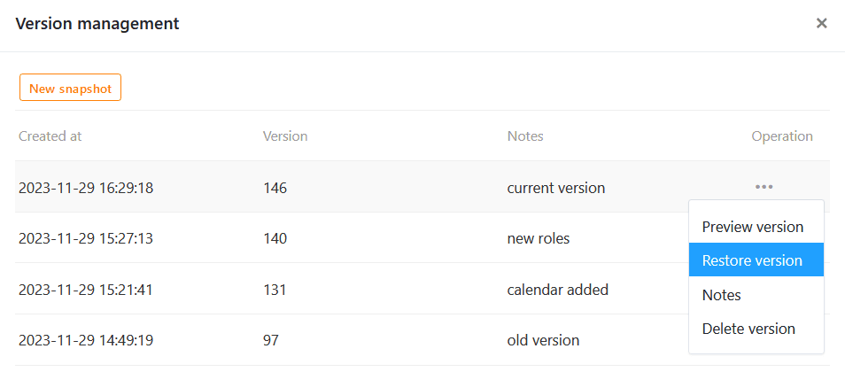

Puede utilizar **instantáneas** para guardar la versión actual de una aplicación universal. Puede **crear**, **ver**, **restaurar** y **eliminar** instantáneas en la gestión de versiones de Universal App Builder. También puedes hacer **notas** en las instantáneas individuales para registrar información sobre una versión.



## Cuándo son útiles las instantáneas de aplicaciones

Las instantáneas de aplicación son **instantáneas** del estado de una aplicación universal y funcionan de forma similar a [las instantáneas de base](). Puedes utilizar las instantáneas de app para guardar la versión actual de una app universal como copia de seguridad, lo que puede resultar útil, por ejemplo, si quieres realizar cambios exhaustivos y, posiblemente, restaurar un estado anterior.



### Lo que ahorra una instantánea de aplicación

Una instantánea de aplicación guarda los siguientes elementos y configuraciones:

- [Ajustes]() como el **nombre**, el **icono** y la **combinación de colores** de la aplicación.
- [Páginas y carpetas]() de la aplicación
- Ajustes y [autorizaciones]() para las páginas individuales

### Lo que no guarda una instantánea de aplicación

Una instantánea de la aplicación no se guarda:

- la **URL definida por el usuario** de una aplicación
- los **datos** de la base subyacente
- los **comentarios** sobre registros de datos individuales
- las [funciones de los usuarios y los enlaces de invitación]() de la aplicación

## Crear una instantánea de la aplicación

1. Abra una **aplicación universal** en [modo de edición]().

3. Haga clic en  **Gestión de versiones** en la parte superior izquierda de la página.

5. Se abre una ventana. Crea allí una **nueva instantánea**.
6. Si lo desea, puede añadir una **nota** a la instantánea.
7. Confirme con **Enviar**.



En cuanto hayas creado una instantánea, tienes cuatro operaciones entre las que elegir:

- **Ver versión**
- **Restaurar versión**
- **Nota**
- **Borrar versión**

## Ver instantánea de la aplicación

Antes de restaurar una instantánea y saltar apresuradamente a otra versión, primero deberías echar un vistazo a esta versión. Para ello, sigue el mismo procedimiento anterior: Haz clic en los **tres puntos** del extremo derecho de una instantánea y selecciona la operación **Ver versión** en el menú desplegable.

## Restaurar instantánea de aplicación

Para restaurar una instantánea de aplicación, haga clic en los **tres puntos** y seleccione la operación correspondiente en el menú desplegable.



En cuanto restaures una instantánea, la aplicación se restablecerá al estado de memoria de esta versión anterior. Cualquier **cambio** que hayas realizado en las páginas, carpetas y ajustes de la aplicación desde entonces se **perderá**. Por lo tanto, es aconsejable guardar también la versión actual en una instantánea antes de restaurar una instantánea. Esto te permite saltar hacia adelante y hacia atrás entre diferentes versiones.

## Editar nota

Si quieres añadir, modificar o eliminar la nota de una versión más adelante, puedes hacerlo en cualquier momento. Abra el campo de texto correspondiente haciendo clic en los **tres puntos** situados en el extremo derecho de una instantánea y seleccionando **Nota** en el menú desplegable. Guarda los cambios haciendo clic en **Enviar**.

## Eliminar la instantánea de la aplicación

Puedes eliminar una instantánea que ya no necesites en cualquier momento. Haz clic en los **tres puntos** situados en el extremo derecho de una instantánea y selecciona la operación **Eliminar versión** en el menú desplegable.


