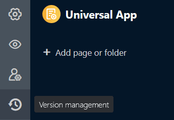

Для сохранения текущей версии универсального приложения можно использовать **моментальные снимки**. Вы можете **создавать**, **просматривать**, **восстанавливать** и **удалять** снимки в управлении версиями в Universal App Builder. Вы также можете делать **заметки** на отдельных снимках, чтобы записать информацию о версии.



## Когда полезны снимки приложений

Снимки приложений - это **снимки** состояния универсального приложения, которые работают так же, как и [снимки базы](). Вы можете использовать снимки приложений для сохранения текущей версии универсального приложения в качестве резервной копии, что может быть полезно, например, если вы хотите внести значительные изменения и, возможно, восстановить предыдущее состояние.



### Что спасает снимок приложения

Снимок приложения сохраняет следующие элементы и настройки:

- [Настройки](), такие как **название**, **иконка** и **цветовая схема** приложения
- [Страницы и папки]() приложения
- Настройки и [полномочия]() для отдельных страниц

### Что не сохраняет снимок приложения

Снимок приложения не сохраняется:

- **пользовательский URL-адрес** приложения
- **данные** базовой основы
- **комментарии** к отдельным записям данных
- [роли пользователей и пригласительные ссылки]() приложения

## Создание моментального снимка приложения

1. Откройте **универсальное приложение** в [режиме редактирования]().

3. Щелкните на  **Управление версиями** в верхней левой части страницы.

5. Откроется окно. Создайте в нем **новый снимок**.
6. По желанию можно добавить **примечание** к снимку.
7. Подтвердите с помощью кнопки **Отправить**.



После создания моментального снимка на выбор предлагается четыре операции:

- **Просмотр версии**
- **Восстановление версии**
- **Примечание**
- **Удалить версию**

## Просмотр снимка приложения

Прежде чем восстанавливать снимок и поспешно переходить к другой версии, следует сначала взглянуть на эту версию. Для этого выполните ту же процедуру, что и выше: Нажмите на **три точки** в правом конце моментального снимка и выберите в раскрывающемся меню операцию **View version**.

## Восстановление снимка приложения

Чтобы восстановить снимок приложения, нажмите на **три точки** и выберите соответствующую операцию из выпадающего меню.



При восстановлении моментального снимка приложение возвращается к состоянию памяти предыдущей версии. Все **изменения**, внесенные в страницы, папки и настройки приложения с тех пор, будут **потеряны**. Поэтому перед восстановлением снимка рекомендуется также сохранить текущую версию в виде моментального снимка. Это позволит вам переходить от одной версии к другой.

## Примечание

Если вы хотите добавить, изменить или удалить примечание к версии позже, вы можете сделать это в любое время. Откройте соответствующее текстовое поле, нажав на **три точки** в правом конце снимка и выбрав в раскрывающемся меню пункт **Примечание**. Сохраните изменения, нажав кнопку **Отправить**.

## Удалить снимок приложения

Вы можете в любой момент удалить снимок, который вам больше не нужен. Нажмите на **три точки** в правой части снимка и выберите в раскрывающемся меню операцию " **Удалить версию** ".


