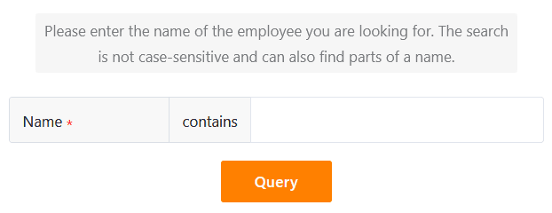

Using this page type, which works in a similar way to the [data query app](), you can search your data records for specific values across certain fields. The page type is particularly useful for **extensive data records** such as product catalogs or libraries. A specific use case could be, for example, querying an employee directory.

## Page settings

If you want to change the settings of a page, click on the corresponding  **cogwheel symbol** in the navigation bar.

## Preset filters, sorting and hidden columns

In the **page settings**, first define the **table** to be searched.

You can then define preset **filters**, **sorting** and **hidden columns** to limit and organize the data displayed for users. To filter or sort, click on **Add filter** or **Add sorting**, select the desired **column** and **condition** and confirm with **Submit**.

Users can see all the information of the applicable data records in the **query results** if you do not restrict them. Therefore, decide which data should be **visible** and show or hide the corresponding columns using the **sliders**.



## Add query fields

**Query fields** are of central importance for this type of page. They allow users to search the selected table columns for specific values and thus **find data records**. Click on  **Add field** in the page settings to define a query field.

You can then select the desired **column** and set whether the query field should be **required**, whether a **fuzzy search** is possible and whether **upper and lower case** are taken into account when making entries.

## Add note

You can add an introductory **note** to your query page, which can contain explanations on how to fill in the query fields, for example. To do this, simply activate the **slider** in the page settings and write the note in the text box that appears.

## Edit query results

To be able to use this function, you must **activate** the slider in the page settings under **Is the query result editable**.

All users with access to the query page can then **edit** the **data records** they are looking for.

- Carry out a **successful data query**.
- Move your mouse to the **line numbering** of the hit list and click on the **double arrow symbol** in front of the data record you want to edit.
- Make the desired changes in the open **row details**.
- Click on the **x symbol** to close the window and save your changes.



## Page authorizations

At the bottom of the page settings, you can restrict who can see the query page.

This is the only [page authorization]() you can select here. You cannot add or delete rows in the table via query pages.

However, after a successful data query, app users can click on [buttons]() in the displayed hit list to **perform** certain **actions**.

One application example is an internal job board: the query page allows you to quickly search for relevant positions. If an interesting position is found, a click on the button in the search results is enough to apply for the position directly.



[Buttons]() can **always** be pressed regardless of the page authorizations. This means that every app user can make certain changes to the data records that you have previously defined, even if the affected columns are otherwise locked for them or the user is not authorized to edit the query results.



## Other helpful articles

If you only need the query functionality described above for your application, you can also use the [data query app]() directly instead of a universal app.
