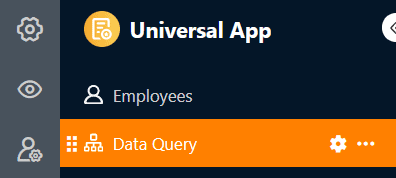

Con este tipo de página, que funciona de forma similar a la [aplicación de consulta de datos](), puede buscar en sus registros de datos valores específicos en determinados campos. Este tipo de página es especialmente útil para registros de **datos extensos**, como catálogos de productos o bibliotecas. Un caso de uso específico podría ser, por ejemplo, la consulta de un directorio de empleados.

## Configuración de página

Si desea cambiar la configuración de una página, haga clic en el **símbolo de rueda dentada**  correspondiente en la barra de navegación.

## Filtros preestablecidos, clasificación y columnas ocultas

En la **configuración de la página**, defina primero la **tabla** en la que se va a buscar.

A continuación, puede definir **filtros** preestablecidos, **clasificar** y **ocultar columnas** para limitar y organizar los datos que se muestran a los usuarios. Para filtrar u ordenar, haga clic en **Añadir filtro** o **Añadir ordenación**, seleccione la **columna** y la **condición** deseadas y confirme con **Enviar**.

Los usuarios pueden ver toda la información de los registros de datos aplicables en los **resultados de la consulta** si usted no los restringe. Por lo tanto, decida qué datos deben ser **visibles** y muestre u oculte las columnas correspondientes utilizando los **controles deslizantes**.



## Añadir campos de consulta

Los **campos de consulta** tienen una importancia fundamental en este tipo de páginas. Los usuarios pueden utilizarlos para buscar valores específicos en las columnas de la tabla seleccionada y **encontrar así registros de datos**. Haga clic en  **Añadir campo** en la configuración de la página para definir un campo de consulta.

A continuación, puede seleccionar la **columna** deseada y establecer si el campo de consulta debe ser **obligatorio**, si es posible realizar una **búsqueda difusa** y si se tienen en cuenta las **mayúsculas y minúsculas** al realizar las entradas.

## Añadir nota

Puede añadir una **nota** introductoria a su página de consulta, que puede contener explicaciones sobre cómo rellenar los campos de consulta, por ejemplo. Para ello, basta con activar el **control deslizante** en la configuración de la página y escribir la nota en el cuadro de texto que aparece.

## Editar los resultados de la consulta

Para poder utilizar esta función, debe **activar** el control deslizante en la configuración de la página en **¿Es editable el resultado de la consulta**?

A continuación, todos los usuarios con acceso a la página de consulta pueden **editar los registros de datos** buscados.

- Realizar una **consulta de datos con éxito**.
- Desplace el ratón hasta la **numeración de líneas** de la lista de aciertos y haga clic en el **símbolo de la doble flecha** situado delante del registro de datos que desea editar.
- Realice los cambios deseados en **los detalles de la fila** abierta.
- Haga clic en el **símbolo x** para cerrar la ventana y guardar los cambios.

## Autorizaciones de páginas

En la parte inferior de la configuración de la página, puede restringir quién puede ver la página de consulta.

Esta es la única [autorización de página]() que puede seleccionar aquí. No puede añadir o eliminar filas en la tabla a través de páginas de consulta.

Sin embargo, tras una consulta de datos satisfactoria, los usuarios de la aplicación pueden hacer clic en [los botones](https://seatable.io/es/docs/andere-spalten/die-schaltflaeche/) de la lista de aciertos mostrada para realizar determinadas **acciones**.

Un ejemplo de aplicación es una bolsa de trabajo interna: la página de consulta permite buscar rápidamente puestos relevantes. Si se encuentra un puesto interesante, basta con hacer clic en el botón de los resultados de la búsqueda para solicitarlo directamente.



## Otros artículos útiles

Si sólo necesitas la funcionalidad de consulta descrita anteriormente para tu aplicación, también puedes utilizar directamente la [app de consulta de datos]() en lugar de una app universal.
