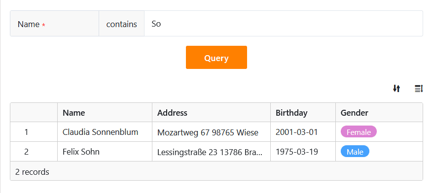
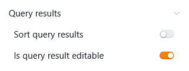
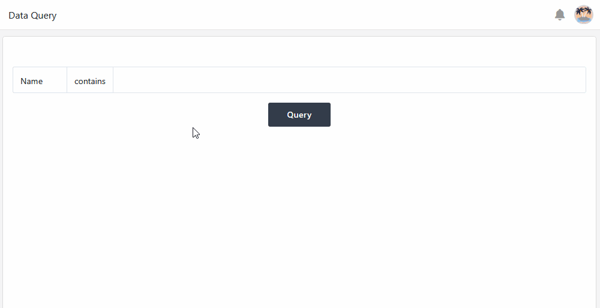
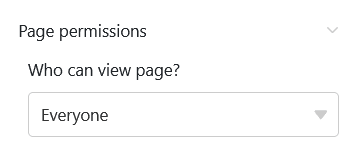

Ce type de page, qui fonctionne de la même manière que l'[application de requête de données](https://seatable.io/fr/docs/apps/datenabfrage-app/), vous permet de rechercher des valeurs spécifiques dans vos ensembles de données à travers certains champs. Ce type de page est particulièrement utile pour les **ensembles de données volumineux** tels que les catalogues de produits ou les bibliothèques. Une application concrète pourrait être par exemple la consultation d'un répertoire d'employés.

## Paramètres de la page

Si vous souhaitez modifier les paramètres d'une page, cliquez dans la navigation sur le **symbole de la roue dentée**  correspondant.

## Filtres prédéfinis, tris et colonnes masquées

Dans les **paramètres de la page**, vous définissez d'abord le **tableau** dans lequel la recherche doit être effectuée.

Vous pouvez ensuite définir des **filtres**, des **tris** et **des colonnes masquées** prédéfinis afin de limiter et d'organiser les données affichées pour les utilisateurs. Pour filtrer ou trier, cliquez sur **Ajouter un filtre** ou **Ajouter un tri**, sélectionnez la **colonne** et la **condition** souhaitées et confirmez en cliquant sur **Envoyer**.

Les utilisateurs peuvent voir toutes les informations des enregistrements applicables dans les **résultats de la requête** si vous ne les limitez pas. Décidez donc quelles données doivent être **visibles** et affichez ou masquez les colonnes correspondantes à l'aide des **curseurs**.



## Ajouter des champs de requête

Les **champs de requête** sont essentiels pour ce type de page. Ils permettent aux utilisateurs de rechercher des valeurs spécifiques dans les colonnes sélectionnées du tableau et de **trouver** ainsi **des enregistrements**. Cliquez sur  **Ajouter un** champ dans les paramètres de la page pour définir un champ de requête.

Vous pouvez ensuite sélectionner la **colonne** souhaitée et définir si le champ de requête est **nécessaire**, si une **recherche floue** est possible et si les **majuscules et les minuscules sont** prises en compte lors de la saisie.

## Ajouter une remarque

Vous pouvez ajouter une **note** d'introduction à votre page d'interrogation, qui peut par exemple contenir des explications sur la manière de remplir les champs d'interrogation. Pour ce faire, il vous suffit d'activer le **curseur** dans les paramètres de la page et d'écrire la remarque dans la zone de texte qui apparaît.

## Modifier les résultats de la requête

Pour pouvoir utiliser cette fonction, vous devez **activer** le curseur dans les paramètres de la page sous **Si le résultat de la requête est modifiable**.

Ensuite, tous les utilisateurs ayant accès à la page de requête peuvent **traiter** les **enregistrements** recherchés.

- Effectuez une **recherche de données réussie**.
- Déplacez votre souris sur la **numérotation des lignes** de la liste de résultats et cliquez sur l'**icône en forme de double flèche** devant l'enregistrement que vous souhaitez modifier.
- Effectuez les modifications souhaitées dans les **détails de la ligne** ouverte.
- Cliquez sur l'**icône x** pour fermer la fenêtre et enregistrer vos modifications.

## Autorisations des pages

Tout en bas, dans les paramètres de la page, vous pouvez limiter les personnes autorisées à voir la page d'interrogation.

C'est la seule [autorisation de page]() que vous pouvez choisir ici. Les pages de requête ne permettent pas d'ajouter ou de supprimer des lignes dans le tableau.

Toutefois, après une recherche de données réussie, les utilisateurs de l'application peuvent actionner [des boutons](https://seatable.io/fr/docs/andere-spalten/die-schaltflaeche/) dans la liste de résultats affichée afin d'**effectuer** certaines **actions**.

Un exemple d'application est une bourse d'emploi interne : la page de requête permet de rechercher rapidement les postes pertinents. Si un poste intéressant y figure, il suffit alors de cliquer sur le bouton dans les résultats de recherche pour postuler directement à l'emploi.



## Autres articles utiles

Si vous n'avez besoin pour votre application que de la fonctionnalité de consultation décrite ci-dessus, vous pouvez aussi utiliser directement l'[application de consultation des données](https://seatable.io/fr/docs/apps/datenabfrage-app/) au lieu d'une application universelle.
