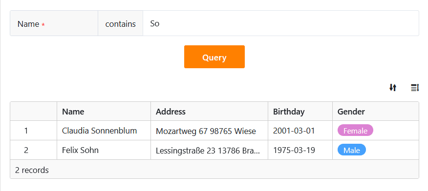
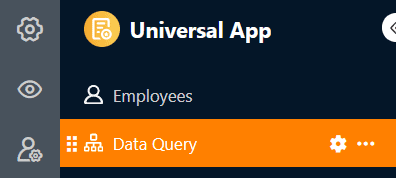
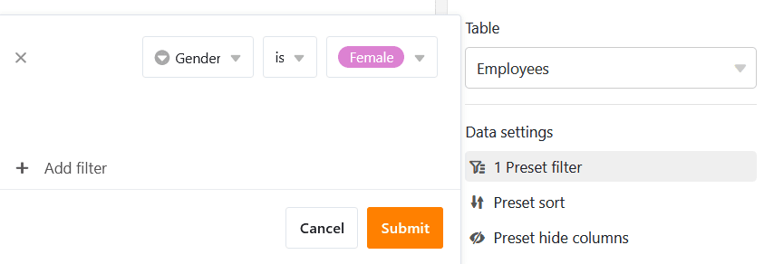
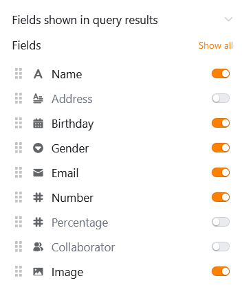
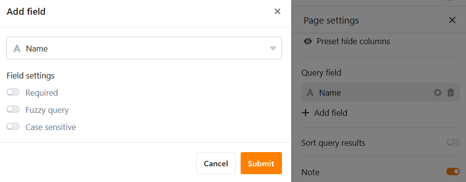
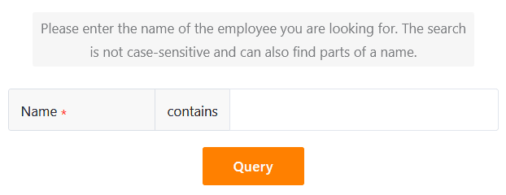
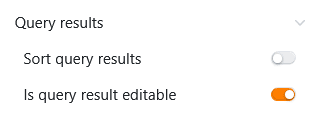
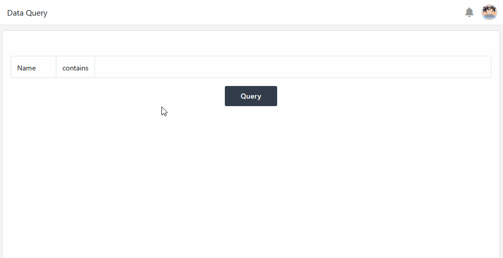
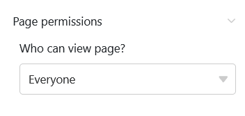
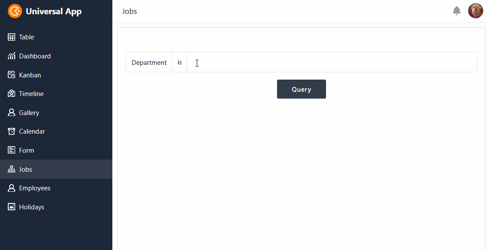

Utilizando este tipo de página, que funciona de forma semelhante à [aplicação de consulta de dados](), pode procurar nos seus registos de dados valores específicos em determinados campos. O tipo de página é particularmente útil para **registos de dados extensos**, como catálogos de produtos ou bibliotecas. Um caso de utilização específico poderia ser, por exemplo, a consulta de um diretório de empregados.

## Definições da página

Se pretender alterar as definições de uma página, clique no **símbolo da roda dentada**  correspondente na barra de navegação.

## Filtros predefinidos, ordenação e colunas ocultas

Nas **definições da página**, comece por definir a **tabela** a pesquisar.

Pode então definir **filtros** predefinidos, **ordenação** e **colunas ocultas** para limitar e organizar os dados apresentados aos utilizadores. Para filtrar ou ordenar, clique em **Adicionar filtro** ou **Adicionar ordenação**, seleccione a **coluna** e a **condição** pretendidas e confirme com **Enviar**.

Os utilizadores podem ver todas as informações dos registos de dados aplicáveis nos **resultados da consulta** se não os restringir. Por conseguinte, decida quais os dados que devem ser **visíveis** e mostre ou oculte as colunas correspondentes utilizando os **cursores**.



## Adicionar campos de consulta

**Os campos de consulta** são de importância central para este tipo de página. Os utilizadores podem utilizá-los para procurar valores específicos nas colunas da tabela selecionada e, assim, **encontrar registos de dados**. Clique em  **Adicionar campo** nas definições da página para definir um campo de consulta.

Em seguida, pode selecionar a **coluna** pretendida e definir se o campo de consulta deve ser **obrigatório**, se é possível uma **pesquisa difusa** e se as maiúsculas **e min** úsculas são tidas em conta ao efetuar entradas.

## Adicionar nota

Pode adicionar uma **nota** introdutória à sua página de consulta, que pode conter explicações sobre como preencher os campos de consulta, por exemplo. Para tal, basta ativar a **barra deslizante** nas definições da página e escrever a nota na caixa de texto que aparece.

## Editar resultados da consulta

Para poder utilizar esta função, deve **ativar** a barra deslizante nas definições da página em **É o resultado da consulta editável**.

Todos os utilizadores com acesso à página de consulta podem então **editar** os **registos de dados** pesquisados.

- Efetuar uma **consulta de dados bem sucedida**.
- Desloque o rato para a **numeração das linhas** da lista de acertos e clique no **símbolo da seta dupla** em frente do registo de dados que pretende editar.
- Efetuar as alterações desejadas nos **detalhes da linha** aberta.
- Clique no **símbolo x** para fechar a janela e guardar as suas alterações.



## Autorizações de páginas

Na parte inferior das definições da página, pode restringir quem pode ver a página de consulta.

Esta é a única [autorização de página]() que pode selecionar aqui. Não é possível adicionar ou eliminar linhas na tabela através de páginas de consulta.

No entanto, após uma consulta de dados bem sucedida, os utilizadores da aplicação podem clicar nos [botões]() da lista de ocorrências apresentada para **executar** determinadas **acções**.

Um exemplo de aplicação é um quadro de empregos interno: a página de consulta permite-lhe procurar rapidamente posições relevantes. Se for encontrada uma posição interessante, basta clicar no botão nos resultados da pesquisa para se candidatar diretamente à posição.



[Os botões]() podem ser **sempre** premidos, independentemente das autorizações da página. Isto significa que todos os utilizadores da aplicação podem fazer determinadas alterações aos registos de dados que definiu previamente, mesmo que as colunas afectadas estejam bloqueadas para eles ou que o utilizador não esteja autorizado a editar os resultados da consulta.



## Outros artigos úteis

Se apenas necessitar da funcionalidade de consulta descrita acima para a sua aplicação, também pode utilizar diretamente a [aplicação de consulta de dados]() em vez de uma aplicação universal.