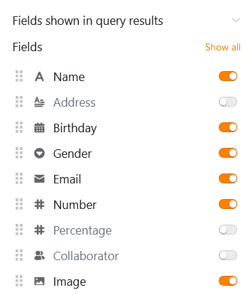

С помощью этого типа страницы, который работает аналогично [приложению "Запрос данных](https://seatable.io/ru/docs/apps/datenabfrage-app/) ", вы можете искать в записях данных определенные значения по определенным полям. Этот тип страницы особенно полезен для **обширных записей данных**, таких как каталоги товаров или библиотеки. Конкретным примером может быть, например, запрос справочника сотрудников.

## Настройки страницы

Если вы хотите изменить настройки какой-либо страницы, нажмите на соответствующий **символ**  на панели навигации.

## Предустановленные фильтры, сортировка и скрытые колонки

В **настройках страницы** сначала определите **таблицу** для поиска.

Вы можете задать предустановленные **фильтры**, **сортировку** и **скрытые столбцы**, чтобы ограничить и упорядочить данные, отображаемые для пользователей. Чтобы отфильтровать или отсортировать данные, нажмите на кнопку **Добавить фильтр** или **Добавить сортировку**, выберите нужный **столбец** и **условие** и подтвердите выбор кнопкой **Отправить**.

Пользователи могут видеть всю информацию соответствующих записей данных в **результатах запроса**, если вы их не ограничиваете. Поэтому решите, какие данные должны быть **видны**, и покажите или скройте соответствующие столбцы с помощью **ползунков**.



## Добавьте поля запроса

**Поля запросов** имеют центральное значение для этого типа страниц. С их помощью пользователи могут искать в выбранных столбцах таблицы определенные значения и таким образом **находить записи данных**. Щелкните на  **Добавить поле** в настройках страницы, чтобы определить поле запроса.

Затем вы можете выбрать нужный **столбец** и задать, должно ли поле запроса быть **обязательным**, возможен ли **нечеткий поиск** и учитывается ли **верхний и нижний регистр** при вводе.

## Добавить заметку

Вы можете добавить на страницу запроса вводное **примечание**, которое может содержать, например, пояснения о том, как заполнять поля запроса. Для этого просто активируйте **слайдер** в настройках страницы и напишите примечание в появившемся текстовом поле.

## Редактирование результатов запроса

Чтобы воспользоваться этой функцией, необходимо **активировать** слайдер в настройках страницы в разделе **Редактируемый результат запроса**.

После этого все пользователи, имеющие доступ к странице запроса, могут **редактировать** искомые **записи данных**.

- Выполните **успешный запрос данных**.
- Подведите курсор к **нумерации строк** в списке ударов и нажмите на **символ двойной стрелки** напротив записи данных, которую вы хотите отредактировать.
- Внесите необходимые изменения в **детали** открытого **ряда**.
- Нажмите на **символ x**, чтобы закрыть окно и сохранить изменения.

## Разрешения на страницы

В нижней части настроек страницы вы можете ограничить круг лиц, которые могут видеть страницу запроса.

Это единственная [страница](https://seatable.io/ru/docs/universelle-apps/seitenberechtigungen-in-einer-universellen-app/), которую можно выбрать. Вы не можете добавлять или удалять строки в таблице через страницы запросов.

Однако после успешного запроса данных пользователи приложения могут нажимать на [кнопки](https://seatable.io/ru/docs/andere-spalten/die-schaltflaeche/) в отображаемом списке, чтобы **выполнить** определенные **действия**.

Один из примеров применения - внутренняя доска объявлений: страница запросов позволяет быстро искать подходящие вакансии. Если интересная вакансия найдена, достаточно нажать на кнопку в результатах поиска, чтобы сразу подать заявку на вакансию.



## Другие полезные статьи

Если для вашего приложения нужна только описанная выше функциональность запросов, вы можете использовать [приложение для запросов данных](https://seatable.io/ru/docs/apps/datenabfrage-app/) напрямую, а не универсальное приложение.
