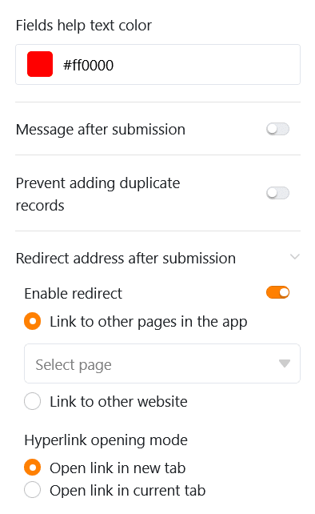

Mithilfe dieses Seitentyps können Sie unterschiedliche **Formulare** bauen, welche die Benutzer im Anschluss einreichen können. Formularseiten in Universellen Apps eignen sich hervorragend, um Daten von vielen verschiedenen Nutzern erfassen zu lassen. Ein möglicher Anwendungsfall ist die [Arbeitszeiterfassung Ihrer Mitarbeiter](https://seatable.io/arbeitszeiterfassung/).



[Webformulare]() gibt es nicht nur in der Universellen App, sondern auch direkt in der Base.



## Seiteneinstellungen ändern

Wenn Sie die Einstellungen einer Seite ändern möchten, klicken Sie in der Navigation auf das entsprechende  **Zahnrad-Symbol**.

## Formulare erstellen

Über die **Seiteneinstellungen**, die Sie vielleicht schon aus dem [Webformular-Editor](https://seatable.io/docs/webformulare/konfigurationsmoeglichkeiten-und-optische-anpassungen-eines-webformulars/) kennen, können Sie verschiedene **Elemente** und **Felder** per Drag-and-Drop zum Webformular hinzufügen. Neben den **Tabellenfeldern**, die den Spalten der ausgewählten Tabelle entsprechen, können Sie auch **horizontale Linien** und **Anmerkungen** hinzufügen.

### Feldeinstellungen

Jedes Feld verfügt zudem über individuelle **Feldeinstellungen**, bei denen Sie einen vom Spaltennamen abweichenden **Anzeigenamen** und einen **Hilfetext** im Formular hinzufügen können. Hier können Sie auch einstellen, ob ein Feld ein erforderliches **Pflichtfeld** ist, mit einem **Standardwert** vorbefüllt sein soll oder nur unter bestimmten **Bedingungen** angezeigt wird.

Wenn Sie die **Reihenfolge** der Felder im Formular verändern möchten, können Sie ein Feld am  **Sechs-Punkte-Symbol** greifen und verschieben. Per Klick auf das  **Papierkorb-Symbol** entfernen Sie ein Feld aus dem Formular.

### Weitere Formularseiten-Einstellungen

Weiter unten können Sie eine **Farbe für die Hilfetexte** festlegen sowie eine **Nachricht**, die den Nutzern nach Einreichung des Formulars angezeigt wird.

Des Weiteren können Sie unterbinden, dass Formulare mit bereits existierenden Datensätzen eingereicht werden, indem Sie das **Hinzufügen von Duplikaten verhindern**. Aktivieren Sie dazu den entsprechenden Regler und wählen Sie die Spalten aus, in denen die Werte übereinstimmen müssen, damit ein Formular als Duplikat gilt. Wenn ein Nutzer daraufhin identische Daten eingibt, wird das Einreichen des Formulars blockiert.

Nicht zuletzt können Sie die Nutzer nach Einreichung des Formulars auf eine andere Seite der App oder eine andere Webseite weiterleiten. Klicken Sie dazu auf **Weiterleitung aktivieren** und wählen Sie den entsprechenden Hyperlink aus. Sie können ebenso einstellen, ob der Link in einem neuen oder im aktuellen Tab geöffnet werden soll.

## Seitenberechtigungen

Ganz unten können Sie eingrenzen, wer die Formularseite sehen darf.

Das ist die einzige [Seitenberechtigung](), die Sie bei Formularseiten zur Auswahl haben – denn über Formularseiten können keine Zeilen in der Tabelle verändert oder gelöscht werden und jeder, der die Seite sehen kann, darf auch Formulare einreichen, also Zeilen hinzufügen.
