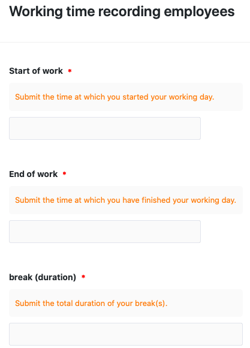
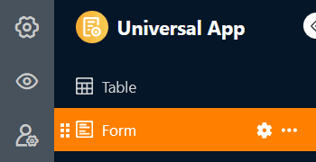
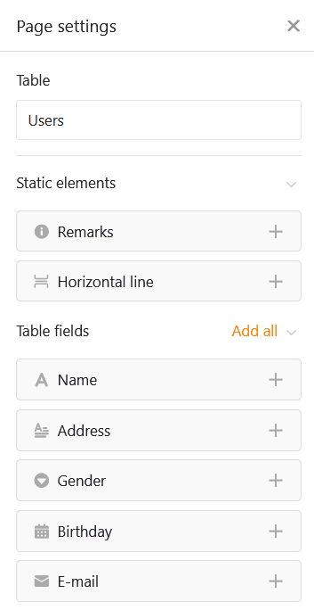
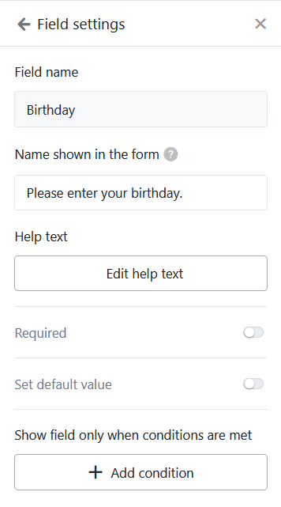
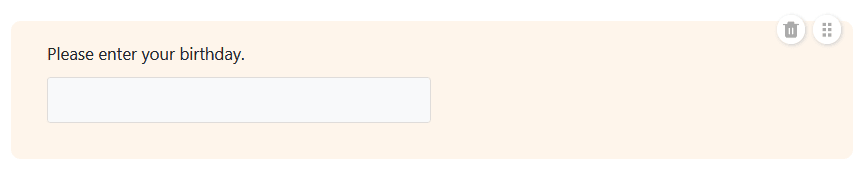
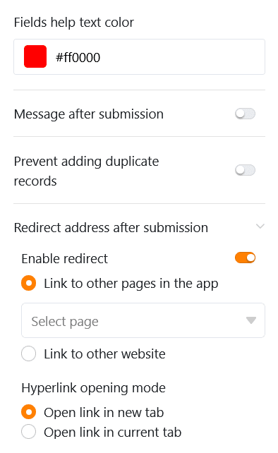
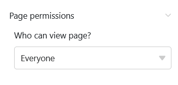

Puedes utilizar este tipo de página para crear diferentes **formularios** que los usuarios pueden enviar. Las páginas de formularios en aplicaciones universales son ideales para recopilar datos de muchos usuarios diferentes. Un posible caso de uso es [registrar las horas de trabajo de tus empleados]().



[Los formularios web]() no sólo están disponibles en la Universal App, sino también directamente en la Base.



## Cambiar la configuración de la página

Si desea cambiar la configuración de una página, haga clic en el **símbolo de rueda dentada**  correspondiente en la barra de navegación.

## Crear formularios

A través de la **configuración de la página**, con la que posiblemente ya esté familiarizado desde el [editor de formularios web](), puede añadir diversos **elementos** y **campos** al formulario web mediante arrastrar y soltar. Además de los campos de **tabla** que corresponden a las columnas de la tabla seleccionada, también puede añadir **líneas horizontales** y **anotaciones**.

### Ajustes de campo

Cada campo tiene también una **configuración** individual en la que se puede añadir un **nombre** que difiera del nombre de la columna y un **texto de ayuda** en el formulario. Aquí también puede establecer si un **campo** es obligatorio, si debe rellenarse previamente con un **valor predeterminado** o si sólo se muestra en determinadas **condiciones**.

Si desea cambiar el **orden** de los campos en el formulario, puede agarrar y mover un campo utilizando el **símbolo de seis puntos** . Puedes eliminar un campo del formulario haciendo clic en el **icono de la papelera** .

### Otros ajustes de la página del formulario

Más abajo, puede definir un **color para los textos de ayuda** y un **mensaje** que se muestra a los usuarios después de enviar el formulario.

También puede evitar que se envíen formularios con registros de datos existentes **impidiendo que se añadan duplic**ados. Para ello, active el control deslizante correspondiente y seleccione las columnas en las que deben coincidir los valores para que un formulario se considere duplicado. Si un usuario introduce entonces datos idénticos, se bloquea el envío del formulario.

Por último, pero no por ello menos importante, puede redirigir a los usuarios a otra página de la aplicación o a otro sitio web después de enviar el formulario. Para ello, haz clic en **Activar redirección** y selecciona el hipervínculo correspondiente. También puede establecer si el enlace debe abrirse en una nueva pestaña o en la pestaña actual.

## Autorizaciones de páginas

En la parte inferior puede restringir quién puede ver la página del formulario.

Esta es la única [autorización de página]() que puede elegir para las páginas de formularios, ya que a través de las páginas de formularios no se puede modificar ni eliminar ninguna fila de la tabla y cualquiera que pueda ver la página también puede enviar formularios, es decir, añadir filas.
