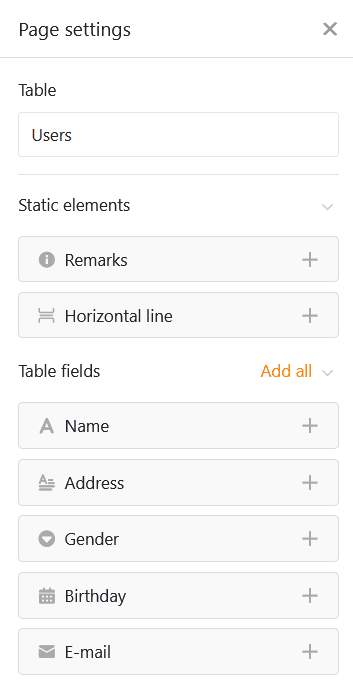
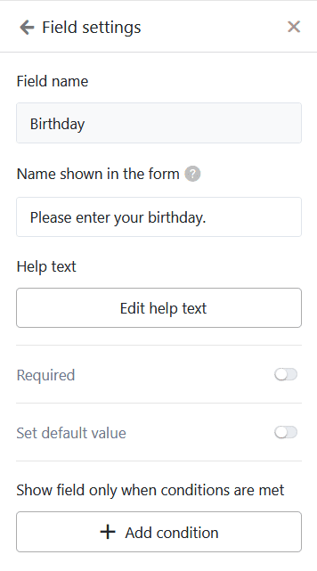

Ce type de page permet de construire différents **formulaires** que les utilisateurs peuvent ensuite soumettre. Les pages de formulaires dans les applications universelles sont idéales pour la saisie de données par de nombreux utilisateurs différents. Une application possible est la [saisie des heures de travail de vos collaborateurs](https://seatable.io/fr/arbeitszeiterfassung/).



[Les formulaires web]() ne sont pas seulement disponibles dans l'application universelle, mais aussi directement dans la base.



## Modifier les paramètres de la page

Si vous souhaitez modifier les paramètres d'une page, cliquez dans la navigation sur le **symbole de la roue dentée**  correspondant.

## Créer des formulaires

Les **paramètres de page**, que vous connaissez peut-être déjà grâce à l'[éditeur de formulaires web](https://seatable.io/fr/docs/webformulare/konfigurationsmoeglichkeiten-und-optische-anpassungen-eines-webformulars/), vous permettent d'ajouter différents **éléments** et **champs** au formulaire web par simple glisser-déposer. Outre les **champs de tableau** correspondant aux colonnes du tableau sélectionné, vous pouvez également ajouter **des lignes horizontales** et **des annotations**.

### Paramètres de champ

Chaque champ dispose en outre de **paramètres de champ** individuels, dans lesquels vous pouvez ajouter un **nom d'affichage** différent du nom de la colonne et un **texte d'aide** dans le formulaire. Vous pouvez également définir ici si un champ est **obligatoire**, s'il doit être pré-rempli avec une **valeur standard** ou s'il ne s'affiche que dans certaines **conditions**.

Si vous souhaitez modifier l'**ordre** des champs dans le formulaire, vous pouvez saisir un champ à l'aide du **symbole à six points**  et le déplacer. En cliquant sur l'**icône de la corbeille** , vous pouvez supprimer un champ du formulaire.

### Autres paramètres de page de formulaire

Plus bas, vous pouvez définir une **couleur pour les textes d'aide** ainsi qu'un **message** qui sera affiché aux utilisateurs après la soumission du formulaire.

De plus, vous pouvez empêcher que des formulaires soient soumis avec des enregistrements déjà existants en **empêchant** l'**ajout de doublons**. Pour ce faire, activez le curseur correspondant et sélectionnez les colonnes dans lesquelles les valeurs doivent correspondre pour qu'un formulaire soit considéré comme un doublon. Si un utilisateur saisit ensuite des données identiques, la soumission du formulaire sera bloquée.

Enfin et surtout, vous pouvez rediriger les utilisateurs vers une autre page de l'application ou un autre site web après avoir soumis le formulaire. Pour ce faire, cliquez sur **Activer la redirection** et sélectionnez le lien hypertexte correspondant. Vous pouvez également définir si le lien doit s'ouvrir dans un nouvel onglet ou dans l'onglet actuel.

## Autorisations des pages

Tout en bas, vous pouvez limiter les personnes autorisées à voir la page du formulaire.

C'est la seule [autorisation de page](https://seatable.io/fr/docs/universelle-apps/seitenberechtigungen-in-einer-universellen-app/) que vous pouvez choisir pour les pages de formulaire - car les pages de formulaire ne permettent pas de modifier ou de supprimer des lignes dans le tableau et toute personne qui peut voir la page peut également soumettre des formulaires, c'est-à-dire ajouter des lignes.
