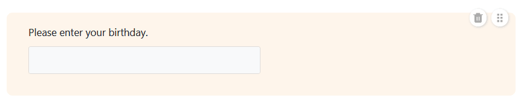

Pode utilizar este tipo de página para criar diferentes **formulários** que os utilizadores podem submeter. As páginas de formulário em aplicações universais são ideais para recolher dados de muitos utilizadores diferentes. Um caso de utilização possível é o [registo das horas de trabalho dos seus empregados]().



[Os formulários Web]() não estão apenas disponíveis na aplicação universal, mas também diretamente na base.



## Alterar as definições da página

Se pretender alterar as definições de uma página, clique no **símbolo da roda dentada**  correspondente na barra de navegação.

## Criar formulários

Utilizando as **definições de página**, com as quais já deve estar familiarizado a partir do [editor de formulários Web](), pode adicionar vários **elementos** e **campos** ao formulário Web utilizando a função arrastar e largar. Para além dos **campos de tabela** que correspondem às colunas da tabela selecionada, também é possível adicionar **linhas horizontais** e **anotações**.

### Definições de campo

Cada campo também tem **definições de campo** individuais onde pode adicionar um **nome de apresentação** diferente do nome da coluna e um **texto de ajuda** no formulário. Aqui também pode definir se um campo é um **campo** obrigatório, se deve ser pré-preenchido com um **valor** predefinido ou se só é apresentado em determinadas **condições**.

Se pretender alterar a **ordem** dos campos no formulário, pode agarrar e mover um campo utilizando o **símbolo de seis pontos** . Pode remover um campo do formulário clicando no **ícone do caixote da reciclagem** .

### Outras definições da página do formulário

Mais abaixo, pode definir uma **cor para os textos de ajuda** e uma **mensagem** que é apresentada aos utilizadores depois de submeterem o formulário.

Também é possível impedir que formulários com registos de dados existentes sejam submetidos, **impedindo a adição de duplicados**. Para tal, active o cursor correspondente e seleccione as colunas cujos valores devem coincidir para que um formulário seja considerado duplicado. Se um utilizador introduzir dados idênticos, a submissão do formulário é bloqueada.

Por último, mas não menos importante, pode redirecionar os utilizadores para outra página da aplicação ou outro sítio Web depois de submeterem o formulário. Para tal, clique em **Ativar redireccionamento** e selecione a hiperligação correspondente. Também pode definir se a hiperligação deve ser aberta num novo separador ou no separador atual.

## Autorizações de páginas

Na parte inferior, pode restringir quem pode ver a página do formulário.

Esta é a única [autorização de página]() que tem de escolher para as páginas de formulário - porque nenhuma linha na tabela pode ser alterada ou eliminada através de páginas de formulário e qualquer pessoa que possa ver a página também pode submeter formulários, ou seja, adicionar linhas.
