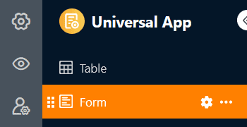

Вы можете использовать этот тип страницы для создания различных **форм**, которые пользователи могут отправлять. Страницы форм в универсальных приложениях идеально подходят для сбора данных от разных пользователей. Один из возможных вариантов использования - [учет рабочего времени ваших сотрудников]().



[Веб-формы]() доступны не только в универсальном приложении, но и непосредственно в Базе.



## Изменение настроек страницы

Если вы хотите изменить настройки какой-либо страницы, нажмите на соответствующий **символ**  на панели навигации.

## Создание форм

Используя **настройки страницы**, с которыми вы уже знакомы по [редактору веб-форм](), вы можете добавлять различные **элементы** и **поля** в веб-форму с помощью перетаскивания. Помимо **полей таблицы**, соответствующих столбцам выбранной таблицы, вы можете добавить **горизонтальные линии** и **аннотации**.

### Настройки поля

Каждое поле также имеет индивидуальные **настройки**, где вы можете добавить **отображаемое имя**, отличное от имени столбца, и **текст подсказки** в форме. Здесь же можно установить, является ли поле обязательным, должно ли **оно** предварительно заполняться **значением по умолчанию** или отображаться только при определенных **условиях**.

Если вы хотите изменить **порядок** расположения полей в форме, вы можете захватить и переместить поле с помощью **символа**  с **шестью точками**. Вы можете удалить поле из формы, нажав на **значок корзины** .

### Дополнительные настройки страницы формы

Далее вы можете задать **цвет для текстов подсказок** и **сообщение**, которое будет отображаться у пользователей после отправки формы.

Вы также можете запретить отправку форм с существующими записями данных, **предотвратив добавление дубликатов**. Для этого активируйте соответствующий ползунок и выберите столбцы, значения в которых должны совпадать, чтобы форма считалась дубликатом. Если пользователь введет идентичные данные, отправка формы будет заблокирована.

И последнее, но не менее важное: после отправки формы вы можете перенаправить пользователя на другую страницу приложения или на другой сайт. Для этого нажмите на **Активировать перенаправление** и выберите соответствующую гиперссылку. Вы также можете указать, должна ли ссылка открываться в новой вкладке или в текущей.

## Разрешения на страницы

Внизу вы можете ограничить круг лиц, которые могут видеть страницу формы.

Это единственная [авторизация страницы](), которую вы можете выбрать для страниц форм - потому что ни одна строка в таблице не может быть изменена или удалена через страницы форм, и каждый, кто видит страницу, может также отправлять формы, то есть добавлять строки.
