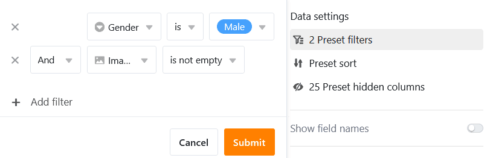
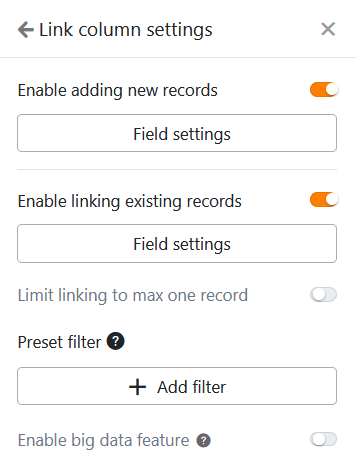

Ce type de page vous permet d'afficher **des images** et d'autres données que vous avez enregistrées dans votre tableau sous la forme d'une **galerie** au sein d'une application universelle. Vous pouvez par exemple utiliser une page de galerie pour **créer des fiches d'information** claires sur **vos collaborateurs**.

## Paramètres de la page

Si vous souhaitez modifier les paramètres d'une page, cliquez dans la navigation sur le **symbole de la roue dentée**  correspondant.

Dans les **paramètres de la page**, vous pouvez sélectionner le **tableau**, la **colonne d'images** et la **colonne de titres** à partir desquels la galerie est alimentée.

## Filtres prédéfinis, tris et colonnes masquées

En outre, vous pouvez définir des filtres prédéfinis, des tris et des colonnes masquées afin de limiter et d'organiser les données affichées pour les utilisateurs. Pour filtrer ou trier, cliquez sur **Ajouter un filtre** ou **Ajouter un tri**, sélectionnez la **colonne** et la **condition** souhaitées et confirmez en cliquant sur **Envoyer**.

Les utilisateurs peuvent afficher plus d'informations sur une fiche dans la galerie en cliquant sur une entrée.

Décidez donc quelles données doivent être **visibles** et affichez ou masquez les colonnes correspondantes à l'aide des **curseurs**.



## Paramètres de la colonne des liens

Dans les **paramètres de la colonne des liens**, vous pouvez définir pour chaque tableau lié quelles données sont visibles et quelles opérations sont autorisées.

- **Autoriser l'ajout de nouvelles entrées**: si vous activez ce curseur, les utilisateurs peuvent ajouter de nouvelles entrées dans le tableau lié. Les paramètres des champs permettent de définir quelles colonnes sont **visibles** et quelles colonnes sont **obligatoires**, c'est-à-dire qu'elles doivent être remplies.
- **Autoriser la liaison d'entrées existantes**: si vous activez ce curseur, les utilisateurs peuvent lier des entrées existantes du tableau lié. Vous pouvez définir quelles colonnes sont **visibles** via les paramètres de champ.
- **Limiter les liens à une ligne maximum**: Si vous activez ce curseur, les utilisateurs ne pourront plus lier qu'une seule ligne du tableau lié à la fois dans les cellules de la colonne des liens.
- **Filtres prédéfinis**: si vous ajoutez un filtre ici, seules les options qui remplissent les conditions du filtre seront affichées lors de la création de liens vers des entrées.
- **Activer la fonction Big Data**: Lorsque la fonction Big Data est activée, les utilisateurs peuvent effectuer des recherches sur plus de 20.000 enregistrements, à condition qu'il y ait autant d'entrées dans le tableau lié.

## Autorisations des pages

Vous pouvez définir les [autorisations de page]() suivantes pour les pages de la galerie :

Décidez qui peut voir la page de la galerie, y ajouter des lignes, la modifier et la supprimer. Grâce aux options d'autorisation différenciées de ce type de page, vous pouvez régler cela avec précision.
