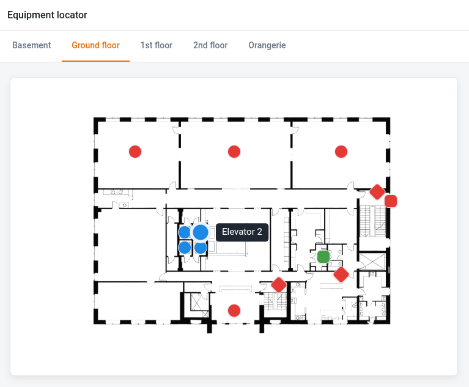
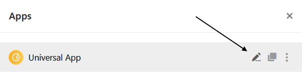
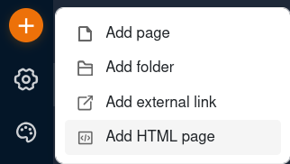
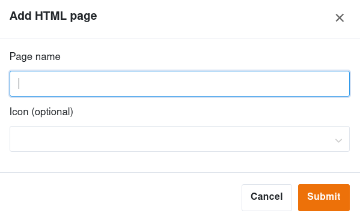
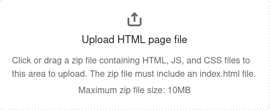

Die anderen [App-Seitentypen]() bieten zwar zahlreiche Konfigurationsmöglichkeiten, geben Aufbau und Verhalten einer Seite aber vor. Mithilfe von **HTML-Seiten** können Sie komplett individuelle Seiten auf Basis von HTML, JavaScript und CSS zu Ihrer App hinzufügen. So können Sie Apps exakt nach Ihren Vorstellungen gestalten und selbst komplexe Interaktionen problemlos umsetzen. **Typische Anwendungsfälle** sind:​
- Individuell gestaltete Formulare, Listen und Info-Seiten
- Eigene Diagrammtypen oder Schaubilder mit klickbaren Elementen
- Kombinierte Ansichten, z. B. Tabelle und Einzeldatensatz auf einer Seite

HTML-Seiten können **statische Inhalte** anzeigen, ihr wahres Potenzial entfalten sie jedoch in Verbindung mit den **Daten einer Base**. Genauso wie andere Seitentypen des App Builders können sie Daten aus einer Base abrufen und Datensätze in einer Base ändern. Bei der **Gestaltung der Benutzeroberfläche** gibt es nahezu keine Einschränkungen. Was sich mit HTML, CSS und JavaScript umsetzen lässt, können Sie auch als HTML-Seite in Ihre App einbauen.



Aktuell richtet sich der Seitentyp an **Benutzer mit Programmiererfahrung**. Der gesamte Code der Seite muss außerhalb von SeaTable erstellt und dann gebündelt in die App hochgeladen werden. Eine KI-Funktion, mit der Sie HTML-Seiten künftig auch in natürlicher Sprache und ohne Programmierkenntnisse erstellen können, ist jedoch bereits in Entwicklung.



## Wie Sie eine HTML-Seite anlegen

1. Öffnen Sie eine App im **Bearbeitungsmodus**. Fahren Sie dazu mit dem Mauszeiger über die App und klicken Sie auf das **Stift-Symbol** .
   
2. Klicken Sie oben links auf **den orangen Kreis mit dem Plus-Symbol** und wählen Sie im Anschluss **HTML-Seite hinzufügen** aus.
   
3. Geben Sie der Seite einen **Namen** und legen Sie optional ein **Icon** für die Seite fest.
    
4. Bestätigen Sie mit **Absenden**.
5. Erstellen Sie auf Ihrem Gerät eine **Zip-Datei**, die HTML-, JavaScript- und CSS-Dateien enthält.
6. **Laden Sie die Datei hoch**, indem Sie in den vorgesehenen Bereich klicken oder die Datei dorthin ziehen.
   
7. Anschließend rendert SeaTable die Datei als **Seite in der App**.



Die Zip-Datei darf **maximal 10 MB** groß sein und muss eine HTML-Datei namens **index.html** enthalten.



## Wie Sie die benötigten Dateien erstellen

Es gibt **zwei Wege**, eine HTML-Seite zu bauen und als Zip-Datei bereitzustellen:
- Der **Low-Code-Ansatz**: Gestalten Sie die Seite in einem **visuellen HTML-Editor**, verknüpfen Sie sie mithilfe vorgefertigter **Code-Schnipsel** mit Ihrer Base, fügen Sie optional **Bilder und Grafiken** hinzu und verpacken Sie alles als **Zip-Datei**. Diese Vorgehensweise ist ideal für individuell designte Formulare, Dashboards und Seiten mit simplen Lese- und Schreibvorgängen.
- Der **Entwickler-Ansatz**: Sobald Sie größere HTML-Seiten mit komplexerer Logik erstellen möchten, z. B. wenn Seitenelemente miteinander interagieren sollen, benötigen Sie die **vollständige JavaScript-Toolchain**. Für die Entwicklung sind **Node.js** und **npm**, ein **Entwicklungsserver** mit Live-Reload sowie ein in der Base generierter **API-Token** erforderlich.

Weiterführende Informationen, Beispiele und Vorlagen finden Sie in unserem [Developer-Handbuch](https://developer.seatable.com/html-pages/).