Mit diesem Seitentyp können Sie Ihrer Kreativität freien Lauf lassen und eine **individuelle Seite** ganz nach Ihren Wünschen bauen. Fügen Sie **Texte** und **Bilder** in Ihre Seite ein oder nutzen Sie **Statistiken**, um mit den Daten aus Ihrer Base aussagekräftige **Dashboards** zu erstellen.

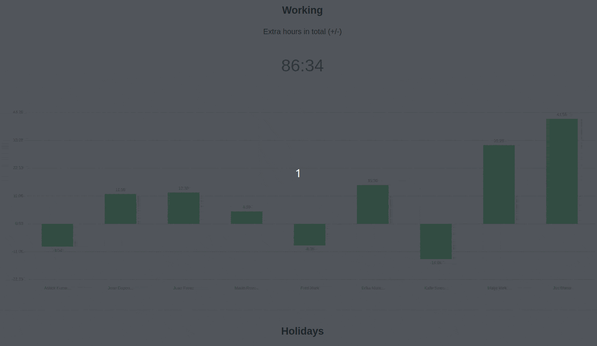

## Individuelle Seiten erstellen

Wenn Sie die Einstellungen einer Seite ändern möchten, klicken Sie in der Navigation auf das entsprechende  **Zahnrad-Symbol**.

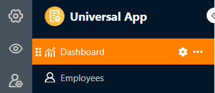

Über die **Seiteneinstellungen** können Sie verschiedene **Elemente** per Drag-and-Drop zu Ihrer Seite hinzufügen.

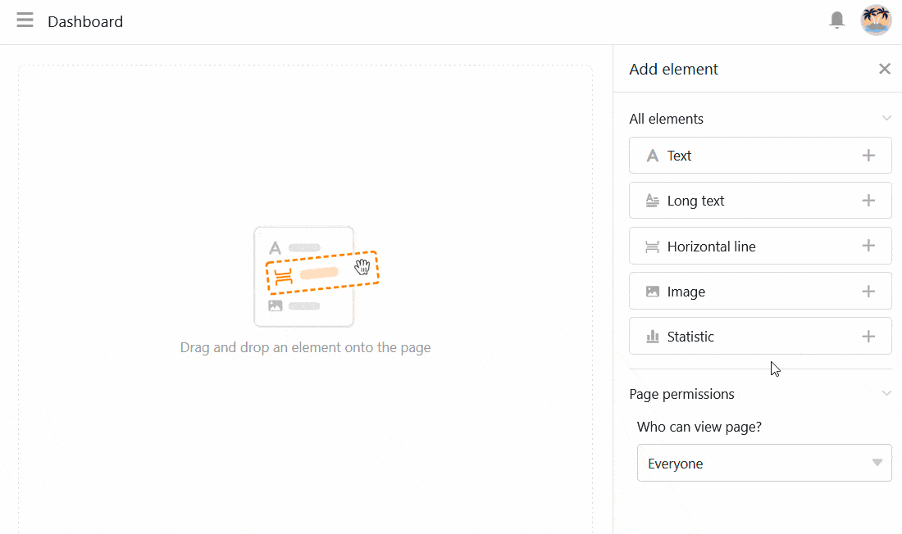

## Elemente kopieren, verschieben oder löschen

Wenn Sie ein bestehendes Element auf Ihrer individuellen Seite kopieren, verschieben oder löschen möchten, nutzen Sie einfach die drei entsprechenden **Symbole** an der oberen rechten Ecke des Rahmens.

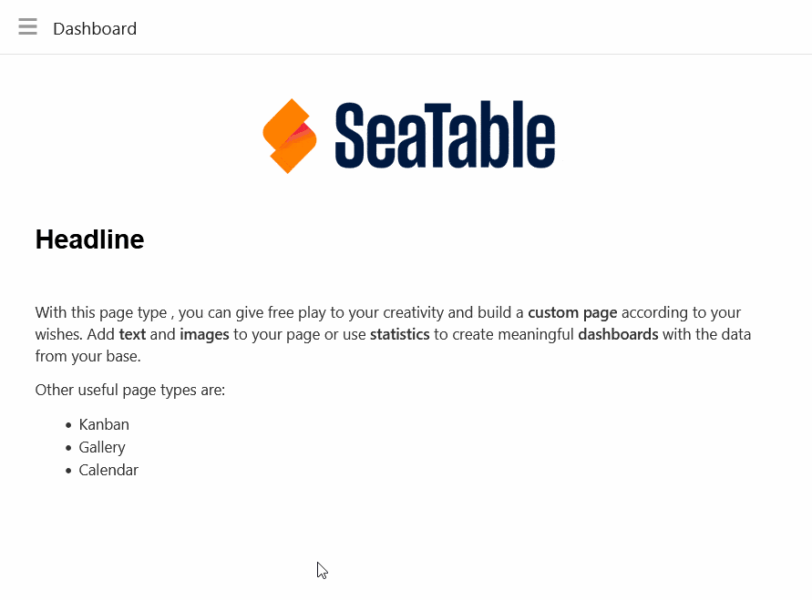

## Elementeinstellungen

Für jedes **Element** der individuellen Seite gibt es zusätzliche Einstellungen, die hauptsächlich die Formatierung und die grafische Konfiguration betreffen.

### Text

Text-Elemente eignen sich vor allem für **Überschriften** oder **kurze Texte**, die Sie auf Ihrer individuellen Seite platzieren wollen.

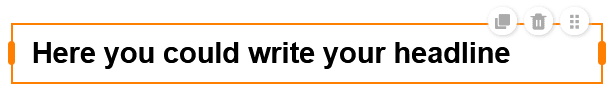

In den Elementeinstellungen können Sie zahlreiche Parameter festlegen:

- **Schriftart, -größe, -stärke und -farbe**
- **Zeilenabstand und Textausrichtung**
- **Hintergrund und Rahmen**

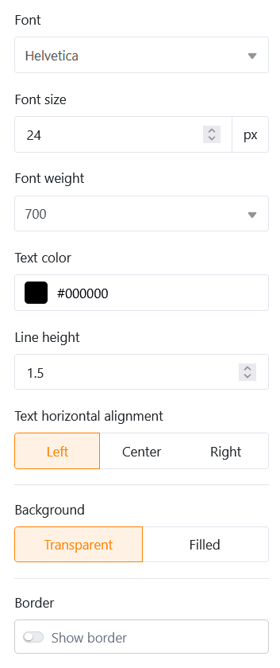

### Formatierter Text

Mit formatierten Text-Elementen können Sie, wie der Name schon sagt, **längere Texte formatieren**. Dabei öffnet sich der Texteditor, den Sie bereits vom Spaltentyp [Formatierter Text](https://seatable.io/docs/text-und-zahlen/die-spalten-text-und-formatierter-text/) kennen.

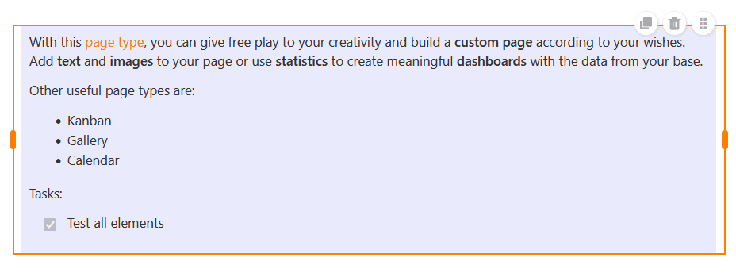

Da Sie im Texteditor bereits vielfältige Formatierungsoptionen haben, können Sie in den Elementeinstellungen nur noch die **Hintergrundfarbe** und den **Rahmen** der Textbox einstellen.

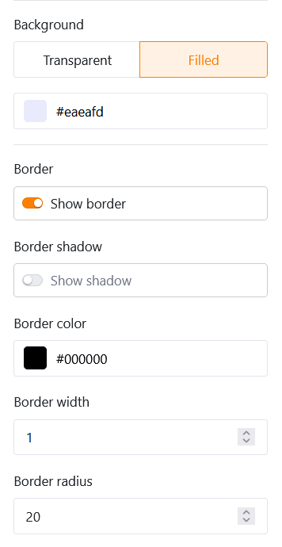

### Horizontale Linie

Um auf Ihrer individuellen Seite verschiedene Bereiche voneinander abzutrennen, können Sie eine **horizontale Linie** einziehen. Dabei können Sie eine **Farbe**, einen **Hintergrund** und einen **Rahmen** festlegen.

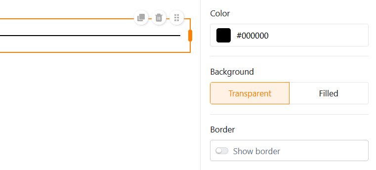

### Bilder

Um Ihre individuelle Seite schöner zu gestalten, können Sie ganz leicht **Bilder** hinzufügen. Klicken Sie dazu auf den Bilderrahmen, den Sie zuvor per Drag-and-Drop in die Seite eingebettet haben, und laden Sie das gewünschte Bild von Ihrem Gerät hoch.

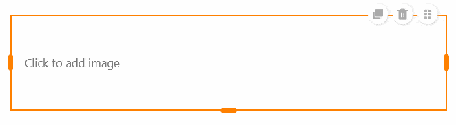

In den Elementeinstellungen können Sie den **Füllmodus**, den **Hintergrund** und den **Rahmen** des Bildes festlegen. Darüber hinaus können Sie **Hyperlinks** nutzen, um andere Seiten der App oder externe Ressourcen auf einem Bild zu verlinken.

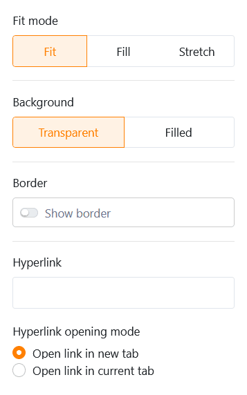

### Container

Ein Container gibt ein **Raster** vor, mit dem Sie andere Elemente (z. B. Texte, Bilder, Statistiken) leichter anordnen und in Gruppen zusammenfassen können. Zuallererst legen Sie daher fest, **wie viele Zeilen und Spalten** dieses Raster haben soll. Daraus ergeben sich die einzelnen Boxen, in die Sie per Drag-and-Drop andere Elemente einfügen können.

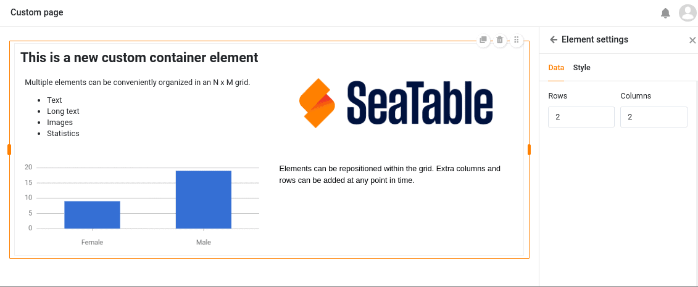

In den Elementeinstellungen können Sie dem Container einen **Titel** hinzufügen, dessen Schriftgröße, Schriftstärke und Ausrichtung Sie anpassen können. Zudem haben Sie die Möglichkeit, die **Hintergrundfarbe** und den **Rahmen** des Containers einzustellen.

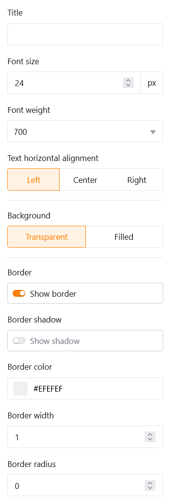

### Karte (Design-Vorlage)

Für ein schönes Seitenlayout sorgt auch die **Karte**, die ein Bild, eine Überschrift und einen Text zu einer Design-Vorlage vereint.

In diese Vorlage können Sie ein **Bild**, einen **Titel** und einen **Karteninhalt** (Text) einfügen. Darüber hinaus können Sie einen **Hyperlink** nutzen, um eine andere Seite der App oder eine externe Ressource zu verlinken.

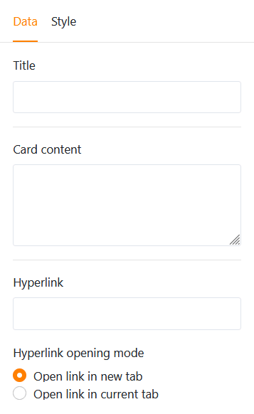

Was die Gestaltung der Karte angeht, haben Sie zuerst die Möglichkeit, den **Füllmodus** des Bildes zu ändern. Als Nächstes können Sie die **Schriftgröße, -stärke und -farbe** sowohl des Titels als auch des Karteninhalts anpassen. Zuletzt stellen Sie die **Hintergrundfarbe** und den **Rahmen** der Karte ein.

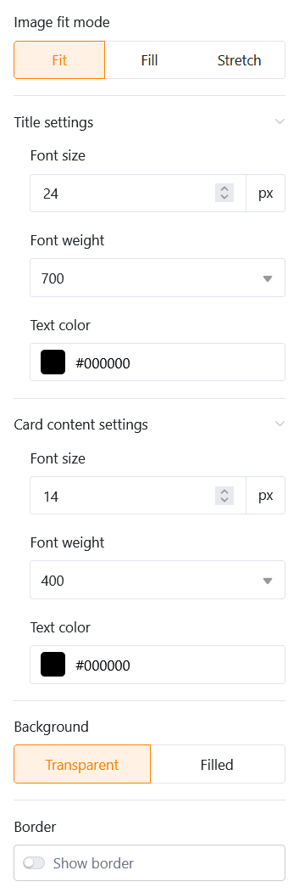

## Statistiken

Auf einer individuellen Seite Ihrer App können Sie die Daten aus der zugrundeliegenden Base mithilfe verschiedenster **Grafiken** und **Diagramme** veranschaulichen.

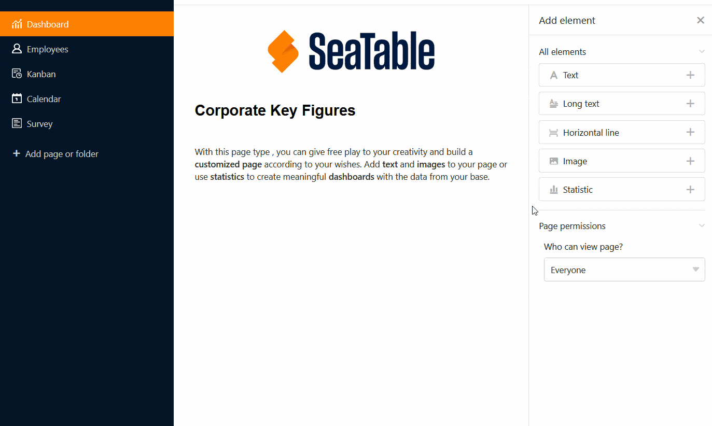

### Dateneinstellungen

Die **Konfiguration von Statistiken** weist dabei viele Ähnlichkeiten zum [Statistik-Modul](https://seatable.io/docs/plugins/anleitung-zum-statistik-plugin/) in der Base auf. Wählen Sie zunächst die **Tabelle**, aus der die Statistik Daten darstellen soll. Mit einem Klick auf die **entgegengesetzten Pfeile** können Sie den **Diagrammtyp** ändern.

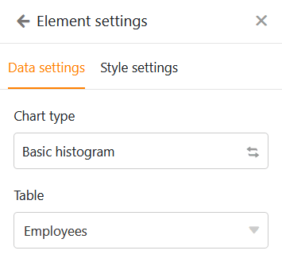

Sie können die Einträge filtern, um die in der Statistik angezeigten Daten einzugrenzen. Klicken Sie dazu auf **Filter hinzufügen**, wählen Sie die gewünschte **Spalte** und **Bedingung** und bestätigen Sie mit **Abschicken**.

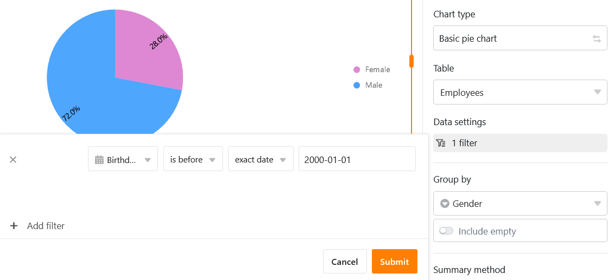

Zudem können Sie die **Drill-down-Funktion** aktivieren und genau festlegen, für welche Spalten die Daten bei einem Klick auf die Statistik zu sehen sein sollen. Bei deaktivierter Funktion erlaubt das Diagramm keine tieferen Einblicke in die zugrundeliegenden Daten. Der Benutzer sieht nur das Diagramm an sich.

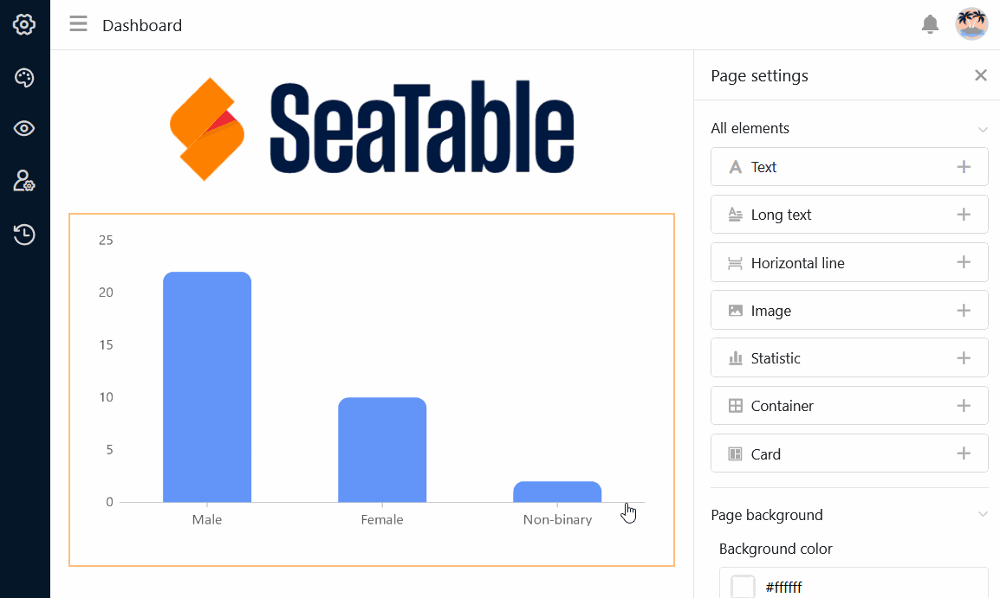

Bei einem Säulendiagramm müssen Sie die Spalte festlegen, welche die **Werte für die X-Achse** liefern soll. Klicken Sie auf das entsprechende Drop-down-Feld und wählen Sie die Spalte aus. Mit einem Regler können Sie einstellen, ob Sie **leere Zeilen** im Diagramm berücksichtigen wollen.

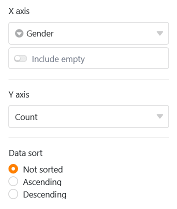

Entscheiden Sie dann, wie die **Werte auf der Y-Achse** dargestellt werden sollen. Sie können wählen zwischen der **Anzahl der Einträge**, die einen bestimmten Wert in der gewählten Spalte aufweisen, und der Option **Feld zusammenfassen**, bei der Sie in **numerischen Spalten** entweder die Summe, den Durchschnitt, die Anzahl eindeutiger Werte, das Maximum oder das Minimum auswerten können.

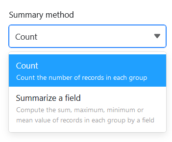

Bei **gruppierten Diagrammen** können Sie eine Spalte mit Optionen angeben, nach denen Sie gruppieren möchten. Bei einigen Diagrammtypen können Sie die Daten auch aufsteigend oder absteigend **sortieren**.

### Stileinstellungen

Je nach Diagrammtyp haben Sie unterschiedliche Stileinstellungen zur Auswahl.

Für ein **Säulendiagramm** können Sie beispielsweise die folgenden Einstellungen vornehmen:

- Titel, Schriftgröße, Schriftstärke und Ausrichtung
- Titel der X- und Y-Achse anzeigen
- Automatische Grenzen oder Minimum und Maximum der Y-Achse
- Farbe und Datenbeschriftung der Säulen
- Rahmen (Schatten, Farbe, Dicke und Radius)

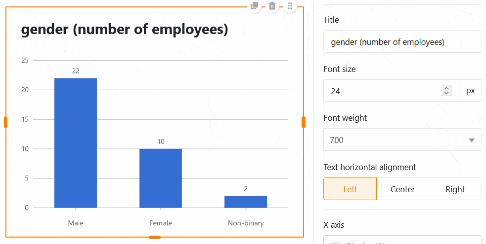

Für ein **Kuchendiagramm** können Sie die folgenden Einstellungen vornehmen:

- Titel, Schriftgröße, Schriftstärke und Ausrichtung
- Legende und Beschriftung anzeigen
- Position, Format und Schriftgröße der Labels
- Mindestanteil eines Sektors
- Rahmen (Schatten, Farbe, Dicke und Radius)

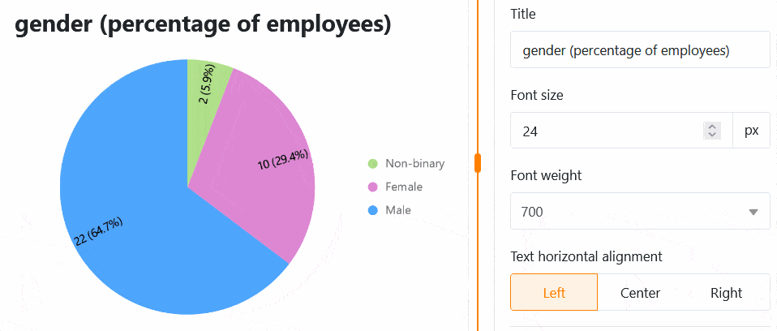

Alle Einstellungsänderungen werden **in Echtzeit** ausgeführt, d.h. das Diagramm wird bei jeder Einstellungsänderung unmittelbar aktualisiert. So können Sie direkt sehen, ob Sie das gewünschte Ergebnis erzielt haben oder nachjustieren müssen.

### Einfache Tabelle

Auf individuellen Seiten gibt es einen besonderen Statistiktyp: Die **Einfache Tabelle** erlaubt – ähnlich wie [Tabellenseiten](https://seatable.io/docs/seitentypen-in-universellen-apps/tabellenseiten-in-universellen-apps/) – die tabellarische Darstellung eines durch den App-Admin vorgefilterten und vorsortierten Datensatzes. Anders als auf der Tabellenseite ist es somit möglich, **mehrere Tabellen** auf einem Dashboard zu vereinen.

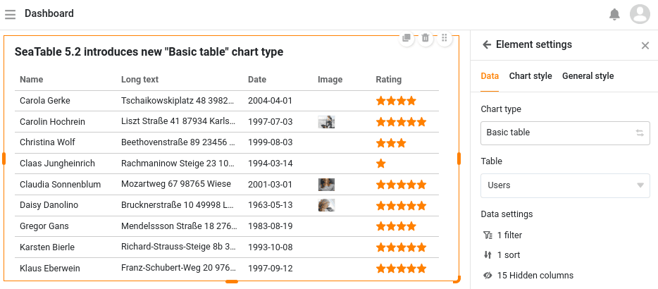

## Hintergrundfarbe der Seite einstellen

Über die Farben der einzelnen Seitenelemente hinaus können Sie auch die **Hintergrundfarbe** einer gesamten individuellen Seite einstellen.

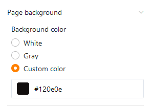

Wählen Sie zwischen Weiß, Grau und einer eigenen Farbe, die Sie per Hexadezimalcode eingeben oder im Farbwähler frei bestimmen können.

## Titelleiste ausblenden

Falls Sie auf einer individuellen Seite die **Titelleiste ausblenden** möchten, können Sie dies tun, indem Sie den entsprechenden **Regler aktivieren**.

## Seitenberechtigungen

Zu guter Letzt können Sie in den Seiteneinstellungen eingrenzen, wer die Seite sehen darf.

Das ist die einzige [Seitenberechtigung](https://seatable.io/docs/universelle-apps/seitenberechtigungen-in-einer-universellen-app/), die Sie bei individuellen Seiten zur Auswahl haben – denn über individuelle Seiten können keine Zeilen in der Tabelle hinzugefügt, verändert oder gelöscht werden.
