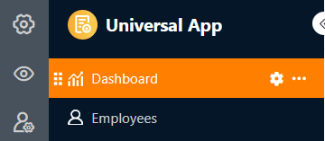
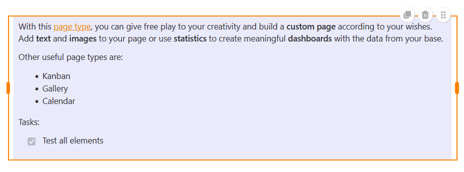
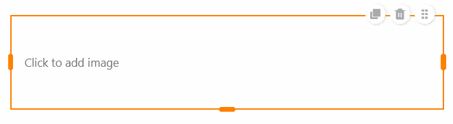
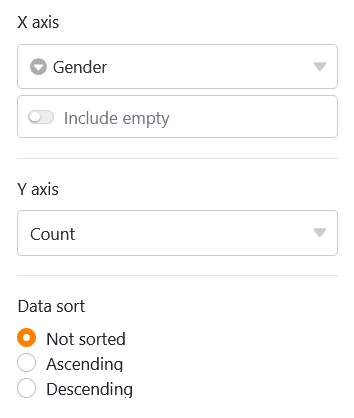
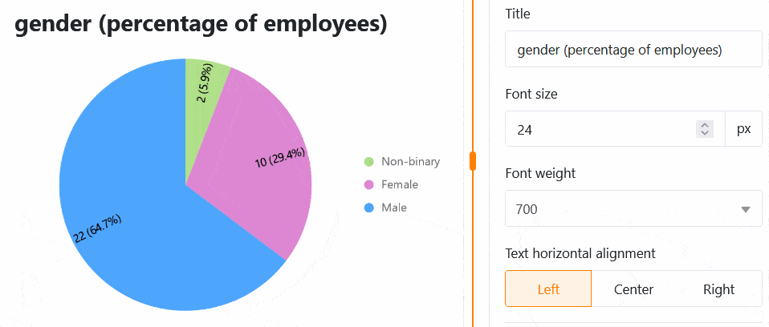

With this page type, you can give free rein to your creativity and build a **customized page** according to your wishes. Add **text** and **images** to your page or use **statistics** to create meaningful **dashboards** with the data from your base.

## Create individual pages

If you want to change the settings of a page, click on the corresponding  **cogwheel symbol** in the navigation bar.

You can use the **page settings** to add various **elements** to your page using drag-and-drop.

## Copy, move or delete elements

If you want to copy, move or delete an existing element on your individual page, simply use the three corresponding **symbols** in the top right-hand corner of the frame.

## Element settings

There are additional settings for each **element** of the individual page, which mainly affect the formatting and graphic configuration.

### Text

Text elements are particularly suitable for **headings** or **short texts** that you want to place on your individual page.

You can define numerous parameters in the element settings:

- **Font type, size, thickness and color**
- **Line spacing and text alignment**
- **Background and framework**

### Formatted text

As the name suggests, you can use formatted text elements to **format longer texts**. This opens the text editor that you already know from the [formatted text]() column type.

As you already have a wide range of formatting options in the text editor, you can only set the **background color** and the **frame of** the text box in the element settings.

### Horizontal line

To separate different areas on your individual page, you can draw a **horizontal line**. You can specify a **color**, a **background** and a **frame**.

### Images

You can easily add **pictures** to make your individual page more attractive. To do this, click on the picture frame that you have previously embedded in the page using drag-and-drop and upload the desired picture from your device.

In the element settings, you can define the **fill mode**, the **background** and the **frame** of the image. You can also use **hyperlinks** to link other pages of the app or external resources on an image.

### Container

A container provides a **grid** with which you can arrange other elements (e.g. texts, images, statistics) more easily and group them together. First of all, you therefore define **how many rows and columns** this grid should have. This results in the individual boxes into which you can insert other elements using drag-and-drop.

In the element settings, you can add a **title** to the container, the font size, font weight and alignment of which you can adjust. You also have the option of setting the **background color** and the **frame** of the container.

### Card (design template)

The **card**, which combines an image, a headline and a text into a design template, also ensures a beautiful page layout.

You can insert an **image**, a **title** and **card content** (text) into this template. You can also use a **hyperlink** to link to another page of the app or an external resource.

As far as the design of the card is concerned, you first have the option of changing the **fill mode** of the image. Next, you can adjust the **font size, weight and color of** both the title and the card content. Finally, you can set the **background color** and the **border** of the card.

## Statistics

On an individual page of your app, you can visualize the data from the underlying base using various **graphics** and **diagrams**.

### Data settings

The **configuration of statistics** is very similar to the [statistics module]() in Base. First select the **table** from which the statistics should display data. You can change the **chart type** by clicking on the **opposite arrows**.

You can filter the entries to narrow down the data displayed in the statistics. To do this, click on **Add filter**, select the desired **column** and **condition** and confirm with **Submit**.

You can also activate the **drill-down function** and specify exactly for which columns the data should be displayed when you click on the statistics. If the function is deactivated, the chart does not allow any deeper insights into the underlying data. The user only sees the chart itself.

For a bar chart, you must specify the column that is to provide the **values for the x-axis**. Click on the corresponding drop-down field and select the column. You can use a slider to set whether you want to include **empty rows** in the chart.

Then decide how the **values** should be displayed **on the Y-axis**. You can choose between the **number of entries** that have a specific value in the selected column and the **Summarize field** option, where you can evaluate either the sum, the average, the number of unique values, the maximum or the minimum in **numerical columns**.

For **grouped charts**, you can specify a column with options by which you want to group. For some chart types, you can also **sort** the data in ascending or descending order.

### Style settings

Depending on the chart type, you have different style settings to choose from.

For example, you can make the following settings for a **bar chart**:

- Title, font size, font weight and alignment
- Display the title of the X and Y axis
- Automatic limits or minimum and maximum of the Y-axis
- Color and data labeling of the columns
- Frame (shade, color, thickness and radius)

You can make the following settings for a **pie chart**:

- Title, font size, font weight and alignment
- Show legend and labeling
- Position, format and font size of the labels
- Minimum share of a sector
- Frame (shade, color, thickness and radius)

All setting changes are carried out **in real time**, i.e. the diagram is updated immediately each time a setting is changed. This allows you to see immediately whether you have achieved the desired result or need to make adjustments.

### Simple table

There is a special type of statistics on individual pages: Similar to [table pages](), the **simple table** allows the tabular display of a data set that has been pre-filtered and pre-sorted by the app admin. Unlike on the table page, it is therefore possible to combine **several tables** on one dashboard.

## Set the background color of the page

In addition to the colors of the individual page elements, you can also set the **background color** of an entire individual page.

Choose between white, grey and your own color, which you can enter using a hexadecimal code or specify freely in the color selector.

## Hide title bar

If you want to **hide** the **title bar** on an individual page, you can do this by **activating** the corresponding **slider**.

## Page authorizations

Last but not least, you can limit who can see the page in the page settings.

This is the only [page authorization]() you have to choose from for individual pages - because individual pages cannot be used to add, change or delete rows in the table.
