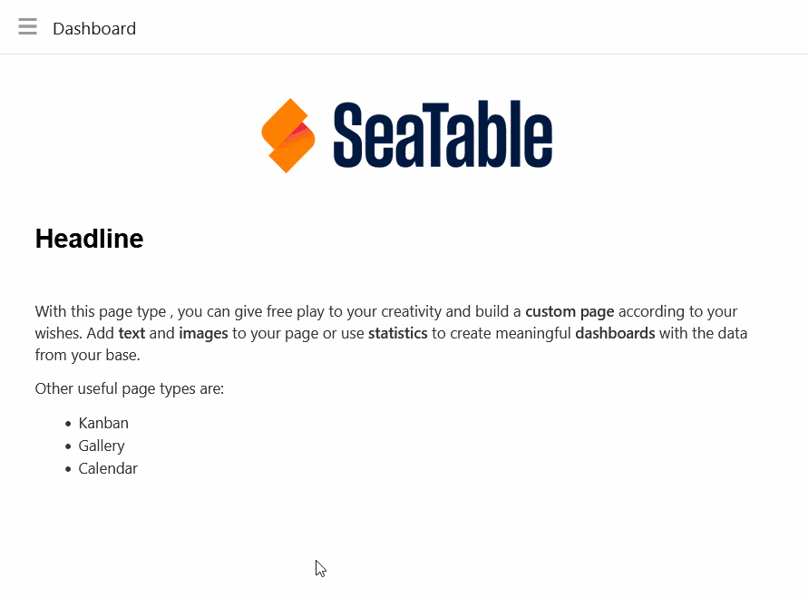
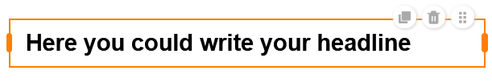
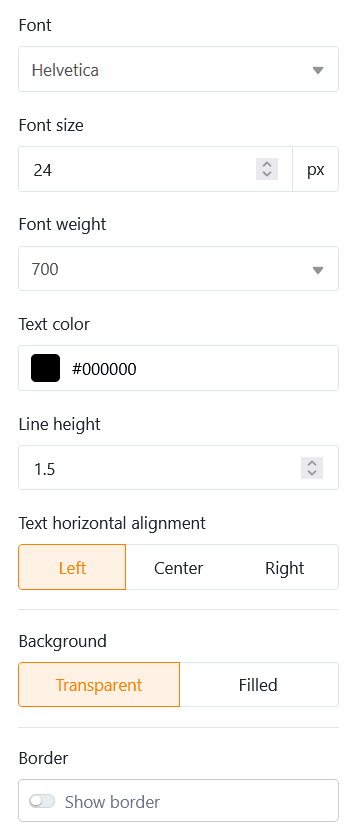

Con este tipo de página, puede dar rienda suelta a su creatividad y construir una **página personalizada** según sus deseos. Añade **texto** e **imágenes** a tu página o utiliza **estadísticas** para crear **cuadros de mando** significativos con los datos de tu base.

## Crear páginas personalizadas

Si desea cambiar la configuración de una página, haga clic en el **símbolo de rueda dentada**  correspondiente en la barra de navegación.

Puede añadir varios **elementos** a su página mediante arrastrar y soltar a través de la **configuración de la página**.

## Copiar, mover o eliminar elementos

Si desea copiar, desplazar o eliminar un elemento existente en su página personalizada, sólo tiene que utilizar los tres **iconos** correspondientes situados en la esquina superior derecha del marco.

## Configuración de los elementos

Existen ajustes adicionales para cada **elemento** de la página individual, que afectan principalmente al formato y a la configuración gráfica.

### Texto

Los elementos de texto son especialmente adecuados para **títulos** o **textos breves** que desee colocar en su página individual.

Puede definir numerosos parámetros en la configuración del elemento:

- **Tipo de letra, tamaño, grosor y color**
- **Interlineado y alineación del texto**
- **Antecedentes y marco**

### Texto con formato

Como su nombre indica, puede utilizar elementos de texto con formato para **dar formato a textos más largos**. Esto abre el editor de texto que ya conoce del tipo de columna Texto con [formato](https://seatable.io/es/docs/text-und-zahlen/die-spalten-text-und-formatierter-text/).

Como ya dispone de una amplia gama de opciones de formato en el editor de texto, sólo puede establecer el **color de fondo** y el **marco** del cuadro de texto en la configuración del elemento.

### Línea horizontal

Para separar diferentes áreas en su página personalizada, puede dibujar una **línea horizontal**. Puede especificar un **color**, un **fondo** y un **marco**.

### Imágenes

Puedes añadir **imágenes** fácilmente para hacer más atractiva tu página personalizada. Para ello, haz clic en el marco de imagen que has incrustado previamente en la página mediante arrastrar y soltar y carga la imagen deseada desde tu dispositivo.

En los ajustes del elemento, puedes definir el **modo de relleno**, el **fondo** y el **marco** de la imagen. También puedes utilizar **hipervínculos** para enlazar otras páginas de la app o recursos externos en una imagen.

### Contenedor

Un contenedor proporciona una **rejilla** con la que puede organizar otros elementos (por ejemplo, textos, imágenes, estadísticas) más fácilmente y agruparlos. En primer lugar, debe definir **cuántas filas y columnas** debe tener esta cuadrícula. Esto da lugar a las casillas individuales en las que puede insertar otros elementos mediante arrastrar y soltar.

En los ajustes del elemento, puede añadir un **título** al contenedor, cuyo tamaño de fuente, peso de fuente y alineación puede ajustar. También puede configurar el **color de fondo** y el **marco** del contenedor.

### Tarjeta (plantilla de diseño)

La **tarjeta**, que combina una imagen, un titular y un texto en una plantilla de diseño, también garantiza un atractivo diseño de página.

En esta plantilla puede insertar una **imagen**, un **título** y **el contenido de la tarjeta** (texto). También puedes utilizar un **hipervínculo** para enlazar a otra página de la app o a un recurso externo.

En cuanto al diseño de la tarjeta, primero tiene la opción de cambiar el **modo de relleno** de la imagen. A continuación, puede ajustar el **tamaño, el peso y el color de la fuente** tanto del título como del contenido de la tarjeta. Por último, puedes establecer el **color de fondo** y el **marco** de la tarjeta.

## Estadísticas

En una página individual de su aplicación, puede visualizar los datos de la base subyacente utilizando una amplia variedad de **gráficos** y **diagramas**.

### Configuración de datos

La **configuración de** las estadísticas es muy similar a la del [módulo de estadísticas](https://seatable.io/es/docs/plugins/anleitung-zum-statistik-plugin/) de Base. Primero seleccione la **tabla** de la que las estadísticas deben mostrar datos. Puede cambiar el **tipo de gráfico** haciendo clic en las **flechas opuestas**.

Puede filtrar las entradas para limitar los datos mostrados en las estadísticas. Para ello, haga clic en **Añadir filtro**, seleccione la **columna** y la **condición** deseadas y confirme con **Enviar**.

También puede activar la **función de desglose** y especificar exactamente para qué columnas deben mostrarse los datos al hacer clic en las estadísticas. Si la función está desactivada, el gráfico no permite profundizar en los datos subyacentes. El usuario sólo ve el gráfico en sí.

Para un gráfico de barras, debe especificar la columna que va a proporcionar los **valores para el eje x**. Haga clic en el campo desplegable correspondiente y seleccione la columna. Puede utilizar un control deslizante para establecer si desea incluir **filas vacías** en el gráfico.

A continuación, decida cómo deben mostrarse los **valores en el eje Y**. Puede elegir entre el **número de entradas** que tienen un valor específico en la columna seleccionada y la opción **Resumir campo**, donde puede evaluar la suma, la media, el número de valores únicos, el máximo o el mínimo en **columnas numéricas**.

Para los **gráficos agrupados**, puede especificar una columna con las opciones por las que desea agrupar. Para algunos tipos de gráficos, también puede **ordenar** los datos en orden ascendente o descendente.

### Ajustes de estilo

Dependiendo del tipo de diagrama, puede elegir entre diferentes estilos.

Por ejemplo, puede realizar los siguientes ajustes para un **gráfico de barras**:

- Título, tamaño, peso y alineación de la fuente
- Mostrar el título de los ejes X e Y
- Límites automáticos o mínimo y máximo del eje Y
- Etiquetado de colores y datos de las columnas
- Marco (tono, color, grosor y radio)

Puede realizar los siguientes ajustes para un **gráfico circular**:

- Título, tamaño, peso y alineación de la fuente
- Mostrar leyenda y etiquetado
- Posición, formato y tamaño de letra de las etiquetas
- Cuota mínima de un sector
- Marco (tono, color, grosor y radio)

Todos los cambios de ajuste se realizan **en tiempo real**, es decir, el diagrama se actualiza inmediatamente cada vez que se modifica un ajuste. Esto le permite ver inmediatamente si ha logrado el resultado deseado o si necesita hacer ajustes.

### Mesa simple

Existe un tipo especial de estadísticas en páginas individuales: la **tabla simple** permite -de forma similar a las páginas [de tablas](https://seatable.io/es/docs/seitentypen-in-universellen-apps/tabellenseiten-in-universellen-apps/) - la visualización tabular de un conjunto de datos que han sido prefiltrados y preclasificados por el administrador de la aplicación. A diferencia de la página de tablas, es posible combinar **varias tablas** en un panel de control.

## Definir el color de fondo de la página

Además de los colores de cada uno de los elementos de la página, también puede definir el **color de fondo** de toda la página.

Elija entre blanco, gris y su propio color, que puede introducir mediante un código hexadecimal o especificar libremente en el selector de color.

## Ocultar la barra de título

Si desea **ocultar** la **barra de título** en una página concreta, puede hacerlo **activando** el **control deslizante** correspondiente.

## Autorizaciones de páginas

Por último, pero no menos importante, puede restringir quién puede ver la página en la configuración de la página.

Esta es la única [autorización de página](https://seatable.io/es/docs/universelle-apps/seitenberechtigungen-in-einer-universellen-app/) que puede seleccionar para páginas individuales, ya que no se pueden añadir, modificar o eliminar filas en la tabla a través de páginas individuales.
