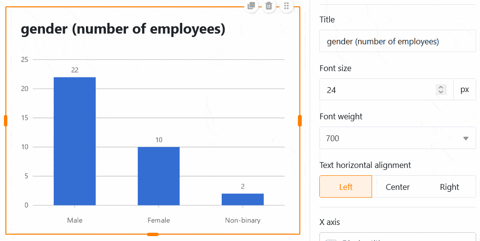

Avec ce type de page, vous pouvez laisser libre cours à votre créativité et construire une **page personnalisée** selon vos souhaits. Insérez **des textes** et **des images** dans votre page ou utilisez **des statistiques** pour créer **des tableaux de bord** pertinents à partir des données de votre base.

## Créer des pages personnalisées

Si vous souhaitez modifier les paramètres d'une page, cliquez dans la navigation sur le **symbole de la roue dentée**  correspondant.

Les **paramètres de page** vous permettent d'ajouter différents **éléments** à votre page par glisser-déposer.

## Copier, déplacer ou supprimer des éléments

Si vous souhaitez copier, déplacer ou supprimer un élément existant sur votre page individuelle, utilisez simplement les trois **icônes** correspondantes dans le coin supérieur droit du cadre.

## Paramètres des éléments

Pour chaque **élément** de la page individuelle, il existe des paramètres supplémentaires qui concernent principalement le formatage et la configuration graphique.

### Texte

Les éléments de texte conviennent surtout pour les **titres** ou **les textes courts** que vous souhaitez placer sur votre page individuelle.

Vous pouvez définir de nombreux paramètres dans les paramètres des éléments :

- **la police, la taille, l'épaisseur et la couleur des caractères**
- **Espacement des lignes et alignement du texte**
- **Contexte et cadre**

### Texte formaté

Les éléments de texte formaté vous permettent, comme leur nom l'indique, de **formater des textes plus longs**. Pour cela, l'éditeur de texte que vous connaissez déjà du type de colonne [Texte formaté]() s'ouvre.

Comme vous disposez déjà de nombreuses options de formatage dans l'éditeur de texte, il ne vous reste plus qu'à régler la **couleur de fond** et le **cadre de** la zone de texte dans les paramètres des éléments.

### Ligne horizontale

Pour séparer différentes zones sur votre page individuelle, vous pouvez tracer une **ligne horizontale**. Pour ce faire, vous pouvez définir une **couleur**, un **arrière-plan** et un **cadre**.

### Images

Pour rendre votre page individuelle plus belle, vous pouvez facilement ajouter **des images**. Pour ce faire, cliquez sur le cadre photo que vous avez préalablement intégré à la page par glisser-déposer et téléchargez l'image souhaitée depuis votre appareil.

Dans les paramètres des éléments, vous pouvez définir le **mode de remplissage**, l'**arrière-plan** et le **cadre de** l'image. En outre, vous pouvez utiliser **des hyperliens** pour lier d'autres pages de l'application ou des ressources externes sur une image.

### Conteneur

Un conteneur fournit une **grille** qui vous permet d'organiser plus facilement d'autres éléments (par ex. textes, images, statistiques) et de les regrouper. Vous déterminez donc tout d'abord le **nombre de lignes et de colonnes** de cette grille. Il en résulte les différentes boîtes dans lesquelles vous pouvez insérer d'autres éléments par glisser-déposer.

Dans les paramètres des éléments, vous pouvez ajouter un **titre** au conteneur, dont vous pouvez adapter la taille, l'épaisseur et l'alignement de la police. Vous avez également la possibilité de définir la **couleur de fond** et le **cadre** du conteneur.

### Carte (modèle de design)

La **carte**, qui réunit une image, un titre et un texte en un modèle de design, assure également une belle mise en page.

Vous pouvez insérer une **image**, un **titre** et un **contenu cartographique** (texte) dans ce modèle. En outre, vous pouvez utiliser un **hyperlien** pour relier une autre page de l'application ou une ressource externe.

En ce qui concerne la conception de la carte, vous avez d'abord la possibilité de modifier le **mode de remplissage** de l'image. Ensuite, vous pouvez adapter la **taille, l'épaisseur et la couleur de la police** du titre et du contenu de la carte. Enfin, vous pouvez définir la **couleur de fond** et le **cadre de** la carte.

## Statistiques

Sur une page individuelle de votre application, vous pouvez illustrer les données de la base sous-jacente à l'aide de différents **graphiques** et **diagrammes**.

### Paramètres de données

La **configuration des statistiques** présente de nombreuses similitudes avec le [module statistique]() de la base. Sélectionnez d'abord le **tableau** à partir duquel les statistiques doivent représenter les données. En cliquant sur les **flèches opposées**, vous pouvez modifier le **type de graphique**.

Vous pouvez filtrer les entrées afin de limiter les données affichées dans les statistiques. Pour ce faire, cliquez sur **Ajouter un filtre**, sélectionnez la **colonne** et **la condition** souhaitées et confirmez en cliquant sur **Envoyer**.

De plus, vous pouvez activer la **fonction d'exploration** et définir précisément les colonnes pour lesquelles les données doivent être affichées lorsque vous cliquez sur les statistiques. Lorsque cette fonction est désactivée, le graphique ne permet pas de voir plus en profondeur les données sous-jacentes. L'utilisateur ne voit que le graphique en lui-même.

Dans le cas d'un diagramme à colonnes, vous devez définir la colonne qui doit fournir les **valeurs pour l'axe des abscisses**. Cliquez sur le champ déroulant correspondant et sélectionnez la colonne. Un curseur vous permet de définir si vous souhaitez prendre en compte **les lignes vides** dans le diagramme.

Décidez ensuite comment les **valeurs** doivent être représentées **sur l'axe des ordonnées**. Vous pouvez choisir entre le **nombre d'entrées** qui présentent une certaine valeur dans la colonne sélectionnée et l'option **Résumer le champ**, qui vous permet d'évaluer dans des **colonnes numériques** soit la somme, la moyenne, le nombre de valeurs uniques, le maximum ou le minimum.

Pour les **graphiques groupés**, vous pouvez spécifier une colonne d'options selon lesquelles vous souhaitez grouper. Pour certains types de graphiques, vous pouvez également **trier** les données par ordre croissant ou décroissant.

### Paramètres de style

Selon le type de graphique, vous avez le choix entre différents paramètres de style.

Pour un **diagramme en bâtons**, vous pouvez par exemple

- Titre, taille de la police, épaisseur et alignement
- Afficher le titre des axes X et Y
- Limites automatiques ou minimum et maximum de l'axe Y
- Couleur et inscription des données sur les colonnes
- Cadre (ombre, couleur, épaisseur et rayon)

Pour un **graphique à secteurs**, vous pouvez définir les paramètres suivants :

- Titre, taille de la police, épaisseur et alignement
- Afficher la légende et l'étiquette
- Position, format et taille de la police des labels
- Part minimale d'un secteur
- Cadre (ombre, couleur, épaisseur et rayon)

Toutes les modifications de réglage sont effectuées **en temps réel**, ce qui signifie que le graphique est immédiatement mis à jour à chaque modification de réglage. Vous pouvez ainsi voir directement si vous avez obtenu le résultat souhaité ou si vous devez procéder à des ajustements.

### Tableau simple

Sur les pages individuelles, il existe un type de statistiques particulier : le **tableau simple** permet - comme les [pages de tableaux]() - de présenter sous forme de tableau un ensemble de données préfiltrées et prétriées par l'administrateur de l'application. Contrairement à la page de tableau, il est donc possible de réunir **plusieurs tableaux** sur un même tableau de bord.

## Régler la couleur de fond de la page

Au-delà des couleurs des différents éléments de la page, vous pouvez également définir la **couleur de fond de** toute une page individuelle.

Choisissez entre le blanc, le gris et une couleur personnalisée que vous pouvez entrer par code hexadécimal ou déterminer librement dans le sélecteur de couleurs.

## Masquer la barre de titre

Si vous souhaitez **masquer** la **barre de titre** sur une page individuelle, vous pouvez le faire en **activant** le **curseur** correspondant.

## Autorisations des pages

Enfin, vous pouvez limiter les personnes autorisées à voir la page dans les paramètres de la page.

C'est la seule [autorisation de page]() que vous pouvez choisir pour les pages individuelles - car aucune ligne ne peut être ajoutée, modifiée ou supprimée dans le tableau via les pages individuelles.
