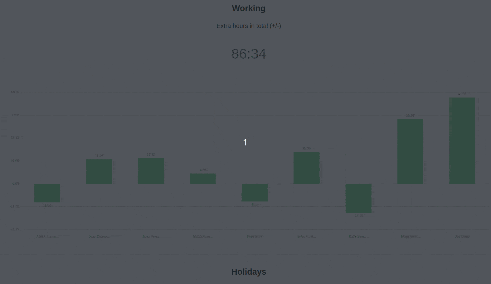
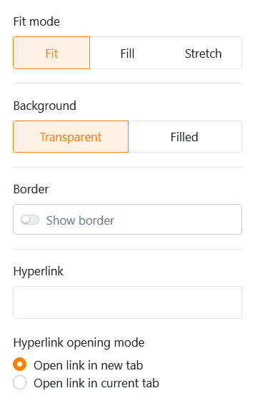
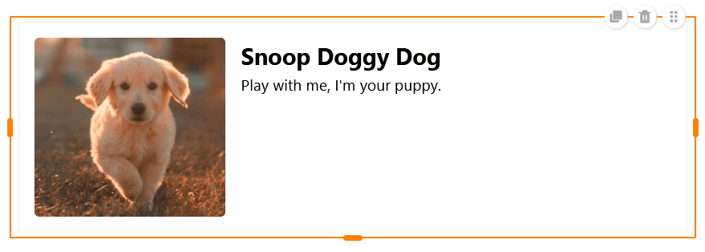
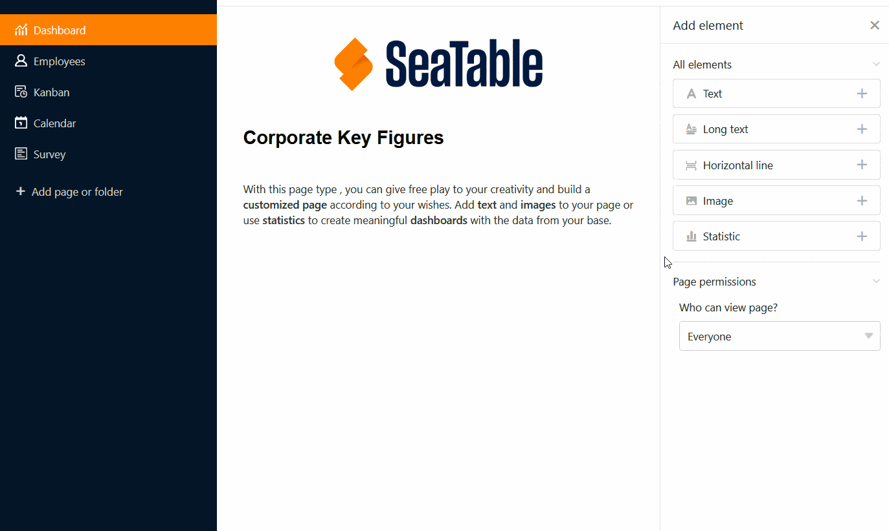
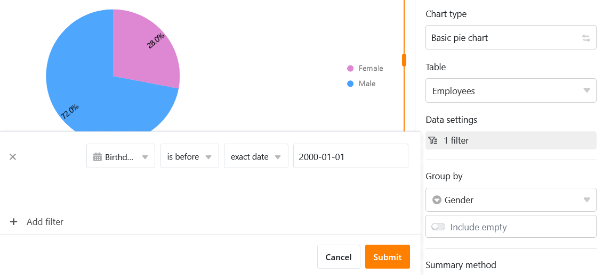
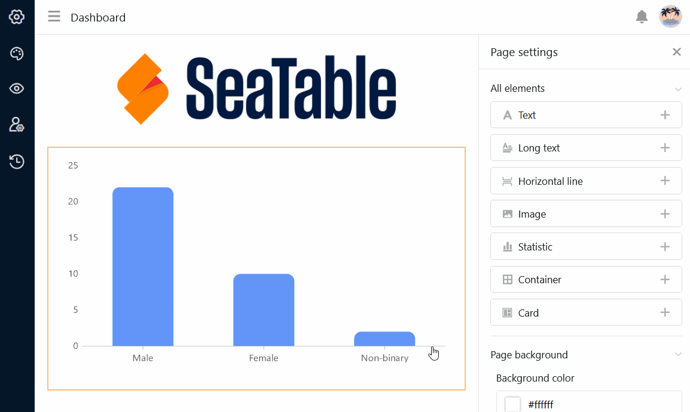

Com este tipo de página, pode dar asas à sua criatividade e construir uma **página personalizada** de acordo com os seus desejos. Adicione **texto** e **imagens** à sua página ou utilize **estatísticas** para criar **painéis de controlo** significativos com os dados da sua base.

## Criar páginas personalizadas

Se pretender alterar as definições de uma página, clique no **símbolo da roda dentada**  correspondente na barra de navegação.

Pode adicionar vários **elementos** à sua página utilizando a função arrastar e largar através das **definições da página**.

## Copiar, mover ou apagar elementos

Se quiser copiar, mover ou apagar um elemento existente na sua página personalizada, basta utilizar os três **símbolos** correspondentes no canto superior direito da moldura.

## Definições de elementos

Existem definições adicionais para cada **elemento** da página individual, que afectam principalmente a formatação e a configuração gráfica.

### Texto

Os elementos de texto são particularmente adequados para **títulos** ou **textos curtos** que pretende colocar na sua página individual.

É possível definir vários parâmetros nas definições do elemento:

- **Tipo, tamanho, espessura e cor dos caracteres**
- **Espaçamento entre linhas e alinhamento do texto**
- **Antecedentes e enquadramento**

### Texto formatado

Como o nome sugere, pode utilizar elementos de texto formatado para **formatar textos mais longos**. Isto abre o editor de texto que já conhece do tipo de coluna [Texto formatado]().

Como já dispõe de uma vasta gama de opções de formatação no editor de texto, só pode definir a **cor de fundo** e a **moldura da** caixa de texto nas definições do elemento.

### Linha horizontal

Para separar diferentes áreas na sua página personalizada, pode desenhar uma **linha horizontal**. Pode especificar uma **cor**, um **fundo** e uma **moldura**.

### Imagens

Pode adicionar facilmente **imagens** para tornar a sua página personalizada mais atractiva. Para o fazer, clique na moldura de imagem que incorporou anteriormente na página utilizando a função arrastar e largar e carregue a imagem pretendida a partir do seu dispositivo.

Nas definições do elemento, pode definir o **modo de preenchimento**, o **fundo** e a **moldura** da imagem. Também pode utilizar **hiperligações** para ligar outras páginas da aplicação ou recursos externos numa imagem.

### Contentor

Um contentor fornece uma **grelha** com a qual pode organizar mais facilmente outros elementos (por exemplo, textos, imagens, estatísticas) e agrupá-los. Em primeiro lugar, define-se **o número de linhas e colunas** que esta grelha deve ter. Isto resulta nas caixas individuais nas quais pode inserir outros elementos utilizando o método de arrastar e largar.

Nas definições do elemento, pode adicionar um **título** ao contentor, cujo tamanho, peso e alinhamento pode ajustar. Também tem a opção de definir a **cor de fundo** e a **moldura** do contentor.

### Cartão (modelo de desenho)

O **cartão**, que combina uma imagem, um título e um texto num modelo de design, também garante uma apresentação atractiva da página.

Pode inserir uma **imagem**, um **título** e **o conteúdo do cartão** (texto) neste modelo. Também pode utilizar uma **hiperligação** para ligar a outra página da aplicação ou a um recurso externo.

No que diz respeito ao design do cartão, tem primeiro a opção de alterar o **modo de preenchimento** da imagem. De seguida, pode ajustar o **tamanho, o peso e a cor do tipo de letra do** título e **do** conteúdo do cartão. Finalmente, pode definir a **cor de fundo** e a **moldura** do cartão.

## Estatísticas

Numa página individual da sua aplicação, pode visualizar os dados da base subjacente utilizando uma grande variedade de **gráficos** e **diagramas**.

### Definições de dados

A **configuração das estatísticas** é muito semelhante à do [módulo de estatísticas]() do Base. Em primeiro lugar, seleccione a **tabela** a partir da qual as estatísticas devem apresentar os dados. Pode alterar o **tipo de gráfico** clicando nas **setas opostas**.

Pode filtrar as entradas para restringir os dados apresentados nas estatísticas. Para tal, clique em **Adicionar filtro**, seleccione a **coluna** e a **condição** pretendidas e confirme com **Enviar**.

Também é possível ativar a **função de pesquisa** e especificar exatamente para que colunas os dados devem ser apresentados quando se clica nas estatísticas. Se a função estiver desactivada, o gráfico não permite qualquer aprofundamento dos dados subjacentes. O utilizador apenas vê o gráfico propriamente dito.

Para um gráfico de barras, é necessário especificar a coluna que deve fornecer os **valores para o eixo x**. Clique no campo pendente correspondente e seleccione a coluna. Pode utilizar um cursor para definir se pretende incluir **linhas vazias** no gráfico.

De seguida, decida como os **valores** devem ser apresentados **no eixo Y**. Pode escolher entre o **número de entradas** que têm um valor específico na coluna selecionada e a opção de **campo Resumir**, onde pode avaliar a soma, a média, o número de valores únicos, o máximo ou o mínimo em **colunas numéricas**.

Para **gráficos agrupados**, pode especificar uma coluna com opções pelas quais pretende agrupar. Para alguns tipos de gráficos, também é possível **ordenar** os dados por ordem ascendente ou descendente.

### Definições de estilo

Dependendo do tipo de diagrama, pode escolher entre diferentes definições de estilo.

Por exemplo, pode efetuar as seguintes definições para um **gráfico de barras**:

- Título, tamanho do tipo de letra, peso do tipo de letra e alinhamento
- Mostrar o título dos eixos X e Y
- Limites automáticos ou mínimo e máximo do eixo Y
- Etiquetagem das colunas por cores e dados
- Moldura (tonalidade, cor, espessura e raio)

É possível efetuar as seguintes definições para um **gráfico de pizza**:

- Título, tamanho do tipo de letra, peso do tipo de letra e alinhamento
- Mostrar legenda e rotulagem
- Posição, formato e tamanho dos caracteres das etiquetas
- Quota mínima de um sector
- Moldura (tonalidade, cor, espessura e raio)

Todas as alterações de configuração são efectuadas **em tempo real**, ou seja, o diagrama é atualizado imediatamente sempre que uma configuração é alterada. Isto permite-lhe ver imediatamente se alcançou o resultado desejado ou se precisa de fazer ajustes.

### Mesa simples

Existe um tipo especial de estatísticas em páginas individuais: a **tabela simples** permite - à semelhança das [páginas de tabela]() - a apresentação tabular de um conjunto de dados que foi pré-filtrado e pré-classificado pelo administrador da aplicação. Ao contrário da página de tabela, é possível combinar **várias tabelas** num único painel.

## Definir a cor de fundo da página

Para além das cores dos elementos individuais da página, também pode definir a **cor de fundo** de uma página individual inteira.

Escolha entre branco, cinzento e a sua própria cor, que pode ser introduzida através de um código hexadecimal ou especificada livremente no seletor de cores.

## Ocultar a barra de título

Se pretender **ocultar** a **barra de título** numa página individual, pode fazê-lo activando a **barra deslizante** correspondente.

## Autorizações de páginas

Por último, mas não menos importante, pode restringir quem pode ver a página nas definições da página.

Esta é a única [autorização de página]() que pode selecionar para páginas individuais - porque nenhuma linha pode ser adicionada, alterada ou eliminada na tabela através de páginas individuais.
