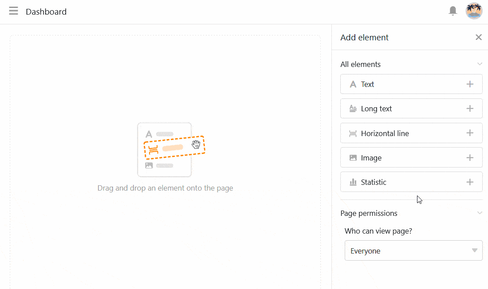
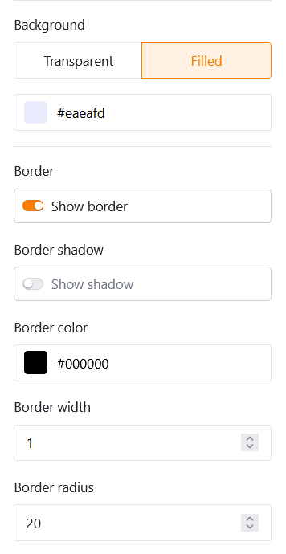
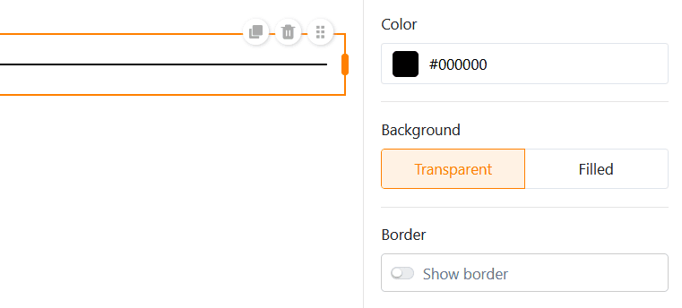
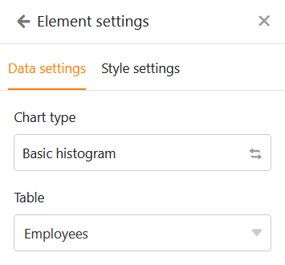

С помощью этого типа страницы вы можете дать волю своему творчеству и создать **индивидуальную страницу** в соответствии с вашими пожеланиями. Добавьте на страницу **текст** и **изображения** или используйте **статистику** для создания содержательных **панелей** с данными из вашей базы.

## Создание пользовательских страниц

Если вы хотите изменить настройки какой-либо страницы, нажмите на соответствующий **символ**  на панели навигации.

Вы можете добавлять различные **элементы** на свою страницу с помощью перетаскивания через **настройки страницы**.

## Копирование, перемещение или удаление элементов

Если вы хотите скопировать, переместить или удалить существующий элемент на вашей странице, просто воспользуйтесь тремя соответствующими **иконками** в правом верхнем углу рамки.

## Настройки элементов

Для каждого **элемента** отдельной страницы существуют дополнительные настройки, которые в основном влияют на форматирование и графическую конфигурацию.

### Текст

Текстовые элементы особенно хорошо подходят для **заголовков** или **коротких текстов**, которые вы хотите разместить на отдельной странице.

В настройках элемента можно задать множество параметров:

- **Тип, размер, толщина и цвет шрифта**
- **Межстрочный интервал и выравнивание текста**
- **Предпосылки и рамки**

### Форматированный текст

Как следует из названия, вы можете использовать элементы форматированного текста для **форматирования длинных текстов**. При этом открывается текстовый редактор, уже знакомый вам по типу столбца " [Форматированный текст]() ".

Поскольку в текстовом редакторе у вас уже есть широкий спектр возможностей форматирования, в настройках элемента можно задать только **цвет фона** и **рамку** текстового поля.

### Горизонтальная линия

Чтобы разделить разные области на странице, можно провести **горизонтальную линию**. Вы можете задать **цвет**, **фон** и **рамку**.

### Изображения

Вы можете легко добавить **изображения**, чтобы сделать вашу страницу более привлекательной. Для этого щелкните по рамке с изображением, которую вы ранее вставили на страницу с помощью перетаскивания, и загрузите нужную картинку с вашего устройства.

В настройках элемента можно задать **режим заливки**, **фон** и **рамку** изображения. Вы также можете использовать **гиперссылки** для размещения на изображении ссылок на другие страницы приложения или внешние ресурсы.

### Контейнер

Контейнер представляет собой **сетку**, с помощью которой вы можете легче расположить другие элементы (например, тексты, изображения, статистику) и сгруппировать их вместе. Прежде всего, вы определяете **, сколько строк и столбцов** должно быть в этой сетке. В результате образуются отдельные ячейки, в которые можно вставлять другие элементы с помощью перетаскивания.

В настройках элемента можно добавить **заголовок** к контейнеру, размер, вес и выравнивание шрифта которого можно регулировать. Также можно задать **цвет фона** и **рамку** контейнера.

### Открытка (шаблон дизайна)

**Карточка**, объединяющая изображение, заголовок и текст в шаблон дизайна, также обеспечивает привлекательный макет страницы.

В этот шаблон можно вставить **изображение**, **заголовок** и **содержание карточки** (текст). Вы также можете использовать **гиперссылку** для ссылки на другую страницу приложения или внешний ресурс.

Что касается дизайна открытки, то сначала вы можете изменить **режим заливки** изображения. Затем можно настроить **размер, вес и цвет шрифта** как заголовка, так и содержимого открытки. Наконец, вы можете задать **цвет фона** и **рамку** открытки.

## Статистика

На отдельной странице вашего приложения вы можете визуализировать данные из базовой базы с помощью разнообразных **графиков** и **диаграмм**.

### Настройки данных

**Настройка статистики** очень похожа на настройку [модуля статистики]() в Base. Сначала выберите **таблицу**, данные из которой должны отображаться в статистике. Вы можете изменить **тип графика**, нажав на **противоположные стрелки**.

Вы можете отфильтровать записи, чтобы сузить круг данных, отображаемых в статистике. Для этого нажмите кнопку **Добавить фильтр**, выберите нужный **столбец** и **условие** и подтвердите выбор кнопкой **Отправить**.

Вы также можете активировать **функцию углубления** и указать, по каким именно столбцам должны отображаться данные при нажатии на статистику. Если функция отключена, график не позволяет глубже изучить данные, лежащие в основе. Пользователь видит только сам график.

Для гистограммы необходимо указать столбец, в котором будут находиться **значения для оси x**. Щелкните в соответствующем раскрывающемся поле и выберите столбец. С помощью ползунка можно установить, нужно ли включать в диаграмму **пустые строки**.

Затем определите, как будут отображаться **значения на оси Y**. Вы можете выбрать между **количеством записей**, имеющих определенное значение в выбранном столбце, и опцией **Суммировать поле**, где вы можете оценить сумму, среднее значение, количество уникальных значений, максимум или минимум в **числовых столбцах**.

Для **сгруппированных диаграмм** можно указать столбец с параметрами, по которым нужно сгруппировать данные. Для некоторых типов диаграмм можно также **сортировать** данные по возрастанию или убыванию.

### Настройки стиля

В зависимости от типа диаграммы вы можете выбрать различные настройки стиля.

Например, для **гистограммы** можно задать следующие настройки:

- Заголовок, размер шрифта, вес шрифта и выравнивание
- Отображение заголовка оси X и Y
- Автоматические ограничения или минимум и максимум по оси Y
- Цветовая и информационная маркировка колонок
- Рама (оттенок, цвет, толщина и радиус)

Для **круговой диаграммы** можно задать следующие настройки:

- Заголовок, размер шрифта, вес шрифта и выравнивание
- Показать легенду и маркировку
- Положение, формат и размер шрифта надписей
- Минимальная доля сектора
- Рама (оттенок, цвет, толщина и радиус)

Все изменения настроек происходят **в режиме реального времени**, т.е. диаграмма обновляется при каждом изменении настроек. Это позволяет сразу увидеть, достигли ли вы желаемого результата или необходимо внести коррективы.

### Простой стол

Существует особый тип статистики на отдельных страницах: **простая таблица** позволяет - подобно [страницам таблиц]() - отображать в табличном виде набор данных, предварительно отфильтрованных и отсортированных администратором приложения. В отличие от страницы таблицы, здесь можно объединить **несколько таблиц** на одной приборной панели.

## Установите цвет фона страницы

Помимо цветов отдельных элементов страницы, вы можете задать **цвет фона** всей страницы.

Выбирайте между белым, серым и собственным цветом, который можно ввести с помощью шестнадцатеричного кода или свободно указать в селекторе цветов.

## Скрыть строку заголовка

Если вы хотите **скрыть строку заголовка** на отдельной странице, вы можете сделать это, **активировав** соответствующий **ползунок**.

## Разрешения на страницы

И последнее, но не менее важное: в настройках страницы вы можете ограничить круг лиц, которые могут ее видеть.

Это единственная [авторизация]()\- потому что через отдельные страницы нельзя добавлять, изменять или удалять строки в таблице.
