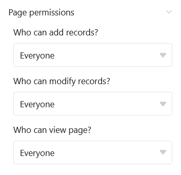

Este tipo de página de la aplicación universal funciona de forma similar al [complemento de calendario]() de la tabla en un **calendario**. Un caso de uso específico podría ser, por ejemplo, la visualización en el calendario de las próximas **reuniones**.

## Configuración de página

Si desea cambiar la configuración de una página, haga clic en el **símbolo de rueda dentada**  correspondiente en la barra de navegación.

En la **configuración de la página**, puede seleccionar el **título**, la **fecha de inicio** y el **color** de las **entradas** que aparecen en el calendario, así como el **día en que comienza** la semana, entre otras cosas.

## Filtros preestablecidos y columnas ocultas

Puede definir **filtros preestablecidos** y **columnas ocultas** para limitar los datos que se muestran a los usuarios.

Para ello, haga clic en **Añadir filtro**, seleccione la **columna** y la **condición** deseadas y confirme con **Enviar**.

Los usuarios pueden ver más información sobre una cita haciendo clic en una entrada del calendario.

Por lo tanto, decida qué datos deben ser **visibles** y muestre u oculte las columnas correspondientes utilizando los **controles deslizantes**.



## Añadir entrada de calendario

Si dispone de la autorización adecuada, puede **añadir nuevas entradas** directamente en una página de calendario. En la vista del mes, haga clic en el pequeño **signo más** situado en la esquina superior derecha de una ficha. La **fecha de** este día ya está rellenada.

Independientemente de la fecha, también puede hacer clic en el gran **símbolo circular "más"** situado en la esquina inferior derecha de la página. Se abrirá una ventana con los **detalles de la línea**. Introduzca allí todos los datos necesarios y guarde la entrada haciendo clic en **Enviar**.

## Editar y mover entradas de la agenda

Puedes editar fácilmente las entradas de la agenda **haciendo clic en una entrada** y realizando los cambios deseados en los **detalles de la línea** que se abren. También puede mover cómodamente las entradas del calendario **mediante arrastrar y soltar**. SeaTable ajusta automáticamente los valores en las respectivas [columnas de fechas]().

## Autorizaciones de páginas

En la parte inferior de la configuración de la página, puede restringir exactamente qué usuarios están autorizados a interactuar con la página. Especifica quién está autorizado a ver la página, añadir líneas o modificar entradas.

