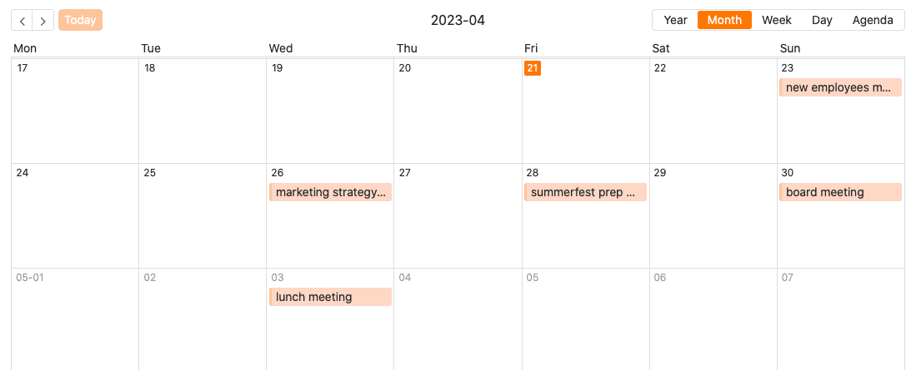
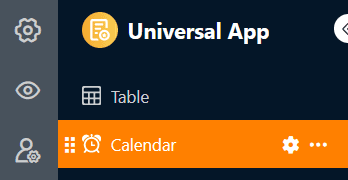
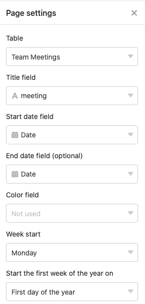
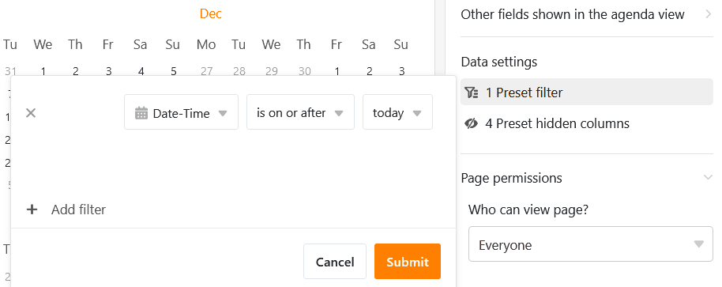
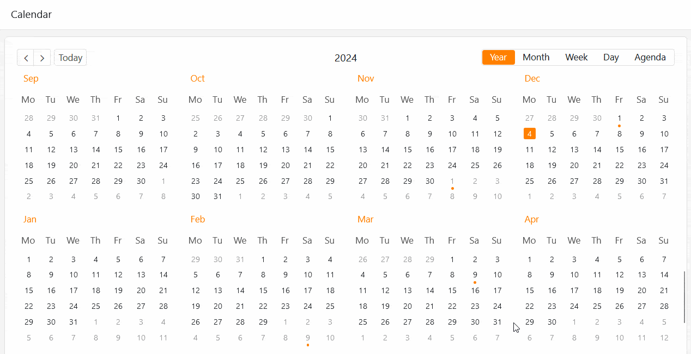
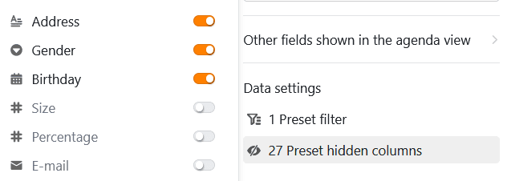
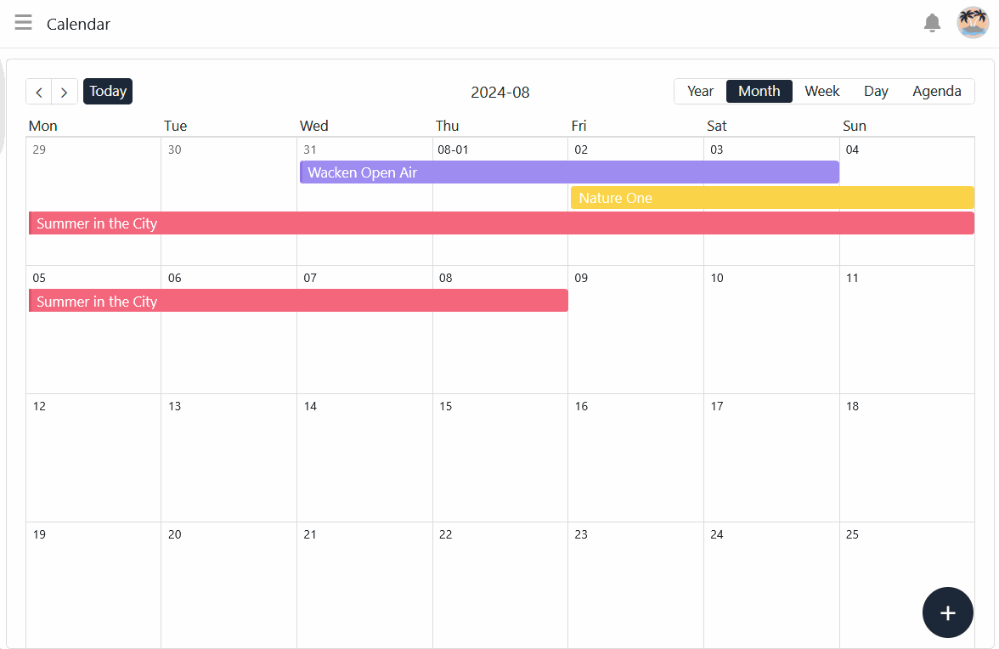
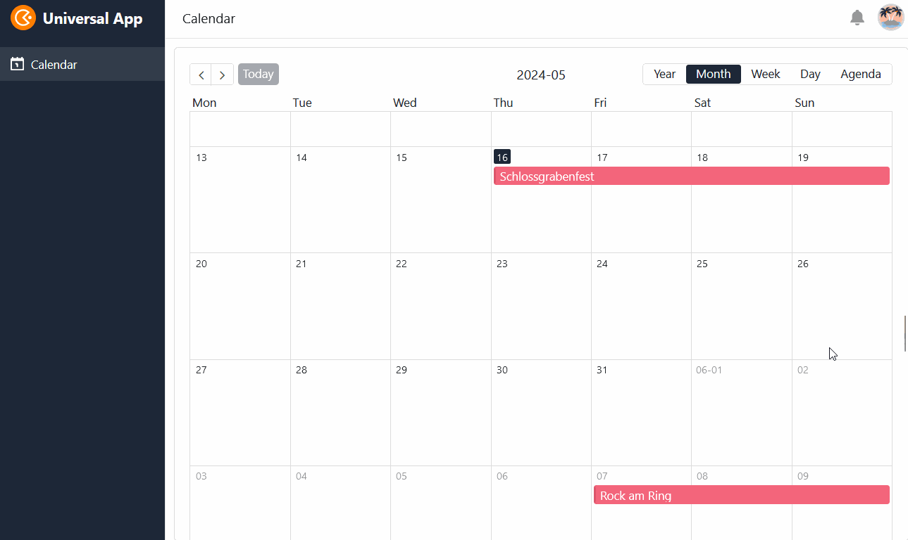
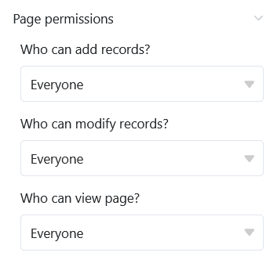

Ce type de page de l'application universelle fonctionne de la même manière que le [plug-in]() de votre tableau dans un **calendrier**. Une application concrète pourrait être, par exemple, la représentation calendaire de **réunions** à venir.

## Paramètres de la page

Si vous souhaitez modifier les paramètres d'une page, cliquez dans la navigation sur le **symbole de la roue dentée**  correspondant.

Dans les **paramètres de la page**, vous pouvez notamment choisir le **titre**, la **date de début** et la **couleur** des **entrées** affichées dans le calendrier et définir le **jour de début de la semaine**.

## Filtres prédéfinis et colonnes masquées

Vous pouvez définir **des filtres prédéfinis** et **des colonnes masquées** afin de limiter les données affichées pour les utilisateurs.

Pour ce faire, cliquez sur **Ajouter un filtre**, sélectionnez la **colonne** et la **condition** souhaitées et confirmez en cliquant sur **Envoyer**.

Les utilisateurs peuvent afficher plus d'informations sur un rendez-vous en cliquant sur une entrée du calendrier.

Décidez donc quelles données doivent être **visibles** et affichez ou masquez les colonnes correspondantes à l'aide des **curseurs**.



## Ajouter une entrée de calendrier

Si vous disposez des autorisations nécessaires, vous pouvez **ajouter de nouvelles entrées** directement sur une page de calendrier. Dans la vue mensuelle, cliquez sur le petit **symbole plus** dans le coin supérieur droit d'une tuile. La **date de** ce jour est alors déjà pré-remplie.

Indépendamment de la date, vous pouvez également cliquer sur le grand **symbole plus circulaire** dans le coin inférieur droit de la page. Une fenêtre s'ouvre ensuite avec les **détails de la ligne**. Saisissez toutes les données souhaitées et enregistrez l'entrée en cliquant sur **Envoyer**.

## Modifier et déplacer des entrées de calendrier

Vous pouvez modifier les entrées du calendrier très facilement en **cliquant sur une entrée** et en effectuant les modifications souhaitées dans les **détails de la ligne** qui s'ouvrent. De plus, vous pouvez facilement **déplacer** les entrées du calendrier **par glisser-déposer**. SeaTable ajuste automatiquement les valeurs dans [les colonnes de date]() correspondantes.

## Autorisations des pages

Tout en bas, dans les paramètres de la page, vous pouvez limiter précisément les utilisateurs autorisés à interagir avec la page. Déterminez qui peut voir la page, ajouter des lignes ou modifier des entrées.

