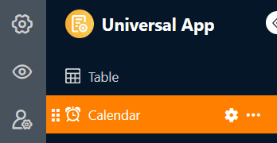
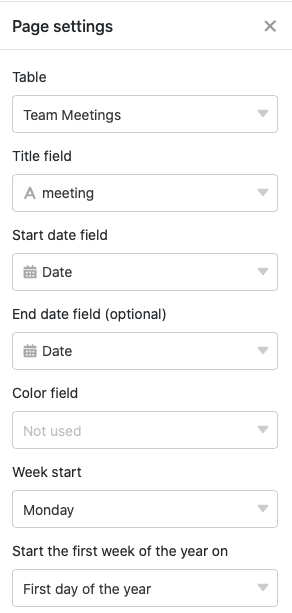
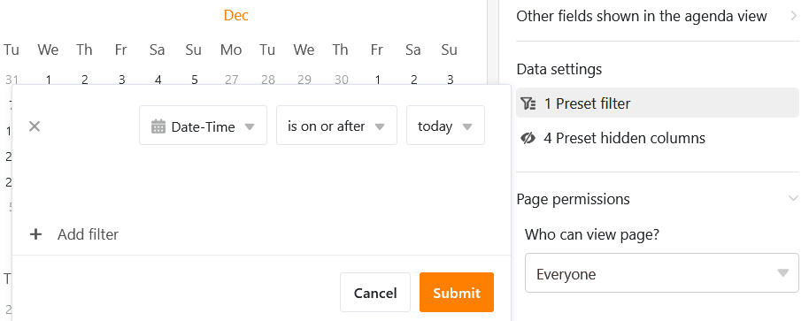
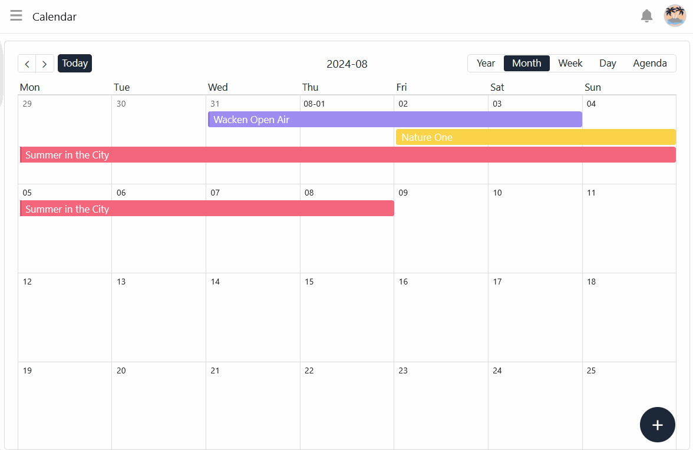

Этот тип страницы универсального приложения работает аналогично [плагину календаря]() вашей таблицы в виде **календаря**. Конкретным вариантом использования может быть, например, отображение в календаре предстоящих **встреч**.

## Настройки страницы

Если вы хотите изменить настройки какой-либо страницы, нажмите на соответствующий **символ**  на панели навигации.

В **настройках страницы** можно выбрать **заголовок**, **дату начала** и **цвет** **записей**, отображаемых в календаре, а также **день начала недели** и другие параметры.

## Предустановленные фильтры и скрытые колонки

Вы можете определить **предустановленные фильтры** и **скрытые столбцы**, чтобы ограничить данные, отображаемые пользователям.

Для этого нажмите кнопку **Добавить фильтр**, выберите нужный **столбец** и **условие** и подтвердите выбор кнопкой **Отправить**.

Пользователи могут просмотреть дополнительную информацию о встрече, нажав на запись в календаре.

Поэтому решите, какие данные должны быть **видны**, и покажите или скройте соответствующие столбцы с помощью **ползунков**.



## Добавить запись в календарь

Если у вас есть соответствующие полномочия, вы можете **добавлять новые записи** прямо на странице календаря. В режиме просмотра месяца нажмите на маленький **символ плюса** в правом верхнем углу плитки. **Дата** этого дня будет уже предварительно заполнена.

Независимо от даты, вы также можете нажать на большой **круглый символ плюса** в правом нижнем углу страницы. После этого откроется окно с **информацией о линии**. Введите в него все необходимые данные и сохраните запись, нажав на кнопку **Отправить**.

## Редактирование и перемещение записей календаря

Вы можете легко редактировать записи календаря, **щелкнув по записи** и внеся нужные изменения в открывшейся **строке деталей**. Вы также можете удобно перемещать записи в календаре с **помощью перетаскивания**. SeaTable автоматически корректирует значения в соответствующих [столбцах дат]().

## Разрешения на страницы

В нижней части настроек страницы вы можете ограничить, каким именно пользователям разрешено взаимодействовать со страницей. Укажите, кто имеет право просматривать страницу, добавлять строки или изменять записи.

