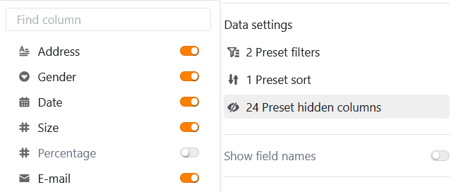

Dieser Seitentyp funktioniert so ähnlich wie das [Kanban-Plugin](https://seatable.io/docs/plugins/anleitung-zum-kanban-plugin/) und bietet Ihnen die Möglichkeit, Einträge als Karteikarten auf einem **Kanban-Board** darzustellen. Ein konkreter Anwendungsfall könnte beispielsweise die **Visualisierung von Workflows und Projektfortschritten** sein.

## Seiteneinstellungen ändern

Wenn Sie die Einstellungen einer Seite ändern möchten, klicken Sie in der Navigation auf das entsprechende  **Zahnrad-Symbol**.

Legen Sie in den **Seiteneinstellungen** fest, auf welcher **Tabelle** das Kanban-Board basiert, nach welcher Spalte die Einträge **gruppiert** werden und aus welcher Spalte die **Titel** stammen.

## Voreingestellte Filter, Sortierungen und ausgeblendete Spalten

Darüber hinaus können Sie voreingestellte Filter, Sortierungen und ausgeblendete Spalten definieren, um die angezeigten Daten für die Nutzer einzugrenzen und zu ordnen. Zum Filtern oder Sortieren klicken Sie auf **Filter hinzufügen** oder **Sortierung hinzufügen**, wählen Sie die gewünschte **Spalte** und **Bedingung** aus und bestätigen mit **Abschicken**.

Die Nutzer können sich mehr Informationen zu einem Eintrag anzeigen lassen, indem sie auf eine Karteikarte klicken. Entscheiden Sie daher, welche Daten **sichtbar** sein sollen, und blenden Sie die entsprechenden Spalten mithilfe der **Regler** ein oder aus.



## Einstellungen der Verknüpfungsspalte

In den **Einstellungen der Verknüpfungsspalte** können Sie für jede verknüpfte Tabelle festlegen, welche Daten sichtbar und welche Operationen erlaubt sind.

- **Hinzufügen neuer Einträge erlauben**: Wenn Sie diesen Regler aktivieren, können Nutzer neue Einträge in der verknüpften Tabelle hinzufügen. Über die Feldeinstellungen können Sie definieren, welche Spalten dabei **sichtbar** und welche Spalten **erforderlich** sind, also ausgefüllt werden müssen.
- **Verknüpfen bestehender Einträge erlauben**: Wenn Sie diesen Regler aktivieren, können Nutzer bestehende Einträge der verknüften Tabelle verlinken. Über die Feldeinstellungen können Sie definieren, welche Spalten dabei **sichtbar** sind.
- **Verknüpfungen auf maximal eine Zeile begrenzen**: Wenn Sie diesen Regler aktivieren, können Nutzer in den Zellen der Verknüpfungsspalte nur noch jeweils eine Zeile der verknüpften Tabelle verlinken.
- **Voreingestellte Filter**: Wenn Sie hier einen Filter hinzufügen, werden beim Verlinken von Einträgen nur Optionen angezeigt, die die Filterbedingungen erfüllen.
- **Big-Data-Funktion aktivieren**: Wenn die Big-Data-Funktion aktiviert ist, können Nutzer mehr als 20.000 Datensätze durchsuchen, sofern in der verknüpften Tabelle so viele Einträge vorhanden sind.

## Weitere Seiteneinstellungen

Mit drei weiteren Reglern können Sie einstellen, dass SeaTable **leere Zeilen nicht anzeigen**, auf den Karteikarten die **Spaltennamen anzeigen** und **Text umbrechen** soll.

Andere **Daten** aus der zugrundeliegenden Tabelle können Sie ebenfalls auf den Karteikarten anzeigen lassen: Aktivieren Sie dazu beliebig viele **anzuzeigende Felder**.

## Seitenberechtigungen

Für Kanbanseiten können Sie folgende [Seitenberechtigungen]() festlegen:

Entscheiden Sie, wer die Kanbanseite sehen, Zeilen hinzufügen, bearbeiten und löschen darf. Dank der differenzierten Berechtigungsoptionen dieses Seitentyps können Sie dies genauestens einstellen.
