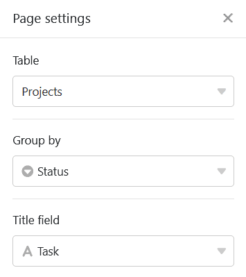
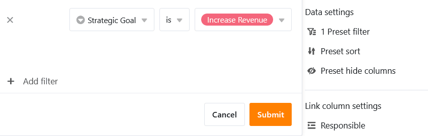

This page type works in a similar way to the [Kanban plugin](https://seatable.io/en/docs/plugins/anleitung-zum-kanban-plugin/) and offers you the option of displaying entries as index cards on a **Kanban board**. A specific use case could be the **visualization of workflows and project progress**, for example.

## Change page settings

If you want to change the settings of a page, click on the corresponding  **cogwheel symbol** in the navigation bar.

In the **page settings**, specify which **table** the Kanban board is based on, which column the entries are **grouped** by and which column the **titles** come from.

## Preset filters, sorting and hidden columns

You can also define preset filters, sorting and hidden columns to limit and organize the data displayed for users. To filter or sort, click on **Add filter** or **Add sorting**, select the desired **column** and **condition** and confirm with **Submit**.

Users can view more information about an entry by clicking on a tab. Therefore, decide which data should be **visible** and show or hide the corresponding columns using the **sliders**.



## Link column settings

In the **settings for the link column**, you can define which data is visible and which operations are permitted for each linked table.

- **Allow adding new entries**: If you activate this slider, users can add new entries to the linked table. You can use the field settings to define which columns are **visible** and which columns are **required**, i.e. must be filled in.
- **Allow linking of existing entries**: If you activate this slider, users can link existing entries in the linked table. You can use the field settings to define which columns are **visible**.
- Limit **links to a maximum of one row :** If you activate this slider, users can only link to one row of the linked table in the cells of the link column.
- **Preset filters**: If you add a filter here, only options that fulfill the filter conditions will be displayed when linking entries.
- **Activate big data** function: If the big data function is activated, users can search through more than 20,000 data records, provided there are this many entries in the linked table.

## Further page settings

With three further sliders you can set SeaTable **not to display empty rows** , to display the **column names** on the index cards and to **wrap text**.

You can also display other **data** from the underlying table on the index cards: Activate any number of **fields to be displayed**.

## Page authorizations

You can define the following [page authorizations](https://seatable.io/en/docs/apps/seitenberechtigungen-in-einer-universellen-app/) for Kanban pages:

Decide who can view, add, edit and delete the Kanban page rows . Thanks to the differentiated authorization options of this page type, you can set this precisely.
