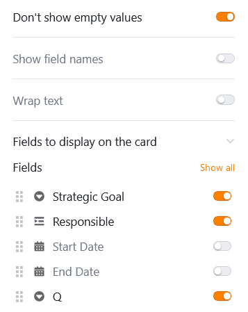

Este tipo de página funciona de forma similar al [plugin Kanban](https://seatable.io/es/docs/plugins/anleitung-zum-kanban-plugin/) y le ofrece la opción de mostrar las entradas como fichas en un **tablero Kanban**. Un caso de uso específico podría ser la **visualización de los flujos de trabajo y el progreso de los proyectos**, por ejemplo.

## Cambiar la configuración de la página

Si desea cambiar la configuración de una página, haga clic en el **símbolo de rueda dentada**  correspondiente en la barra de navegación.

En la **configuración de la página**, especifique en qué **tabla** se basa la tabla Kanban, por qué columna se **agrupan** las entradas y de qué columna proceden los **títulos**.

## Filtros preestablecidos, clasificación y columnas ocultas

También puede definir filtros preestablecidos, clasificaciones y columnas ocultas para limitar y organizar los datos que se muestran a los usuarios. Para filtrar u ordenar, haga clic en **Añadir filtro** o **Añadir ordenación**, seleccione la **columna** y la **condición** deseadas y confirme con **Enviar**.

Los usuarios pueden ver más información sobre una entrada haciendo clic en una pestaña. Por lo tanto, decida qué datos deben ser **visibles** y muestre u oculte las columnas correspondientes utilizando los **controles deslizantes**.



## Configuración de la columna de enlaces

En **la configuración de la columna de enlace**, puede especificar qué datos son visibles y qué operaciones están permitidas para cada tabla enlazada.

- **Permitir añadir nuevas entradas**: Si activa este control deslizante, los usuarios podrán añadir nuevas entradas a la tabla vinculada. Puede utilizar la configuración de campos para definir qué columnas son **visibles** y qué columnas son **obligatorias**, es decir, deben rellenarse.
- **Permitir la vinculación de entradas existentes**: Si activa este control deslizante, los usuarios podrán vincular entradas existentes en la tabla vinculada. Puede utilizar los ajustes de campo para definir qué columnas son **visibles**.
- **Limitar** los enlaces a una fila como máximo: Si activa este control deslizante, los usuarios sólo podrán enlazar una fila de la tabla enlazada en las celdas de la columna de enlace.
- **Filtros preestablecidos**: si añade un filtro aquí, al enlazar las entradas sólo se mostrarán las opciones que cumplan las condiciones del filtro.
- **Activar** la función big data: Si la función big data está activada, los usuarios pueden buscar en más de 20.000 registros de datos, siempre que haya este número de entradas en la tabla vinculada.

## Otros ajustes de página

Con otros tres deslizadores puede configurar SeaTable para **que no muestre filas vacías**, para que muestre los **nombres de las columnas** en las fichas y para que **ajuste el texto**.

También puede mostrar otros **datos** de la tabla subyacente en las fichas: Active el número de campos que **desee visualizar**.

## Autorizaciones de páginas

Puede definir las siguientes [autorizaciones de página](https://seatable.io/es/docs/apps/seitenberechtigungen-in-einer-universellen-app/) para las páginas Kanban:

Decida quién está autorizado a ver, añadir, editar y eliminar la página Kanban. Gracias a las opciones de autorización diferenciadas de este tipo de página, puede establecerlo con precisión.
