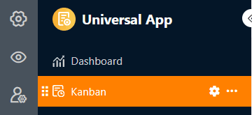

Ce type de page fonctionne de la même manière que le [plug-in Kanban]() et vous offre la possibilité d'afficher des entrées sous forme de fiches sur un **tableau Kanban**. Une application concrète pourrait être, par exemple, la **visualisation des workflows et de l'avancement du projet**.

## Modifier les paramètres de la page

Si vous souhaitez modifier les paramètres d'une page, cliquez dans la navigation sur le **symbole de la roue dentée**  correspondant.

Dans les **paramètres de la page**, déterminez le **tableau** sur lequel le tableau Kanban est basé, la colonne selon laquelle les entrées sont **regroupées** et la colonne d'où proviennent les **titres**.

## Filtres prédéfinis, tris et colonnes masquées

En outre, vous pouvez définir des filtres prédéfinis, des tris et des colonnes masquées afin de limiter et d'organiser les données affichées pour les utilisateurs. Pour filtrer ou trier, cliquez sur **Ajouter un filtre** ou **Ajouter un tri**, sélectionnez la **colonne** et la **condition** souhaitées et confirmez en cliquant sur **Envoyer**.

Les utilisateurs peuvent afficher plus d'informations sur une entrée en cliquant sur une fiche. Décidez donc quelles données doivent être **visibles** et affichez ou masquez les colonnes correspondantes à l'aide des **curseurs**.



## Paramètres de la colonne des liens

Dans les **paramètres de la colonne des liens**, vous pouvez définir pour chaque tableau lié quelles données sont visibles et quelles opérations sont autorisées.

- **Autoriser l'ajout de nouvelles entrées**: si vous activez ce curseur, les utilisateurs peuvent ajouter de nouvelles entrées dans le tableau lié. Les paramètres des champs permettent de définir quelles colonnes sont **visibles** et quelles colonnes sont **obligatoires**, c'est-à-dire qu'elles doivent être remplies.
- **Autoriser la liaison d'entrées existantes**: si vous activez ce curseur, les utilisateurs peuvent lier des entrées existantes du tableau lié. Vous pouvez définir quelles colonnes sont **visibles** via les paramètres de champ.
- **Limiter les liens à une ligne maximum**: Si vous activez ce curseur, les utilisateurs ne pourront plus lier qu'une seule ligne du tableau lié à la fois dans les cellules de la colonne des liens.
- **Filtres prédéfinis**: si vous ajoutez un filtre ici, seules les options qui remplissent les conditions du filtre seront affichées lors de la création de liens vers des entrées.
- **Activer la fonction Big Data**: Lorsque la fonction Big Data est activée, les utilisateurs peuvent effectuer des recherches sur plus de 20.000 enregistrements, à condition qu'il y ait autant d'entrées dans le tableau lié.

## Autres paramètres de page

Trois autres curseurs permettent de faire en sorte que SeaTable **n'affiche pas les lignes vides**, qu'il **affiche les noms des colonnes** sur les fiches et qu'il **renverse le texte**.

Vous pouvez également afficher sur les fiches d'autres **données** du tableau sous-jacent : Pour ce faire, activez autant de **champs à afficher** que vous le souhaitez.

## Autorisations des pages

Pour les pages Kanban, vous pouvez définir les [autorisations de page]() suivantes :

Décidez qui peut voir la page Kanban, ajouter des lignes, les modifier et les supprimer. Grâce aux options d'autorisation différenciées de ce type de page, vous pouvez régler cela avec précision.
