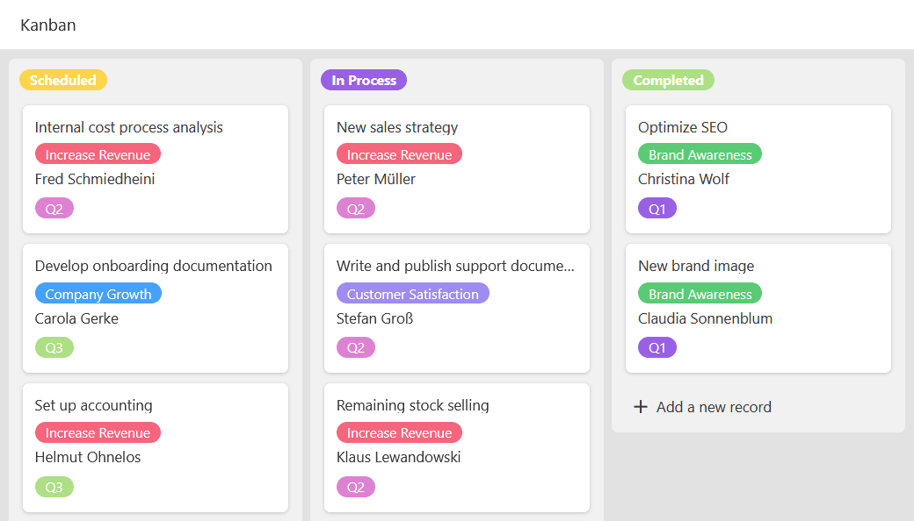
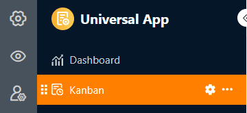
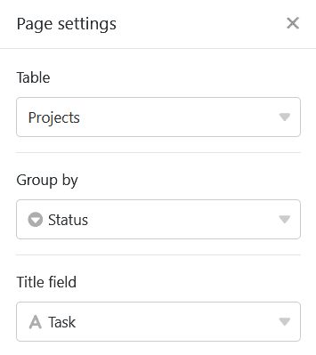
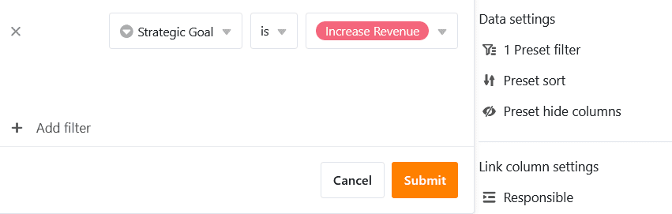
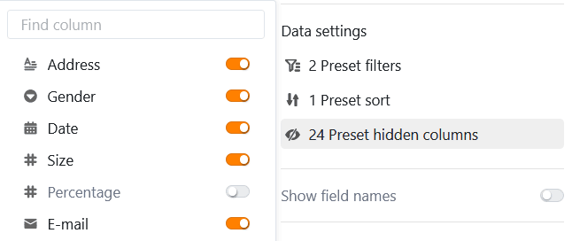
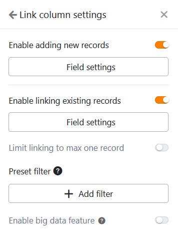
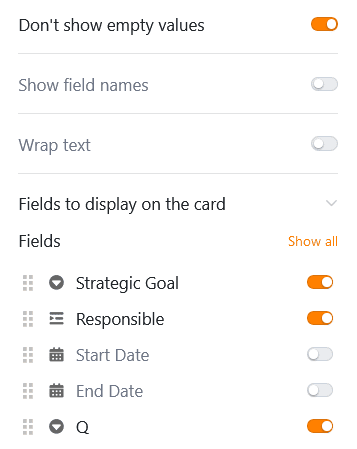
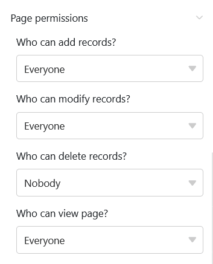

Этот тип страницы работает аналогично [плагину Kanban]() и предлагает вам возможность отображать записи в виде индексных карточек на **доске Kanban**. Конкретным вариантом использования может быть, например, **визуализация рабочих процессов и хода выполнения проекта**.

## Изменение настроек страницы

Если вы хотите изменить настройки какой-либо страницы, нажмите на соответствующий **символ**  на панели навигации.

В **настройках страницы** укажите, на какой **таблице** основана доска Kanban, по какому столбцу **группируются** записи и из какого столбца **берутся заголовки**.

## Предустановленные фильтры, сортировка и скрытые колонки

Вы также можете задать предустановленные фильтры, сортировку и скрытые столбцы, чтобы ограничить и упорядочить данные, отображаемые для пользователей. Чтобы отфильтровать или отсортировать данные, нажмите на кнопку **Добавить фильтр** или **Добавить сортировку**, выберите нужный **столбец** и **условие** и подтвердите выбор кнопкой **Отправить**.

Пользователи могут просмотреть дополнительную информацию о записи, нажав на вкладку. Поэтому решите, какие данные должны быть **видны**, и покажите или скройте соответствующие столбцы с помощью **ползунков**.



## Настройки колонки ссылок

В **настройках столбца связи** можно указать, какие данные будут видны и какие операции разрешены для каждой связанной таблицы.

- **Разрешить добавлять новые записи**: если вы активируете этот ползунок, пользователи смогут добавлять новые записи в связанную таблицу. Вы можете использовать настройки поля, чтобы определить, какие столбцы будут **видимыми**, а какие - **обязательными**, т. е. подлежащими заполнению.
- **Разрешить связывать существующие записи**: если вы активируете этот ползунок, пользователи смогут связывать существующие записи в связанной таблице. Вы можете использовать настройки поля, чтобы определить, какие столбцы будут **видны**.
- **Ограничить ссылки не более чем одной строкой**: Если вы активируете этот ползунок, пользователи смогут связывать только одну строку связанной таблицы в ячейках столбца ссылок.
- **Предустановленные фильтры**: если вы добавите здесь фильтр, то при связывании записей будут отображаться только те варианты, которые соответствуют условиям фильтра.
- **Активируйте** функцию **больших данных**: Если активирована функция больших данных, пользователи могут искать в более чем 20 000 записей данных, если в связанной таблице имеется столько записей.

## Дополнительные настройки страницы

С помощью трех дополнительных ползунков вы можете настроить SeaTable так, **чтобы не отображать пустые строки**, отображать **названия столбцов** на индексных карточках и **оборачивать текст**.

На индексных карточках можно отображать и другие **данные** из основной таблицы: Активируйте любое количество **полей для отображения**.

## Разрешения на страницы

Вы можете определить следующие [полномочия для страниц]() Kanban:

Определите, кто имеет право просматривать, добавлять, редактировать и удалять страницу Kanban. Благодаря дифференцированным параметрам авторизации данного типа страницы вы можете точно установить эти параметры.
