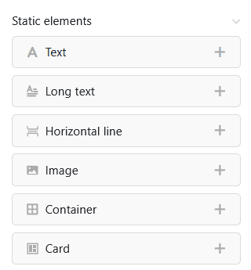
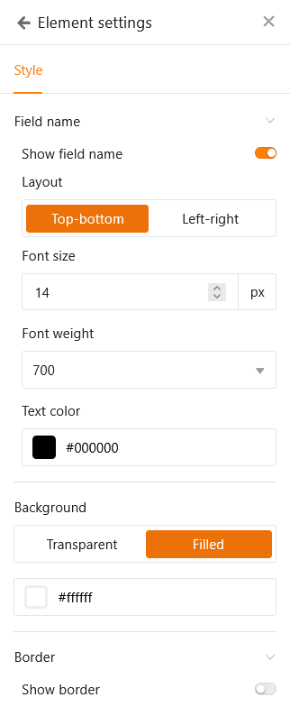
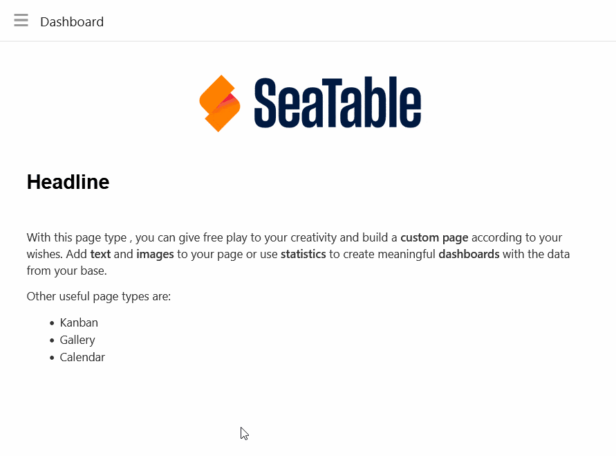
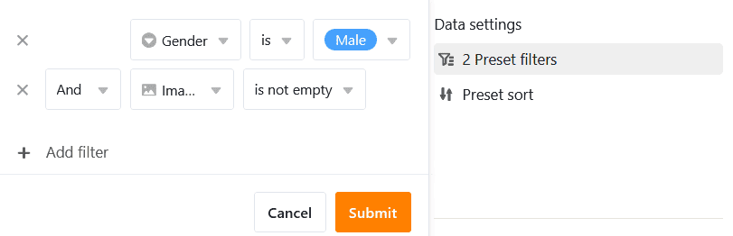
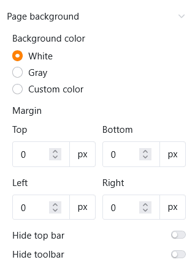
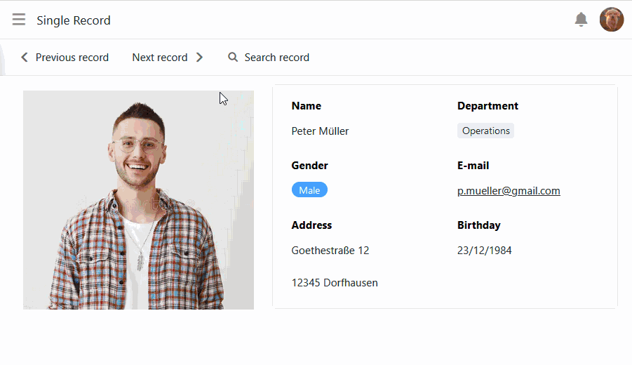
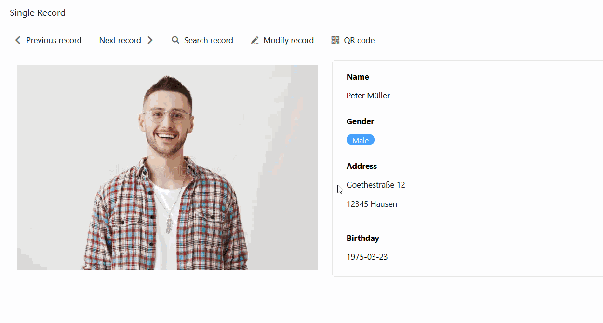
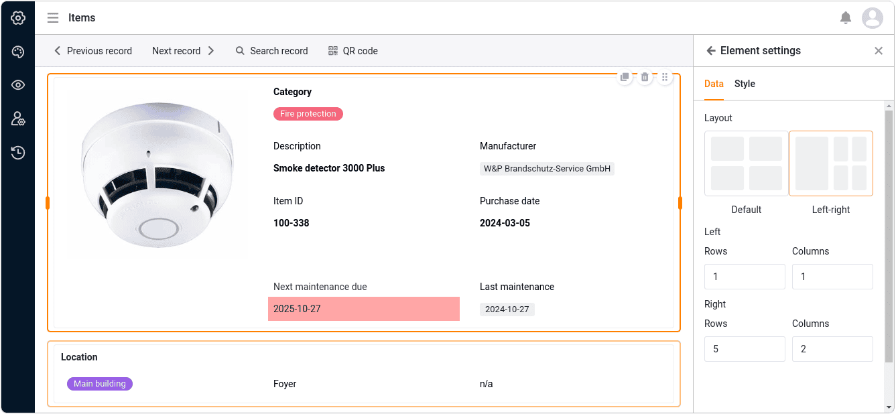
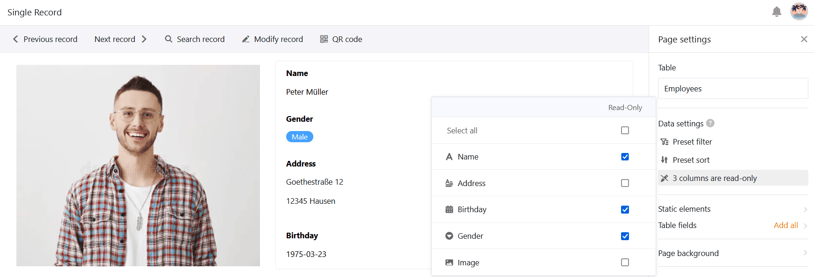

Mit dem [Seitentyp]() **Einzelner Datensatz** haben Sie die Möglichkeit, eine Seite mit statischen Elementen, dynamischen Tabellenfeldern, Farben, Rahmen etc. zu designen, um die in einer Zeile gespeicherten Daten optisch aufzubereiten. Damit ähnelt dieser Seitentyp dem [Seitendesign-Plugin](https://seatable.io/docs/seitendesign-plugin/anleitung-zum-seitendesign-plugin/), das Sie bereits aus der Base kennen.

Die Nutzer der App können auf dieser Seite – mit der jeweiligen Berechtigung – die einzelnen Datensätze sehen, suchen und durchblättern oder sogar bearbeiten. Dieser Seitentyp eignet sich zum Beispiel, um die Daten in einer Mitarbeiterdatenbank als persönliche Steckbriefe anzuzeigen.

## Seiteneinstellungen

Wenn Sie die Einstellungen einer Seite ändern möchten, klicken Sie in der Navigation auf das entsprechende  **Zahnrad-Symbol**.

In den **Seiteneinstellungen** können Sie die **Tabelle** auswählen, in der die einzelnen Datensätze gespeichert sind.

### Statische Elemente

Ähnlich wie auf [individuellen Seiten]() können Sie auch auf Seiten des Typs Einzelner Datensatz **statische Elemente** hinzufügen, die zur Gestaltung der Seite dienen und über alle Datensätze hinweg gleich bleiben. Diese Elemente sind:

- Text
- Formatierter Text
- Horizontale Linie
- Bild
- Container
- Karte

Für genauere Informationen zu den **Einstellungsmöglichkeiten** dieser Elemente konsultieren Sie bitte [diesen Hilfeartikel]().

### Tabellenfelder

Als Tabellenfelder sind alle Spalten der Tabelle aufgelistet, aus denen Sie Daten in die Seite einbauen können. Der Inhalt der Felder hängt von den einzelnen Datensätzen in der Tabelle ab und ändert sich je nach Eintrag.

Ebenso wie die statischen Elemente verfügt auch jedes Tabellenfeld über eigene **Elementeinstellungen**. Wählen Sie zunächst aus, ob Sie den **Feldnamen anzeigen** möchten, der als Überschrift des Eintrags dient. Wenn ja, können Sie die **Ausrichtung**, die **Schriftgröße**, **Schriftstärke** und **Schriftfarbe** exakt einstellen.

Außerdem können Sie für jedes Tabellenfeld eine **Hintergrundfarbe** und einen **Rahmen** festlegen.

Bei allen text- und zahlenbasierten Spaltentypen haben Sie auch die Möglichkeit, die **Schriftgröße, Schriftstärke, Schriftfarbe und Ausrichtung der angezeigten Werte** einzustellen.

## Elemente kopieren, verschieben oder löschen

Wenn Sie ein bestehendes Element auf Ihrer Seite kopieren, verschieben oder löschen möchten, nutzen Sie einfach die drei entsprechenden **Symbole** an der oberen rechten Ecke des Rahmens.

## Voreingestellte Filter und Sortierungen

Darüber hinaus können Sie voreingestellte Filter und Sortierungen definieren, um die anzeigbaren Datensätze für die Nutzer einzugrenzen und zu ordnen. Zum Filtern oder Sortieren klicken Sie auf **Filter hinzufügen** oder **Sortierung hinzufügen**, wählen Sie die gewünschte **Spalte** und **Bedingung** aus und bestätigen mit **Abschicken**.

Die Nutzer können nur die Informationen zu einem einzelnen Datensatz sehen, die Sie über die eingebundenen Tabellenfelder anzeigen lassen.



## Grafische Einstellungen des Seitenhintergrunds

Folgende grafische Einstellungen können Sie für die gesamte Seite des Typs Einzelner Datensatz vornehmen:

- Wählen Sie Weiß, Grau oder eine benutzerdefinierte Farbe als **Hintergrundfarbe** der Seite.
- Stellen Sie die **Seitenränder** (oben, unten, links, rechts) ein.
- Entscheiden Sie, ob Sie die **Titelleiste ausblenden** möchten.
- Entscheiden Sie, ob Sie die **Toolbar ausblenden** möchten, mit der die Nutzer zwischen den Einträgen wechseln können.

## Zwischen den Einträgen wechseln

Wenn Sie die Toolbar eingeblendet haben, können die App-Nutzer mit der entsprechenden Seitenberechtigung zwischen den einzelnen Datensätzen wechseln. Klicken Sie dazu auf  **Vorheriger Eintrag** oder **Nächster Eintrag** . Sie können auch gezielt einen  **Eintrag suchen**.

## Eintrag bearbeiten

Mit der entsprechenden Berechtigung können App-Nutzer auf dieser Seite die einzelnen Datensätze bearbeiten.

- Klicken Sie in der Toolbar auf **Eintrag bearbeiten**.
- Das Fenster mit den **Zeilendetails** öffnet sich. Nehmen Sie dort die gewünschten Änderungen am Datensatz vor.
- Schließen Sie das Fenster mit einem Klick auf das **x-Symbol**, um die Änderungen zu speichern.

## QR-Code für einzelne Einträge generieren

In der Toolbar finden Sie außerdem einen **QR-Code-Generator**. Der QR-Code enthält den Link auf den aktuell angezeigten Eintrag. Auf einem Gegenstand oder Gerät angebracht, können Sie den QR-Code über ein Tablet oder Smartphone scannen und ohne jede Tastatureingabe alle Daten in der App abrufen. Dadurch wird beispielsweise die [Inventarverwaltung](https://seatable.io/inventarliste-vorlagen/) noch einfacher.

## Schaltflächen-Aktionen ausführen

Genau wie auf Tabellen- und Abfrageseiten können Sie auch hier Spalten vom Typ [Schaltfläche](https://seatable.io/docs/andere-spalten/die-schaltflaeche/) nutzen. Ob Sie ein PDF-Dokument erstellen, einen Datensatz bearbeiten oder ein Skript ausführen möchten – all diese **Schaltflächen-Aktionen** können Sie per Knopfdruck starten. Eine Bearbeitungsberechtigung ist dafür **nicht** notwendig. Auf diese Weise können App-Admins die Benutzerinteraktionen für diesen Seitentyp auf einige vordefinierte Aktionen beschränken.

## Seitenberechtigungen

Für Seiten vom Typ Einzelner Datensatz können Sie folgende [Seitenberechtigungen]() festlegen:

Entscheiden Sie, wer die einzelnen Datensätze **sehen** und **bearbeiten** darf. Über diese Seite können Sie keine Zeilen in der Tabelle hinzufügen oder löschen.



## Schreibgeschützte Spalten

Zusätzlich zur Seitenberechtigung “Wer darf Zeilen bearbeiten?” können Sie mithilfe von schreibgeschützten Spalten präzise festlegen, welche Spaltenwerte eines Datensatzes die Benutzer ändern können und welche nicht.

Gehen Sie in die **Seiteneinstellungen** und klicken Sie die **Kästchen** der Spalten an, die für die Nutzer **nur lesbar** sein sollen. Schreibgeschützte Spalten erkennen Sie daran, dass sie in den Zeilendetails **grau** hinterlegt sind.
