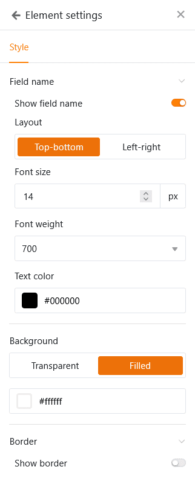

Con el [tipo de página]() de **registro de datos único**, tiene la opción de diseñar una página con elementos estáticos, campos de tabla dinámicos, colores, marcos, etc. para presentar visualmente los datos almacenados en una fila. Este tipo de página es, por tanto, similar al [plugin de diseño de páginas]() que ya conoce de Base.

Los usuarios de la aplicación pueden ver, buscar, explorar o incluso editar los registros de datos individuales en esta página, con la autorización pertinente. Este tipo de página es adecuada, por ejemplo, para mostrar los datos de una base de datos de empleados como perfiles personalizados.

## Configuración de página

Si desea cambiar la configuración de una página, haga clic en el **símbolo de rueda dentada**  correspondiente en la barra de navegación.

En la **configuración de la página**, puede seleccionar la **tabla** en la que se guardan los registros de datos individuales.

### Elementos estáticos

De forma similar a las [páginas individuales](), también puede añadir **elementos estáticos** a las páginas del tipo de registro de datos Único que se utilizan para diseñar la página y permanecen iguales en todos los registros de datos. Estos elementos son

- Texto
- Texto con formato
- Línea horizontal
- Imagen
- Contenedor
- Carta

Para obtener información más detallada sobre las **opciones de configuración** de estos elementos, consulte [este artículo de ayuda]().

### Campos de la tabla

Todas las columnas de la tabla desde las que se pueden insertar datos en la página aparecen como campos de la tabla. El contenido de los campos depende de los registros de datos individuales de la tabla y cambia en función de la entrada.

Al igual que los elementos estáticos, cada campo de tabla también tiene su propia **configuración de elementos**. En primer lugar, seleccione si desea mostrar el **nombre** del campo que sirve de encabezamiento de la entrada. En caso afirmativo, puede establecer la **alineación** exacta, el **tamaño de la** fuente, el **peso de la fuente** y el **color de la fuente**.

También puede definir un **color de fondo** y un **marco** para cada campo de la tabla.

Para todos los tipos de columnas basadas en texto y números, también tiene la opción de establecer el **tamaño de la fuente, el peso de la fuente, el color de la fuente y la alineación de los valores mostrados**.

También hay algunas características especiales para los siguientes tipos de columnas:

- Si pulsa sobre una dirección de correo electrónico en una **columna de correo**, se abrirá el cliente de correo electrónico instalado en su dispositivo (por ejemplo, Microsoft Outlook o Mozilla Thunderbird).
- Si pulsa sobre un enlace en una columna **URL**, se abrirá el sitio web correspondiente en una nueva pestaña de su navegador.
- Si hace clic en un símbolo de miniatura en una columna **Archivo**, el archivo se abrirá en un visor adecuado en una nueva pestaña de su navegador. Si tiene configurado un editor de Office en línea, también podrá abrir y editar documentos de Office directamente en el navegador.
- Con las **columnas de enlace**, todas las entradas vinculadas al registro de datos pueden visualizarse claramente en una tabla. Puede ajustar la anchura de las columnas y también ocultarlas a través de la configuración del elemento para que sólo se muestre la información esencial de las entradas vinculadas.

## Copiar, mover o eliminar elementos

Si desea copiar, desplazar o eliminar un elemento existente en su página, sólo tiene que utilizar los tres **símbolos** correspondientes situados en la esquina superior derecha del marco.

## Filtros preestablecidos y clasificación

También puede definir filtros y clasificaciones predefinidos para limitar y organizar los registros de datos que se pueden mostrar a los usuarios. Para filtrar u ordenar, haga clic en **Añadir filtro** o **Añadir ordenación**, seleccione la **columna** y la **condición** deseadas y confirme con **Enviar**.

Los usuarios sólo pueden ver la información de un único registro de datos que usted muestra a través de los campos de la tabla integrada.



## Configuración gráfica del fondo de la página

Puede realizar los siguientes ajustes gráficos para toda la página del tipo de registro de datos Único:

- Seleccione blanco, gris o un color definido por el usuario como **color de fondo** de la página.
- Establezca los **márgenes de la página** (superior, inferior, izquierdo, derecho).
- Decida si desea **ocultar** la **barra de título**.
- Decida si desea **ocultar** la **barra de herramientas** que los usuarios pueden utilizar para pasar de una entrada a otra.

## Cambiar entre las entradas

Si ha desplegado la barra de herramientas, los usuarios de la aplicación con la autorización de página correspondiente pueden pasar de un registro de datos a otro.   Para ello, haga clic en **Entrada** **anterior** o **Entrada siguiente**.  También puede buscar una **entrada** concreta.

## Editar entrada

Con la autorización adecuada, los usuarios de la aplicación pueden editar los registros de datos individuales en esta página.

- Haga clic en **Editar entrada** en la barra de herramientas.
- Se abre la ventana con los **detalles de la línea**. Realice allí los cambios deseados en el registro de datos.
- Cierre la ventana haciendo clic en el **símbolo x** para guardar los cambios.

## Generar código QR para entradas individuales

También encontrará un **generador de códigos QR** en la barra de herramientas. El código QR contiene el enlace a la entrada mostrada en ese momento. Adjuntado a un objeto o dispositivo, puede escanear el código QR con una tableta o un teléfono inteligente y consultar todos los datos de la aplicación sin necesidad de utilizar el teclado. Esto facilita aún más, por ejemplo, la [gestión de inventarios]().

## Ejecutar acciones de botón

Al igual que en las páginas de tablas y consultas, aquí también puede utilizar columnas de tipo [botón](). Tanto si desea crear un documento PDF, editar un registro de datos o ejecutar un script, puede iniciar todas estas **acciones con** sólo pulsar un botón. Para ello **no** se requiere autorización de edición. De este modo, los administradores de aplicaciones pueden restringir las interacciones del usuario para este tipo de página a unas pocas acciones predefinidas.

## Autorizaciones de páginas

Puede definir las siguientes [autorizaciones de página]() para las páginas del tipo de registro de datos Único:

Decida quién está autorizado a **ver** y **editar** los registros de datos individuales. En esta página no se pueden añadir ni eliminar filas de la tabla.



[Los botones]() **siempre** se pueden pulsar independientemente de las autorizaciones de la página. Esto significa que todos los usuarios de la app pueden realizar determinados cambios en los registros de datos que hayas definido previamente, aunque las columnas afectadas estén bloqueadas para ellos o el usuario no esté autorizado a editar la página.



## Columnas de sólo lectura

Además de la autorización de página "¿Quién puede editar filas?", puede utilizar columnas de sólo lectura para definir con precisión qué valores de columna de un registro de datos pueden y no pueden modificar los usuarios.

Vaya a la **configuración de la página** y marque las **casillas** de las columnas que deben ser **de sólo lectura** para los usuarios. Puede reconocer las columnas de solo lectura porque aparecen resaltadas en **gris** en los detalles de la fila.
