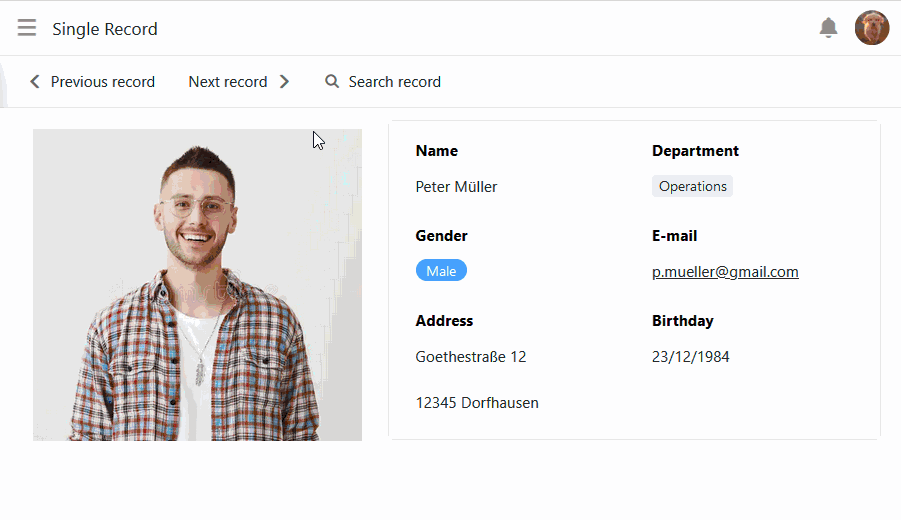
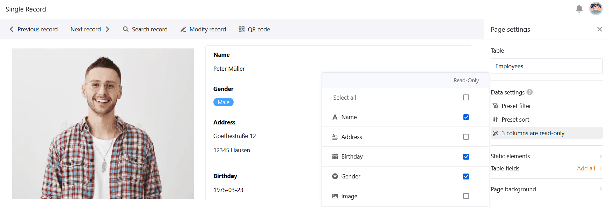

Avec le [type de page]() **Enregistrement individuel**, vous avez la possibilité de concevoir une page avec des éléments statiques, des champs de tableau dynamiques, des couleurs, des cadres, etc. afin de présenter visuellement les données stockées dans une ligne. Ce type de page est donc similaire au [plug-in de conception de page]() que vous connaissez déjà dans la Base.

Sur cette page, les utilisateurs de l'application peuvent - avec l'autorisation correspondante - voir, rechercher et parcourir les différents enregistrements, voire les modifier. Ce type de page convient par exemple pour afficher les données d'une base de données d'employés sous forme de fiches personnelles.

## Paramètres de la page

Si vous souhaitez modifier les paramètres d'une page, cliquez dans la navigation sur le **symbole de la roue dentée**  correspondant.

Dans les **paramètres de la page**, vous pouvez sélectionner la **table** dans laquelle les différents enregistrements sont stockés.

### Éléments statiques

Comme pour les [pages individuelles](), vous pouvez ajouter aux pages de type enregistrement unique des **éléments statiques** qui servent à l'organisation de la page et qui restent identiques pour tous les enregistrements. Ces éléments sont

- Texte
- Texte formaté
- Ligne horizontale
- Image
- Conteneur
- Carte

Pour des informations plus précises sur les **possibilités de réglage** de ces éléments, veuillez consulter [cet article d'aide]().

### Champs du tableau

Toutes les colonnes du tableau à partir desquelles vous pouvez intégrer des données dans la page sont listées comme champs de tableau. Le contenu des champs dépend des différents enregistrements de la table et change en fonction de l'entrée.

Tout comme les éléments statiques, chaque champ de tableau dispose de ses propres **paramètres d'élément**. Choisissez d'abord si vous souhaitez **afficher** le **nom du champ** qui sert d'en-tête à l'élément. Si c'est le cas, vous pouvez régler précisément l'**alignement**, la **taille**, **l'épaisseur** et **la couleur de la police**.

Vous pouvez également définir une **couleur d'arrière-plan** et une **bordure** pour chaque champ de tableau.

Pour tous les types de colonnes basées sur le texte et les chiffres, vous avez également la possibilité de régler la **taille, l'épaisseur, la couleur et l'orientation de la police des valeurs affichées**.

## Copier, déplacer ou supprimer des éléments

Si vous souhaitez copier, déplacer ou supprimer un élément existant sur votre page, utilisez simplement les trois **icônes** correspondantes dans le coin supérieur droit du cadre.

## Filtres et tris prédéfinis

En outre, vous pouvez définir des filtres et des tris prédéfinis afin de limiter et d'ordonner les enregistrements affichables pour les utilisateurs. Pour filtrer ou trier, cliquez sur **Ajouter un filtre** ou **Ajouter un tri**, sélectionnez la **colonne** et la **condition** souhaitées et confirmez en cliquant sur **Envoyer**.

Les utilisateurs ne peuvent voir que les informations relatives à un seul enregistrement que vous avez choisi d'afficher via les champs de table intégrés.



## Paramètres graphiques de l'arrière-plan de la page

Vous pouvez effectuer les réglages graphiques suivants pour l'ensemble de la page de type enregistrement unique :

- Choisissez le blanc, le gris ou une couleur personnalisée comme **couleur de fond de** la page.
- Réglez les **marges** (haut, bas, gauche, droite).
- Décidez si vous souhaitez **masquer** la **barre de titre**.
- Décidez si vous souhaitez **masquer** la **barre d'outils** qui permet aux utilisateurs de passer d'une entrée à l'autre.

## Passer d'une entrée à l'autre

Si vous avez affiché la barre d'outils, les utilisateurs de l'application peuvent passer d'un enregistrement à l'autre avec l'autorisation de page correspondante. Pour ce faire, cliquez sur  **Enregistrement précédent** ou **Enregistrement suivant** . Vous pouvez également **rechercher** une **entrée**  **de** manière ciblée.

## Modifier l'entrée

Avec l'autorisation correspondante, les utilisateurs de l'application peuvent modifier les différents enregistrements sur cette page.

- Cliquez sur **Modifier l'entrée** dans la barre d'outils.
- La fenêtre avec les **détails de la ligne** s'ouvre. Effectuez-y les modifications souhaitées sur l'enregistrement.
- Fermez la fenêtre en cliquant sur le **symbole x** pour enregistrer les modifications.

## Générer un code QR pour des entrées individuelles

Dans la barre d'outils, vous trouverez également un **générateur de code QR**. Le code QR contient le lien vers l'entrée actuellement affichée. Placé sur un objet ou un appareil, vous pouvez scanner le code QR à l'aide d'une tablette ou d'un smartphone et consulter toutes les données dans l'application sans aucune saisie au clavier. Cela facilite encore plus la [gestion de l'inventaire](https://seatable.io/fr/inventarliste-vorlagen/), par exemple.

## Exécuter des actions de bouton

Comme pour les pages de tableaux et de requêtes, vous pouvez utiliser des colonnes de type [bouton](). Que vous souhaitiez créer un document PDF, modifier un enregistrement ou exécuter un script, vous pouvez lancer toutes ces **actions de bouton** en appuyant sur un bouton. Une autorisation d'édition n'est **pas** nécessaire. De cette manière, les administrateurs d'applications peuvent limiter les interactions utilisateur pour ce type de page à quelques actions prédéfinies.

## Autorisations des pages

Pour les pages de type enregistrement unique, vous pouvez définir les [autorisations de page]() suivantes :

Décidez qui peut **voir** et **modifier** les différents enregistrements. Vous ne pouvez pas ajouter ou supprimer des lignes dans le tableau via cette page.



[Les boutons]() peuvent **toujours** être actionnés indépendamment des autorisations de la page. Cela permet à tout utilisateur de l'application d'effectuer certaines modifications sur les enregistrements que vous avez définis au préalable, même si les colonnes concernées sont par ailleurs bloquées pour lui ou si l'utilisateur n'est pas autorisé à modifier la page.



## Colonnes en lecture seule

En plus de l'autorisation de page "Qui peut modifier les lignes ?", vous pouvez utiliser des colonnes en lecture seule pour définir précisément les valeurs de colonne d'un enregistrement que les utilisateurs peuvent ou ne peuvent pas modifier.

Allez dans les **paramètres de la page** et cochez les **cases** des colonnes qui doivent être **en lecture seule** pour les utilisateurs. Vous reconnaissez les colonnes en lecture seule au fait qu'elles sont **grisées** dans les détails des lignes.
