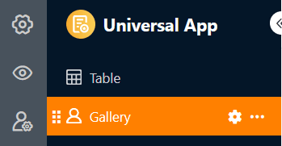
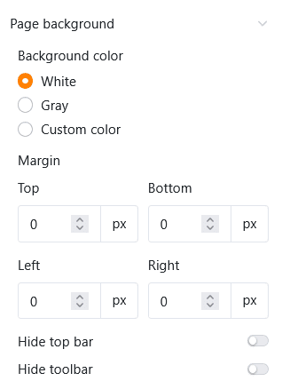
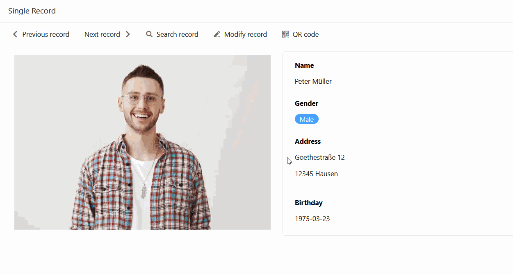

Com o [tipo de página]() de **registo de dados único**, tem a possibilidade de conceber uma página com elementos estáticos, campos de tabela dinâmicos, cores, molduras, etc., para apresentar visualmente os dados armazenados numa linha. Este tipo de página é, portanto, semelhante ao [plugin de conceção de páginas](https://seatable.io/pt/docs/seitendesign-plugin/anleitung-zum-seitendesign-plugin/) que já conhece do Base.

Os utilizadores da aplicação podem ver, pesquisar, navegar ou mesmo editar os registos de dados individuais nesta página - com a autorização relevante. Este tipo de página é adequado, por exemplo, para apresentar os dados de uma base de dados de empregados como perfis personalizados.

## Definições da página

Se pretender alterar as definições de uma página, clique no **símbolo da roda dentada**  correspondente na barra de navegação.

Nas **definições da página**, é possível selecionar a **tabela** em que os registos de dados individuais são guardados.

### Elementos estáticos

À semelhança das [páginas individuais](), também é possível adicionar **elementos estáticos** às páginas do tipo Registo de dados único, que são utilizados para conceber a página e permanecem iguais em todos os registos de dados. Estes elementos são

- Texto
- Texto formatado
- Linha horizontal
- Imagem
- Contentor
- Mapa

Para obter informações mais pormenorizadas sobre as **opções de definição** destes elementos, consulte [este artigo de ajuda]().

### Campos da tabela

Todas as colunas da tabela a partir das quais é possível inserir dados na página são listadas como campos de tabela. O conteúdo dos campos depende dos registos de dados individuais na tabela e muda consoante a entrada.

Tal como os elementos estáticos, cada campo de tabela também tem as suas próprias **definições de elementos**. Em primeiro lugar, seleccione se pretende apresentar o **nome do campo** que serve de título para a entrada. Em caso afirmativo, pode definir o **alinhamento** exato, o **tamanho** do tipo de letra, **a espessura** e a **cor do tipo de letra**.

Também pode definir uma **cor de fundo** e uma **moldura** para cada campo da tabela.

Para todos os tipos de colunas baseadas em texto e números, também tem a opção de definir o **tamanho, a espessura, a cor e o alinhamento dos valores apresentados**.

## Copiar, mover ou apagar elementos

Se quiser copiar, mover ou apagar um elemento existente na sua página, basta utilizar os três **símbolos** correspondentes no canto superior direito da moldura.

## Filtros predefinidos e ordenação

Também é possível definir filtros e ordenações predefinidos para limitar e organizar os registos de dados que podem ser apresentados aos utilizadores. Para filtrar ou ordenar, clique em **Adicionar filtro** ou **Adicionar ordenação**, seleccione a **coluna** e a **condição** pretendidas e confirme com **Enviar**.

Os utilizadores só podem ver as informações de um registo de dados individual que é apresentado através dos campos da tabela integrada.



## Definições gráficas do fundo da página

É possível fazer as seguintes definições gráficas para toda a página do tipo de registo de dados Simples:

- Seleccione branco, cinzento ou uma cor definida pelo utilizador como **cor de fundo** da página.
- Definir as **margens da página** (superior, inferior, esquerda, direita).
- Decida se pretende **ocultar** a **barra de título**.
- Decida se pretende **ocultar** a **barra de ferramentas** que os utilizadores podem utilizar para alternar entre entradas.

## Alternar entre as entradas

Se tiver exibido a barra de ferramentas, os utilizadores de aplicações com a autorização de página correspondente podem alternar entre os registos de dados individuais.   Para o fazer, clique em **Entrada** **anterior** ou **Entrada seguinte**.  Também é possível procurar uma **entrada** específica.

## Editar entrada

Com a autorização adequada, os utilizadores da aplicação podem editar os registos de dados individuais nesta página.

- Clique em **Editar entrada** na barra de ferramentas.
- Abre-se a janela com os **detalhes da linha**. Efectue aí as alterações desejadas no registo de dados.
- Feche a janela clicando no **símbolo x** para guardar as alterações.

## Gerar código QR para entradas individuais

Também encontrará um **gerador de código QR** na barra de ferramentas. O código QR contém a ligação para a entrada atualmente apresentada. Anexado a um objeto ou dispositivo, pode digitalizar o código QR utilizando um tablet ou smartphone e aceder a todos os dados na aplicação sem qualquer introdução no teclado. Isto torna [a gestão do inventário](https://seatable.io/pt/inventarliste-vorlagen/), por exemplo, ainda mais fácil.

## Executar acções de botão

Tal como nas páginas de tabelas e consultas, também aqui pode utilizar colunas do tipo [botão](https://seatable.io/pt/docs/andere-spalten/die-schaltflaeche/). Quer pretenda criar um documento PDF, editar um registo de dados ou executar um script - pode iniciar todas estas **acções de botão** com o toque de um botão. Para tal, **não** é necessária **qualquer** autorização de edição. Desta forma, os administradores de aplicações podem restringir as interações dos utilizadores para este tipo de página a algumas acções predefinidas.

## Autorizações de páginas

É possível definir as seguintes [autorizações de página]() para páginas do tipo Registo de dados único:

Decida quem está autorizado a **ver** e **editar** os registos de dados individuais. Não é possível adicionar ou eliminar linhas na tabela através desta página.



## Colunas só de leitura

Para além da autorização de página "Quem pode editar linhas?", é possível utilizar colunas só de leitura para definir com precisão quais os valores de coluna de um registo de dados que os utilizadores podem ou não alterar.

Vá às **definições da página** e assinale as **caixas** das colunas que devem ser **só de leitura** para os utilizadores. Pode reconhecer as colunas só de leitura pelo facto de estarem destacadas **a cinzento** nos detalhes da linha.
