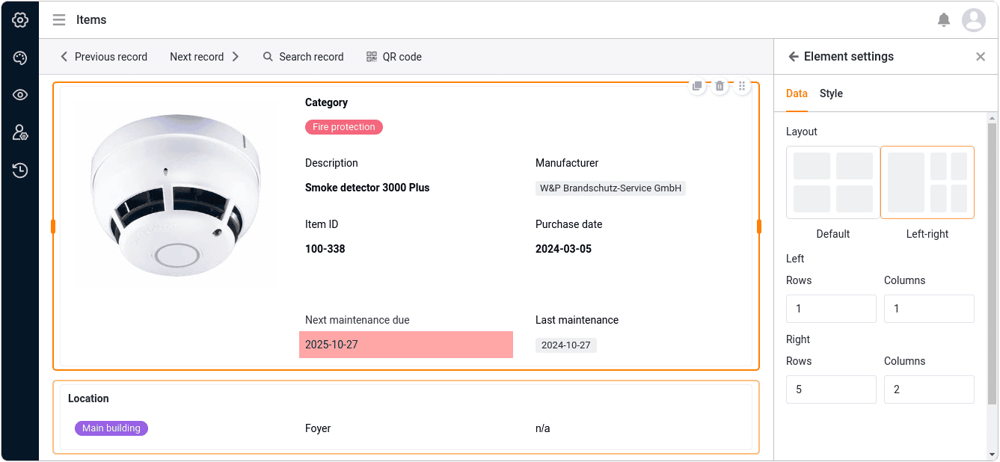

С помощью [типа страницы](https://seatable.io/ru/docs/universelle-apps/seitentypen-in-der-universellen-app/) с **одной записью данных** вы можете создать страницу со статическими элементами, динамическими полями таблицы, цветами, рамками и т. д., чтобы визуально представить данные, хранящиеся в строке. Таким образом, этот тип страницы похож на [плагин дизайна страниц](https://seatable.io/ru/docs/seitendesign-plugin/anleitung-zum-seitendesign-plugin/), который вы уже знаете из Base.

Пользователи приложения могут просматривать, искать, просматривать и даже редактировать отдельные записи данных на этой странице - при наличии соответствующих полномочий. Этот тип страницы подходит, например, для отображения данных в базе данных сотрудников в виде персонализированных профилей.

## Настройки страницы

Если вы хотите изменить настройки какой-либо страницы, нажмите на соответствующий **символ**  на панели навигации.

В **настройках страницы** можно выбрать **таблицу**, в которой будут сохраняться отдельные записи данных.

### Статические элементы

Как и на [отдельные страницы](), на страницы типа "Одна запись данных" можно добавлять **статические элементы**, которые используются для оформления страницы и остаются неизменными для всех записей данных. К таким элементам относятся

- Текст
- Форматированный текст
- Горизонтальная линия
- Изображение
- Контейнер
- Карта

Для получения более подробной информации о **настройках** этих элементов обратитесь к [этой статье справки]().

### Поля таблицы

Все столбцы таблицы, из которых можно вставить данные на страницу, перечислены как поля таблицы. Содержимое полей зависит от отдельных записей данных в таблице и меняется в зависимости от записи.

Как и у статических элементов, у каждого поля таблицы также есть свои **настройки элемента**. Сначала выберите, нужно ли отображать **название поля**, которое служит заголовком записи. Если да, то можно задать точное **выравнивание**, **размер шрифта**, **вес шрифта** и **цвет шрифта**.

Вы также можете задать **цвет фона** и **рамку** для каждого поля таблицы.

Для всех текстовых и числовых типов столбцов вы также можете задать **размер шрифта, вес шрифта, цвет шрифта и выравнивание отображаемых значений**.

## Копирование, перемещение или удаление элементов

Если вы хотите скопировать, переместить или удалить существующий элемент на странице, просто воспользуйтесь тремя соответствующими **символами** в правом верхнем углу рамки.

## Предустановленные фильтры и сортировка

Вы также можете задать предустановленные фильтры и сортировку, чтобы ограничить и упорядочить записи данных, которые могут быть отображены для пользователей. Для фильтрации или сортировки нажмите на кнопку **Добавить фильтр** или **Добавить сортировку**, выберите нужный **столбец** и **условие** и подтвердите выбор кнопкой **Отправить**.

Пользователи могут видеть информацию только для одной записи данных, которую вы отображаете с помощью встроенных полей таблицы.



## Графические настройки фона страницы

Вы можете задать следующие графические настройки для всей страницы типа записи данных Single:

- Выберите белый, серый или заданный пользователем цвет в качестве **цвета фона** страницы.
- Установите **поля страницы** (верхнее, нижнее, левое, правое).
- Решите, нужно ли **скрывать строку заголовка**.
- Решите, нужно ли **скрывать панель инструментов**, с помощью которой пользователи могут переключаться между записями.

## Переключение между записями

Если вы отобразили панель инструментов, пользователи приложений с соответствующими полномочиями на странице могут переключаться между отдельными записями данных.   Для этого нажмите на **Предыдущую запись** или **Следующую запись**.  Также можно выполнить поиск определенной **записи**.

## Редактировать запись

При наличии соответствующих полномочий пользователи приложения могут редактировать отдельные записи данных на этой странице.

- Нажмите на кнопку **Редактировать запись** на панели инструментов.
- Откроется окно с **информацией о линии**. Внесите в него необходимые изменения в записи данных.
- Закройте окно, нажав на **символ x**, чтобы сохранить изменения.

## Генерируйте QR-код для отдельных записей

На панели инструментов вы также найдете **генератор QR-кодов**. QR-код содержит ссылку на отображаемую в данный момент запись. Прикрепив его к объекту или устройству, вы можете отсканировать QR-код с помощью планшета или смартфона и вызвать все данные в приложении без использования клавиатуры. Это еще больше упрощает, например, [управление запасами](https://seatable.io/ru/inventarliste-vorlagen/).

## Выполнение действий с кнопками

Как и на страницах таблиц и запросов, здесь также можно использовать столбцы типа ["кнопка](https://seatable.io/ru/docs/andere-spalten/die-schaltflaeche/) ". Хотите ли вы создать PDF-документ, отредактировать запись данных или выполнить сценарий - все эти **действия** можно запустить одним **нажатием кнопки**. Для этого **не** требуется разрешения на редактирование. Таким образом, администраторы приложений могут ограничить взаимодействие пользователей с этим типом страницы несколькими предопределенными действиями.

## Разрешения на страницы

Вы можете определить следующие [полномочия страниц](https://seatable.io/ru/docs/apps/seitenberechtigungen-in-einer-universellen-app/) для страниц типа Одиночная запись данных:

Определите, кто имеет право **просматривать** и **редактировать** отдельные записи данных. На этой странице нельзя добавлять или удалять строки в таблице.



## Колонки, доступные только для чтения

В дополнение к полномочиям страницы "Кто может редактировать строки?" вы можете использовать столбцы только для чтения, чтобы точно определить, какие значения столбцов записи данных пользователи могут изменять, а какие нет.

Перейдите к **настройкам страницы** и установите **флажки** для столбцов, которые должны быть доступны пользователям **только для чтения**. Вы можете узнать столбцы, предназначенные только для чтения, по тому, что они выделены **серым** цветом в деталях строки.
