Mithilfe dieses Seitentyps können Sie eine beliebige **Tabelle** Ihrer Base als [Seite zu Ihrer Universellen App hinzufügen](https://seatable.io/docs/universelle-apps/seiten-und-ordner-in-einer-universellen-app-anlegen-und-verwalten/).

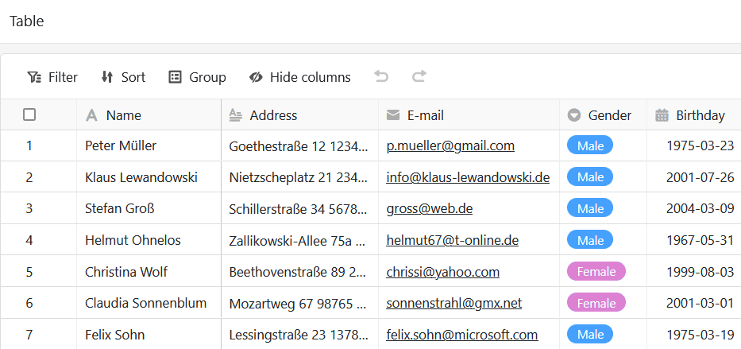

## Seiteneinstellungen ändern

Wenn Sie die Einstellungen einer Seite ändern möchten, klicken Sie in der Navigation auf das entsprechende  **Zahnrad-Symbol**.

Beim Bearbeiten von Tabellenseiten können Sie zahlreiche **Seiteneinstellungen** vornehmen, um die angezeigten Daten aus der zugrundeliegenden Tabelle exakt auf eine Nutzergruppe zuzuschneiden.

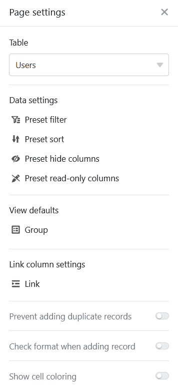

## Voreingestellte Filter, Sortierungen und Gruppierungen

Sie können in den Seiteneinstellungen **voreingestellte Filter**, **Sortierungen** und **Gruppierungen** definieren, um die angezeigten Daten für eine Nutzergruppe einzugrenzen und zu ordnen.

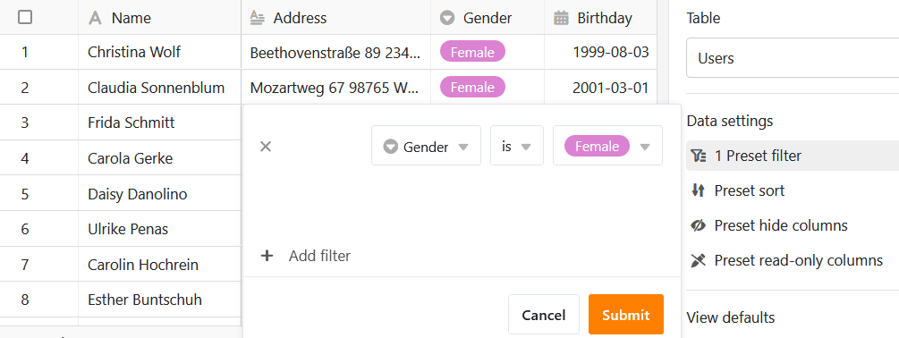

Klicken Sie dazu auf **Filter hinzufügen**, **Sortierung hinzufügen** oder **Gruppe hinzufügen**, wählen Sie die gewünschte **Spalte** und **Bedingung** aus und bestätigen Sie mit **Abschicken**.



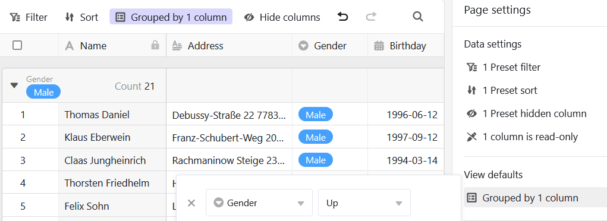

Mit den **Ansichtsoptionen** über der Tabelle können die App-Nutzer bestehende Gruppierungen und Sortierungen aufheben oder ergänzende Einstellungen vornehmen.



## Ausgeblendete und schreibgeschützte Spalten

Über die voreingestellten Filter hinaus können Sie auch **ausgeblendete und schreibgeschützte Spalten** definieren, um die Sichtbarkeit und Bearbeitbarkeit bestimmter Daten weiter einzuschränken.

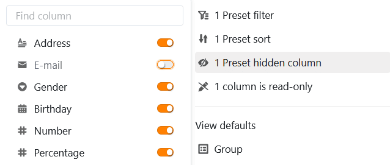

Klicken Sie einfach die **Regler** oder **Kästchen** der Spalten an, die für die Nutzer **ausgeblendet** oder **nur lesbar** sein sollen.

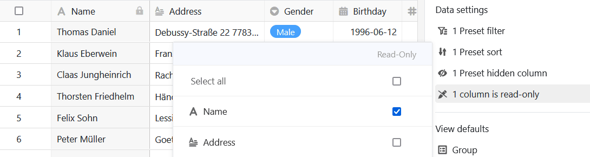

Schreibgeschützte Spalten erkennen Sie daran, dass sie in der Tabelle **grau** hinterlegt und mit einem **Schloss-Symbol** gekennzeichnet sind.



## Einstellungen der Verknüpfungsspalte

In den **Einstellungen der Verknüpfungsspalte** können Sie für jede verknüpfte Tabelle festlegen, welche Daten sichtbar und welche Operationen erlaubt sind.

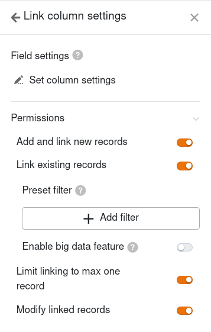

- **Hinzufügen neuer Einträge erlauben**: Wenn Sie diesen Regler aktivieren, können Nutzer neue Einträge in der verknüpften Tabelle hinzufügen. Über die Feldeinstellungen können Sie definieren, welche Spalten dabei **sichtbar** und welche Spalten **erforderlich** sind, also ausgefüllt werden müssen.
- **Verknüpfen bestehender Einträge erlauben**: Wenn Sie diesen Regler aktivieren, können Nutzer bestehende Einträge der verknüften Tabelle verlinken. Über die Feldeinstellungen können Sie definieren, welche Spalten dabei **sichtbar** sind.
- **Verknüpfungen auf maximal eine Zeile begrenzen**: Wenn Sie diesen Regler aktivieren, können Nutzer in den Zellen der Verknüpfungsspalte nur noch jeweils eine Zeile der verknüpften Tabelle verlinken.
- **Voreingestellte Filter**: Wenn Sie hier einen Filter hinzufügen, werden beim Verlinken von Einträgen nur Optionen angezeigt, die die Filterbedingungen erfüllen.
- **Big-Data-Funktion aktivieren**: Wenn die Big-Data-Funktion aktiviert ist, können Nutzer mehr als 20.000 Datensätze durchsuchen, sofern in der verknüpften Tabelle so viele Einträge vorhanden sind.

## Hinzufügen von Duplikaten verhindern

Auf Tabellenseiten, über die verschiedene Benutzer neue Einträge in einer Base vornehmen können, ist es schnell passiert, dass **identische Zeilen** angelegt werden. Dies können Sie unterbinden, indem Sie das Hinzufügen von Duplikaten verhindern. Aktivieren Sie dazu den entsprechenden **Regler** und wählen Sie die **Spalten** aus, in denen die Werte übereinstimmen müssen, damit eine Zeile als **Duplikat** gilt. Wenn das Hinzufügen einer Zeile blockiert wird, erscheint eine entsprechende Fehlermeldung.

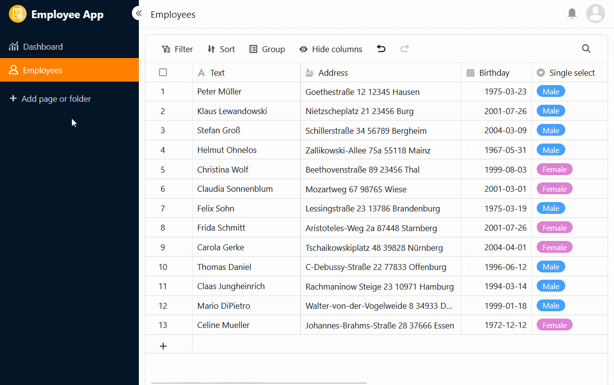

## Formatprüfung bei neuen Einträgen

Sie können einen weiteren **Regler** aktivieren, um [Eingaben in Text-Spalten zu validieren](https://seatable.io/docs/text-und-zahlen/validierung-der-eingabe-bei-textfeldern/). Sobald die **Formatprüfung** eingeschaltet ist, öffnen sich immer die Zeilendetails, wenn jemand einen neuen Eintrag auf der Tabellenseite hinzufügen möchte – und dies ist nur möglich, sofern die Einträge dem definierten Format entsprechen. Bei Einträgen mit einem abweichenden Format erscheint eine **Fehlermeldung**.

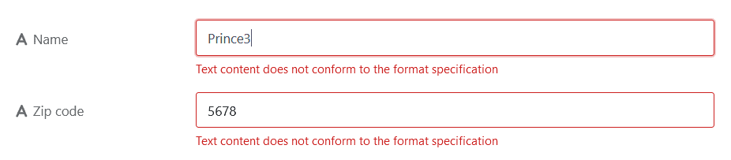

So können Sie zum Beispiel **Tippfehler** bei klar umrissenen Zeichenfolgen wie Postleitzahlen oder Kontonummern minimieren. Die [regulären Ausdrücke](https://seatable.io/docs/text-und-zahlen/validierung-der-eingabe-bei-textfeldern/) zum Validieren der Eingaben legen Sie bereits beim Erstellen einer Text-Spalte in der Base fest.

## Zellformatierung anzeigen

Wenn Sie in der zugrundeliegenden Tabelle das [Einfärben von Zellen](https://seatable.io/docs/ansichtsoptionen/einfaerben-von-zellen/) nutzen, können Sie mit einem Klick die Option aktivieren, dass die Zellformatierung auch auf der Tabellenseite angezeigt wird.

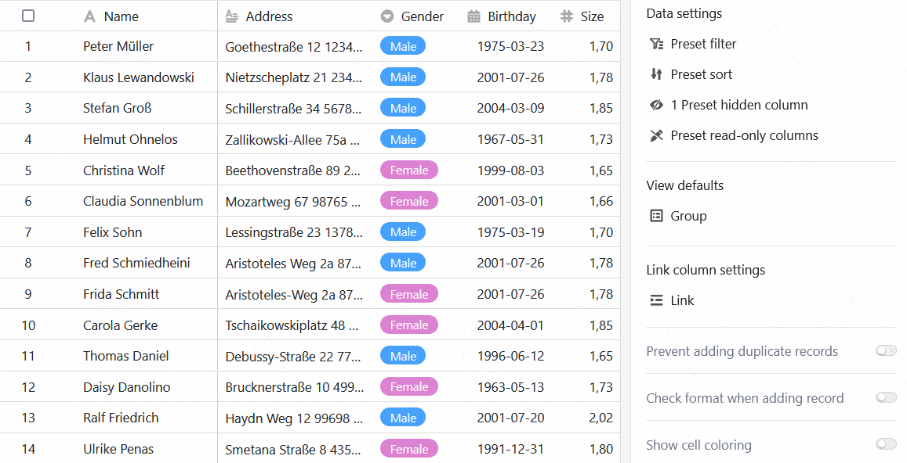

## Tabellenseite als Excel-Datei exportieren

Diese Funktion ist standardmäßig ausgeschaltet. Wenn Sie den Excel-Export ermöglichen möchten, aktivieren Sie den entsprechenden Regler in den Einstellungen der Tabellenseite. Danach können alle App-Nutzer, die Zugang zu der Tabellenseite haben, die sichtbaren Daten als Excel-Datei exportieren. Klicken Sie dazu auf die **drei Punkte** in den Ansichtsoptionen und dann auf **Nach Excel exportieren**.

Die Daten, die aus der Tabellenseite exportiert werden, sind unabhängig von der aktuellen **Ansicht**. Selbst wenn Sie **filtern oder Spalten ausblenden**, sind alle Daten im Export enthalten.

## Seitenberechtigungen

Bei den [Seitenberechtigungen](https://seatable.io/docs/apps/seitenberechtigungen-in-einer-universellen-app/) können Sie genauestens einstellen, wer die Tabelle sehen und bearbeiten darf.



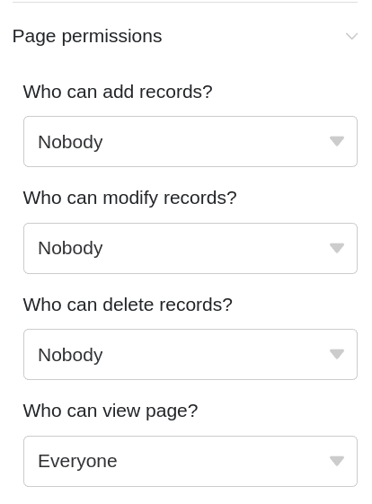
