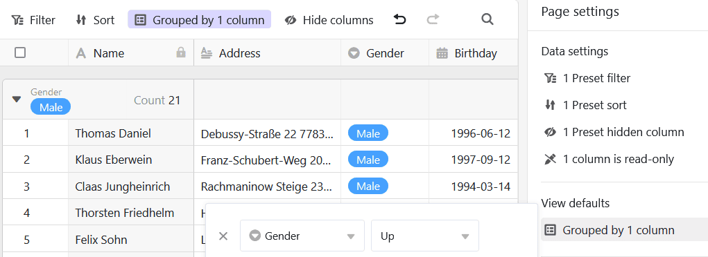
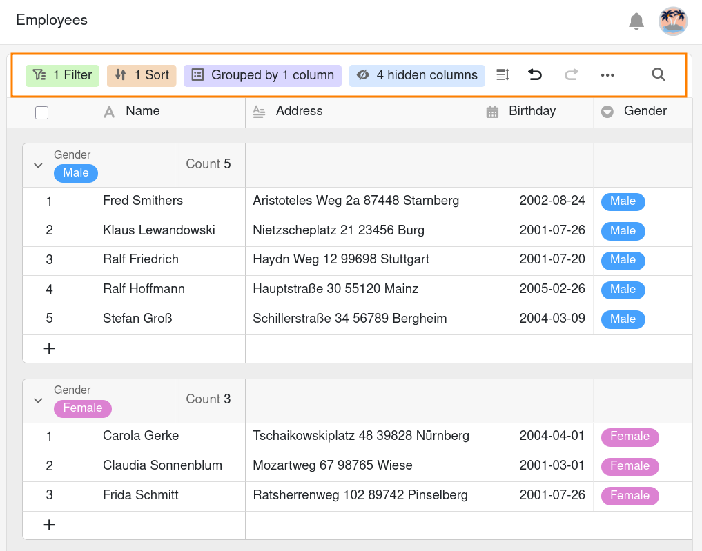
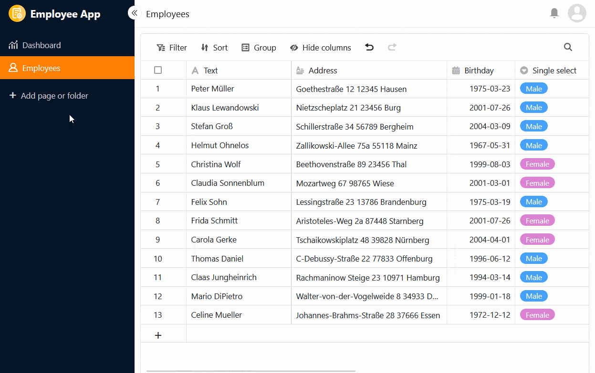

You can use this page type to [add a table from your base to your app]().

## Change page settings

If you want to change the settings of a page, click on the corresponding  **cogwheel symbol** in the navigation bar.

When editing table pages, you can make numerous **page settings** to tailor the displayed data from the underlying table precisely to a user group.

## Preset filters, sorting and grouping

You can define **preset filters**, **sorting** and **grouping** in the page settings to limit and organize the displayed data for a user group.

To do this, click on **Add filter**, **Add sort** or **Add group**, select the desired **column** and **condition** and confirm with **Submit**.





## Hidden and read-only columns

In addition to the preset filters, you can also define **hidden and read-only columns** to further restrict the visibility and editability of certain data.

Simply click on the **sliders** or **boxes** of the columns that should be **hidden** or **read-only** for the users.

You can recognize read-only columns by the fact that they are highlighted in **grey** in the table and marked with a **lock symbol**.



## View options of the user

With the **view options** above the table, app users can make their own additional settings, which work in exactly the same way as in the base. These include

- [Filter]()
- [Sort]()
- [Group]()
- [Hide columns]()
- [Set row height]()
- [Adjust the number of frozen columns]()

As mentioned above, the user's individual view settings **have no effect on the standard settings** you have predefined for the table page. For example, the user can hide additional columns or additionally filter a view that you have pre-filtered, but they cannot display any rows that you have filtered out or columns that you have hidden or even make them visible to others.

## Link column settings

In the **settings for the link column**, you can define which data is visible and which operations are permitted for each linked table.

- **Field settings**: Here you can define exactly which columns the following authorizations apply to.
- **Add and link new records**: If you activate this slider, users can add new records to the linked table. You can use the field settings to specify which columns are **required**, i.e. must be filled in.
- **Link existing records**: If you activate this slider, users can link existing records in the linked table. You can use the field settings to define which columns are **visible**.
- **Preset filter**: If you add a filter here, only options that fulfill the filter conditions will be displayed when linking records.
- **Enable big data feature**: When the Big Data feature is enabled, users can search more than 20,000 records if there are that many records in the linked table.
- **Limit linking to max one record**: If you activate this slider, users can only link one row of the linked table at a time in the cells of the link column.
- **Modify linked records**: If you activate this slider, users can edit existing records in the linked table. You can use the field settings to define which columns are **editable**.

## Prevent duplicates from being added

On table pages where different users can make new entries in a base, it is easy for **identical rows** to be created. You can prevent this by preventing duplicates from being added. To do this, activate the corresponding **slider** and select the **columns** in which the values must match for an row to be considered a **duplicate**. If the addition of an row is blocked, a corresponding error message appears.

## Format check for new entries

You can activate another **slider** to [validate entries in text columns](). As soon as the **format check** is switched on, the row details always open when someone wants to add a new entry to the table page - and this is only possible if the entries correspond to the defined format. An **error message** appears for entries with a different format.

For example, you can minimize **typing errors** for clearly defined character strings such as zip codes or account numbers. You define the [regular expressions]() for validating the entries when you create a text column in the base.

## Show cell formatting

If you use the [coloring of cells]() in the underlying table, you can activate the option to display the cell formatting on the table page with one click.

## Export table page as Excel file

This function is disabled by default. If you want to enable Excel export, activate the corresponding slider in the table page settings. All app users who have access to the table page can then export the visible data as an Excel file. To do this, click on the **three dots** in the view options and then on **Export to Excel**.

The data exported from the table page is independent of the current **view**. Even if you **filter or hide columns**, all data is included in the export.

## Page authorizations

In the [page authorizations](), you can set exactly who is allowed to view and edit the table.



[Buttons]() can **always** be activated regardless of the page authorizations. This means that every app user can make certain changes to the data records that you have previously defined, even if the affected columns are otherwise locked for them or the user is not authorized to edit the page.



