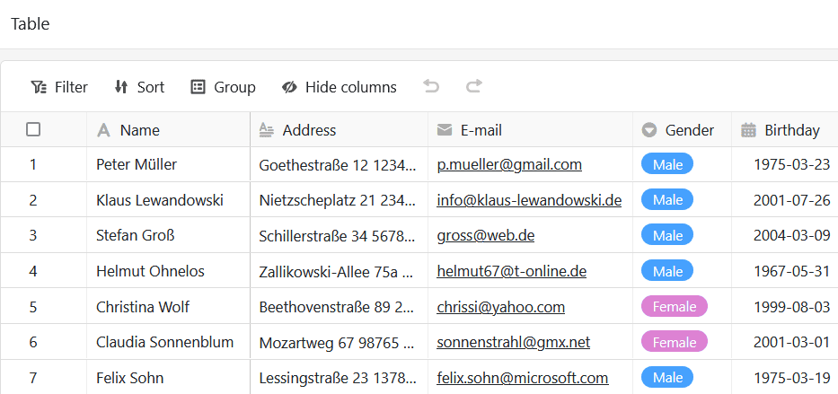
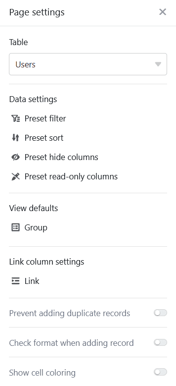

Puede utilizar este tipo de página para [añadir]().

## Cambiar la configuración de la página

Si desea cambiar la configuración de una página, haga clic en el **símbolo de rueda dentada**  correspondiente en la barra de navegación.

Al editar páginas de tablas, puede realizar numerosos **ajustes de página** para personalizar los datos mostrados de la tabla subyacente precisamente a un grupo de usuarios.

## Filtros preestablecidos, clasificación y agrupación

Puede definir **filtros**, **clasificaciones** y **agrupaciones** **predefinidos** en la configuración de la página para limitar y organizar los datos mostrados para un grupo de usuarios.

Para ello, haga clic en **Añadir filtro**, **Añadir ordenación** o **Añadir grupo**, seleccione la **columna** y la **condición** deseadas y confirme con **Enviar**.



Con las **opciones de vista** situadas encima de la tabla, los usuarios de la aplicación pueden cancelar las agrupaciones y ordenaciones existentes o realizar ajustes adicionales.



## Columnas ocultas y de sólo lectura

Además de los filtros preestablecidos, también puede definir **columnas ocultas y de sólo lectura** para restringir aún más la visibilidad y editabilidad de determinados datos.

Sólo tiene que hacer clic en los **controles deslizantes** o **casillas** de las columnas que desee **ocultar** o que **sean de sólo lectura** para los usuarios.

Puede reconocer las columnas protegidas contra escritura porque aparecen resaltadas en **gris** en la tabla y marcadas con el **símbolo de un candado**.



## Configuración de la columna de enlaces

En **la configuración de la columna de enlace**, puede especificar qué datos son visibles y qué operaciones están permitidas para cada tabla enlazada.

- **Permitir añadir nuevas entradas**: Si activa este control deslizante, los usuarios podrán añadir nuevas entradas a la tabla vinculada. Puede utilizar la configuración de campos para definir qué columnas son **visibles** y qué columnas son **obligatorias**, es decir, deben rellenarse.
- **Permitir la vinculación de entradas existentes**: Si activa este control deslizante, los usuarios podrán vincular entradas existentes en la tabla vinculada. Puede utilizar los ajustes de campo para definir qué columnas son **visibles**.
- **Limitar** los enlaces a una fila como máximo: Si activa este control deslizante, los usuarios sólo podrán enlazar una fila de la tabla enlazada en las celdas de la columna de enlace.
- **Filtros preestablecidos**: si añade un filtro aquí, al enlazar las entradas sólo se mostrarán las opciones que cumplan las condiciones del filtro.
- **Activar** la función big data: Si la función big data está activada, los usuarios pueden buscar en más de 20.000 registros de datos, siempre que haya este número de entradas en la tabla vinculada.

## Evitar que se añadan duplicados

En las páginas de tablas donde diferentes usuarios pueden hacer nuevas entradas en una base, es fácil que se creen **filas idénticas**. Puede evitarlo impidiendo que se añadan duplicados. Para ello, active el **control deslizante** correspondiente y seleccione las **columnas** en las que deben coincidir los valores para que una fila se considere **duplicada**. Si se bloquea la adición de una fila, aparece el mensaje de error correspondiente.

## Comprobación del formato de las nuevas entradas

Puede activar otro **control deslizante** para [validar las entradas en columnas de texto](). En cuanto se activa la **comprobación** del formato, los detalles de la fila se abren siempre que alguien quiere añadir una nueva entrada a la página de la tabla - y esto sólo es posible si las entradas corresponden al formato definido. Para entradas con un formato diferente aparece un **mensaje de error**.

Por ejemplo, puede minimizar los **errores de escritura** en cadenas de caracteres claramente definidas, como códigos postales o números de cuenta. Las [expresiones regulares]() para validar las entradas se definen al crear una columna de texto en la base.

## Mostrar formato de celda

Si utiliza la [coloración de celdas]() en la tabla subyacente, puede activar la opción de mostrar el formato de celda en la página de la tabla haciendo clic en ella.

## Exportar página de tabla como archivo Excel

Esta función está desactivada por defecto. Si desea habilitar la exportación a Excel, active el control deslizante correspondiente en la configuración de la página de tabla. Todos los usuarios de la aplicación que tengan acceso a la página de la tabla podrán entonces exportar los datos visibles como archivo Excel. Para ello, haga clic en los **tres puntos** de las opciones de visualización y, a continuación, en **Exportar a Excel**.

Los datos que se exportan desde la página de tabla son independientes de la **vista** actual. Aunque **filtre u oculte columnas**, todos los datos se incluyen en la exportación.

## Autorizaciones de páginas

En las [autorizaciones de la página](), puede establecer exactamente quién tiene permiso para ver y editar la tabla.



[Los botones]() **siempre** se pueden pulsar independientemente de las autorizaciones de la página. Esto significa que todos los usuarios de la app pueden realizar determinados cambios en los registros de datos que hayas definido previamente, aunque las columnas afectadas estén bloqueadas para ellos o el usuario no esté autorizado a editar la página.



