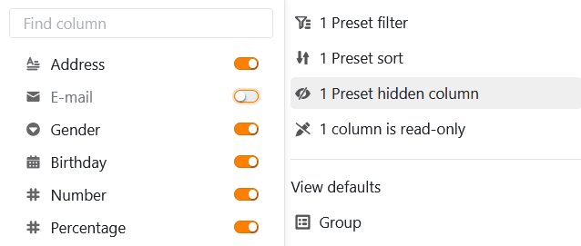
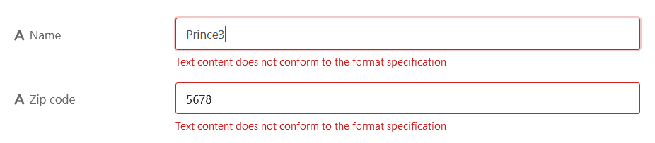

Ce type de page vous permet d'[ajouter]() n'importe quel **tableau** de votre base comme page à votre application universelle.

## Modifier les paramètres de la page

Si vous souhaitez modifier les paramètres d'une page, cliquez dans la navigation sur le **symbole de la roue dentée**  correspondant.

Lorsque vous modifiez des pages de tableau, vous pouvez définir de nombreux **paramètres de page** afin d'adapter exactement les données affichées du tableau sous-jacent à un groupe d'utilisateurs.

## Filtres, tris et groupes prédéfinis

Vous pouvez définir des **filtres**, des **tris** et des **groupes** **prédéfinis** dans les paramètres de la page afin de limiter et d'organiser les données affichées pour un groupe d'utilisateurs.

Pour ce faire, cliquez sur **Ajouter un filtre**, **Ajouter un tri** ou **Ajouter un groupe**, sélectionnez la **colonne** et la **condition** souhaitées et confirmez en cliquant sur **Envoyer**.





## Colonnes masquées et en lecture seule

En plus des filtres prédéfinis, vous pouvez également définir des **colonnes masquées et en lecture seule** afin de limiter davantage la visibilité et la modifiabilité de certaines données.

Il suffit de cliquer sur les **curseurs** ou les **cases** des colonnes qui doivent être **masquées** ou **uniquement lisibles** par les utilisateurs.

Vous reconnaissez les colonnes en lecture seule au fait qu'elles sont **grisées** dans le tableau et marquées par un **symbole de cadenas**.



## Options d'affichage de l'utilisateur

Les **options d'affichage** au-dessus du tableau permettent aux utilisateurs de l'application de définir leurs propres paramètres complémentaires, qui fonctionnent exactement comme dans la base. Il s'agit notamment de

- [Filtrer]()
- [Trier]()
- [Grouper]()
- [Masquer des colonnes]()
- [Sélectionner l'hauteur de ligne]()
- [Ajuster le nombre de colonnes fixes]()

Comme indiqué ci-dessus, les paramètres d'affichage individuels de l'utilisateur **n'ont aucun effet sur les paramètres par défaut** de la page de tableau que vous avez prédéfinis. Par exemple, l'utilisateur peut filtrer davantage une vue que vous avez pré-filtrée ou masquer d'autres colonnes, mais il ne peut pas afficher les enregistrements que vous avez filtrés ou les colonnes que vous avez masquées, ni même les rendre visibles pour les autres.

## Paramètres de la colonne des liens

Dans les **paramètres de la colonne des liens**, vous pouvez définir pour chaque tableau lié quelles données sont visibles et quelles opérations sont autorisées.

- **Paramètres des champs** : Ici, vous pouvez définir précisément les colonnes auxquelles s'appliquent les autorisations suivantes.
- **Créer et lier de nouvelles entrées** : Si vous activez ce curseur, les utilisateurs peuvent ajouter de nouvelles entrées dans la table liée. Les paramètres de champ vous permettent de définir quelles colonnes sont **nécessaires**, c'est-à-dire qu'elles doivent être remplies.
- **Lier des entrées existantes** : Si vous activez ce curseur, les utilisateurs peuvent lier les entrées existantes de la table liée. Vous pouvez définir quelles colonnes sont **visibles** dans les paramètres de champ.
- **Filtres prédéfinis** : Si vous ajoutez un filtre ici, seules les options qui remplissent les conditions du filtre seront affichées lors de la liaison d'entrées.
- **Activer la fonction Big Data** : Lorsque la fonction Big Data est activée, les utilisateurs peuvent effectuer des recherches sur plus de 20 000 enregistrements, à condition qu'il y ait autant d'entrées dans la table liée.
- **Limiter les liens à une seule ligne maximum** : Si vous activez ce curseur, les utilisateurs ne pourront lier qu'une seule ligne de la table liée à la fois dans les cellules de la colonne de jointure.
- **Modifier les entrées liées** : Si vous activez ce curseur, les utilisateurs peuvent modifier les entrées existantes du tableau lié. Vous pouvez définir quelles colonnes sont **éditables** dans les paramètres de champ.

## Empêcher l'ajout de doublons

Sur les pages de tableaux permettant à différents utilisateurs d'effectuer de nouvelles entrées dans une base, il est vite arrivé que **des lignes identiques** soient créées. Vous pouvez empêcher cela en empêchant l'ajout de doublons. Pour ce faire, activez le **curseur** correspondant et sélectionnez les **colonnes** dans lesquelles les valeurs doivent correspondre pour qu'une ligne soit considérée comme **un doublon**. Si l'ajout d'une ligne est bloqué, un message d'erreur correspondant apparaît.

## Contrôle du format pour les nouvelles entrées

Vous pouvez activer un autre **curseur** pour [valider les entrées dans les colonnes de texte](). Dès que la **vérification du format** est activée, les détails de la ligne s'ouvrent toujours lorsque quelqu'un veut ajouter une nouvelle entrée sur la page du tableau - et cela n'est possible que si les entrées correspondent au format défini. Pour les entrées dont le format est différent, un **message d'erreur** apparaît.

Vous pouvez par exemple minimiser **les erreurs de frappe** sur des chaînes de caractères clairement définies, comme les codes postaux ou les numéros de compte. Vous définissez les [expressions régulières]() pour valider les entrées dès la création d'une colonne de texte dans la base.

## Afficher le formatage des cellules

Si vous utilisez la [colorisation des cellules]() dans le tableau sous-jacent, vous pouvez activer d'un clic l'option permettant d'afficher le formatage des cellules également sur la page du tableau.

## Exporter la page du tableau en tant que fichier Excel

Cette fonction est désactivée par défaut. Si vous souhaitez permettre l'exportation vers Excel, activez le curseur correspondant dans les paramètres de la page du tableau. Ensuite, tous les utilisateurs de l'app qui ont accès à la page du tableau peuvent exporter les données visibles sous forme de fichier Excel. Pour ce faire, cliquez sur les **trois points** dans les options d'affichage, puis sur **Exporter vers Excel**.

Les données exportées depuis la page du tableau sont indépendantes de l'**affichage** actuel. Même si vous **filtrez ou masquez des colonnes**, toutes les données sont incluses dans l'exportation.

## Autorisations des pages

Dans les [autorisations de page](), vous pouvez définir avec précision qui peut voir et modifier le tableau.



[Les boutons]() peuvent **toujours** être actionnés indépendamment des autorisations de la page. Cela permet à tout utilisateur de l'application d'effectuer certaines modifications sur les enregistrements que vous avez définis au préalable, même si les colonnes concernées sont par ailleurs bloquées pour lui ou si l'utilisateur n'est pas autorisé à modifier la page.



