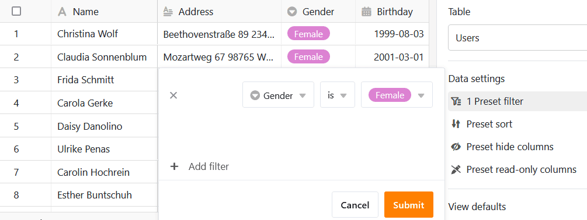
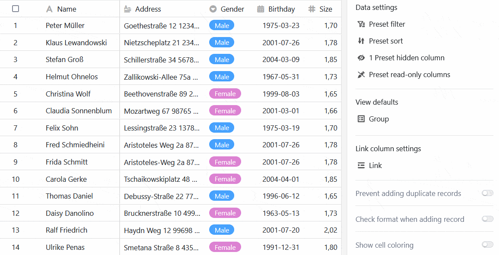

Pode utilizar este tipo de página para [adicionar](https://seatable.io/pt/docs/universelle-apps/seiten-und-ordner-in-einer-universellen-app-anlegen-und-verwalten/) qualquer **tabela** da sua base como uma [página à sua aplicação universal](https://seatable.io/pt/docs/universelle-apps/seiten-und-ordner-in-einer-universellen-app-anlegen-und-verwalten/).

## Alterar as definições da página

Se pretender alterar as definições de uma página, clique no **símbolo da roda dentada**  correspondente na barra de navegação.

Ao editar páginas de tabela, é possível definir várias **configurações de página** para personalizar os dados apresentados da tabela subjacente precisamente para um grupo de utilizadores.

## Filtros predefinidos, ordenação e agrupamento

É possível definir **filtros predefinidos**, **ordenação** e **agrupamentos** nas definições da página para limitar e organizar os dados apresentados para um grupo de utilizadores.

Para tal, clique em **Adicionar filtro**, **Adicionar ordenação** ou **Adicionar grupo**, seleccione a **coluna** e a **condição** pretendidas e confirme com **Enviar**.



Com as **opções de visualização** acima da tabela, os utilizadores da aplicação podem cancelar os agrupamentos e a ordenação existentes ou efetuar definições adicionais.



## Colunas ocultas e só de leitura

Para além dos filtros predefinidos, também é possível definir **colunas ocultas e só de leitura** para restringir ainda mais a visibilidade e a possibilidade de edição de determinados dados.

Basta clicar nos **cursores** ou nas **caixas** das colunas que pretende **ocultar** ou tornar **apenas de leitura** para os utilizadores.

Pode reconhecer colunas protegidas contra escrita pelo facto de estarem destacadas a **cinzento** na tabela e marcadas com um **símbolo de cadeado**.



## Definições da coluna de ligações

Nas **opções da coluna de ligação**, é possível especificar quais os dados visíveis e quais as operações permitidas para cada tabela ligada.

- **Permitir adicionar novas entradas**: Se ativar este seletor, os utilizadores podem adicionar novas entradas à tabela ligada. Pode utilizar as definições de campo para definir as colunas que são **visíveis** e as que são **obrigatórias**, ou seja, que têm de ser preenchidas.
- **Permitir a ligação de entradas existentes**: Se ativar esta barra deslizante, os utilizadores podem ligar entradas existentes na tabela ligada. Pode utilizar as definições de campo para definir as colunas que são **visíveis**.
- **Limitar as ligações a um máximo de uma linha**: Se ativar esta barra deslizante, os utilizadores só podem ligar uma linha da tabela ligada nas células da coluna de ligação.
- **Filtros predefinidos**: Se adicionar um filtro aqui, apenas as opções que satisfazem as condições do filtro serão apresentadas ao ligar as entradas.
- **Ativar** a função de grandes volumes de dados: Se a função de grandes volumes de dados estiver activada, os utilizadores podem pesquisar mais de 20.000 registos de dados, desde que existam este número de entradas na tabela ligada.

## Impedir a adição de duplicados

Nas páginas de tabelas em que diferentes utilizadores podem fazer novas entradas numa base, é fácil criar **linhas idênticas**. Pode evitar que isso aconteça impedindo a adição de linhas duplicadas. Para tal, active o **cursor** correspondente e seleccione as **colunas** em que os valores devem coincidir para que uma linha seja considerada **duplicada**. Se a adição de uma linha for bloqueada, uma mensagem de erro correspondente será exibida.

## Verificação de formato para novas entradas

Pode ativar outra **barra deslizante** para [validar entradas em colunas de texto](https://seatable.io/pt/docs/text-und-zahlen/validierung-der-eingabe-bei-textfeldern/). Assim que a **verificação do formato** estiver activada, os detalhes da linha abrem-se sempre que alguém quiser adicionar uma nova entrada à página da tabela - e isto só é possível se as entradas corresponderem ao formato definido. Aparece uma **mensagem de erro** para entradas com um formato diferente.

Por exemplo, é possível minimizar **os erros de digitação** em cadeias de caracteres claramente definidas, como códigos postais ou números de conta. As [expressões regulares](https://seatable.io/pt/docs/text-und-zahlen/validierung-der-eingabe-bei-textfeldern/) para validação das entradas são definidas quando se cria uma coluna de texto na base.

## Mostrar formatação de células

Se utilizar a [coloração das células]() na tabela subjacente, pode ativar a opção para apresentar a formatação das células na página da tabela, clicando na mesma.

## Exportar página de tabela como ficheiro Excel

Esta função está desactivada por defeito. Se pretender ativar a exportação para Excel, active o cursor correspondente nas definições da página de tabela. Todos os utilizadores da aplicação que têm acesso à página de tabela podem então exportar os dados visíveis como um ficheiro Excel. Para o fazer, clique nos **três pontos** nas opções de visualização e, em seguida, em **Exportar para Excel**.

Os dados que são exportados da página de tabela são independentes da **vista** atual. Mesmo que **filtre ou oculte colunas**, todos os dados são incluídos na exportação.

## Autorizações de páginas

Nas [autorizações de página](https://seatable.io/pt/docs/apps/seitenberechtigungen-in-einer-universellen-app/), pode definir exatamente quem tem permissão para ver e editar a tabela.



