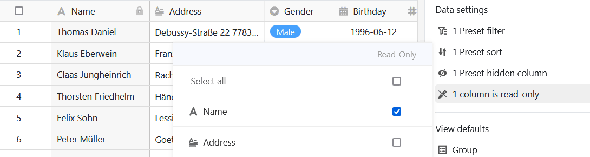
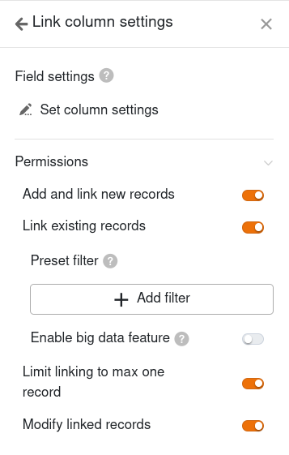
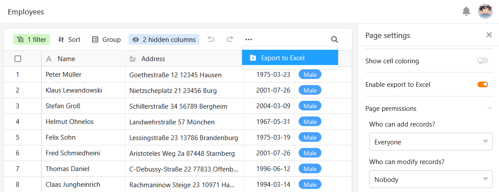

Вы можете использовать этот тип страницы, чтобы [добавить]().

## Изменение настроек страницы

Если вы хотите изменить настройки какой-либо страницы, нажмите на соответствующий **символ**  на панели навигации.

При редактировании страниц таблиц можно выполнить множество **настроек страницы**, чтобы настроить отображение данных из основной таблицы именно для той или иной группы пользователей.

## Предустановленные фильтры, сортировка и группировка

В настройках страницы можно задать **предустановленные фильтры**, **сортировку** и **группировку**, чтобы ограничить и упорядочить данные, отображаемые для группы пользователей.

Для этого нажмите кнопку **Добавить фильтр**, **Добавить сортировку** или **Добавить группу**, выберите нужный **столбец** и **условие** и подтвердите выбор кнопкой **Отправить**.



С помощью **опций просмотра** над таблицей пользователи приложения могут отменить существующие группировки и сортировки или задать дополнительные настройки.



## Скрытые и доступные только для чтения столбцы

В дополнение к предустановленным фильтрам вы также можете определить **скрытые столбцы и столбцы только для чтения**, чтобы еще больше ограничить видимость и возможность редактирования определенных данных.

Просто нажмите на **ползунки** или **поля** колонок, которые вы хотите **скрыть** или сделать доступными **только для чтения**.

Вы можете узнать столбцы с защитой от записи по тому, что они выделены в таблице **серым** цветом и помечены **символом замка**.



## Настройки колонки ссылок

В **настройках столбца связи** можно указать, какие данные будут видны и какие операции разрешены для каждой связанной таблицы.

- **Разрешить добавлять новые записи**: если вы активируете этот ползунок, пользователи смогут добавлять новые записи в связанную таблицу. Вы можете использовать настройки поля, чтобы определить, какие столбцы будут **видимыми**, а какие - **обязательными**, т. е. подлежащими заполнению.
- **Разрешить связывать существующие записи**: если вы активируете этот ползунок, пользователи смогут связывать существующие записи в связанной таблице. Вы можете использовать настройки поля, чтобы определить, какие столбцы будут **видны**.
- **Ограничить ссылки не более чем одной строкой**: Если вы активируете этот ползунок, пользователи смогут связывать только одну строку связанной таблицы в ячейках столбца ссылок.
- **Предустановленные фильтры**: если вы добавите здесь фильтр, то при связывании записей будут отображаться только те варианты, которые соответствуют условиям фильтра.
- **Активируйте** функцию **больших данных**: Если активирована функция больших данных, пользователи могут искать в более чем 20 000 записей данных, если в связанной таблице имеется столько записей.

## Предотвращение добавления дубликатов

На страницах таблиц, где разные пользователи могут вносить новые записи в базу, легко создать **одинаковые строки**. Вы можете предотвратить это, запретив добавление дубликатов. Для этого активируйте соответствующий **ползунок** и выберите **столбцы**, значения в которых должны совпадать, чтобы строка считалась **дубликатом**. Если добавление строки заблокировано, появится соответствующее сообщение об ошибке.

## Проверка формата на наличие новых записей

Вы можете активировать еще один **ползунок** для [проверки записей в текстовых колонках](). Если включена **проверка формата**, то при желании добавить новую запись на страницу таблицы всегда открываются сведения о строке - и это возможно только в том случае, если записи соответствуют заданному формату. Для записей с другим форматом появляется **сообщение об ошибке**.

Например, вы можете свести к минимуму **ошибки при вводе** четко определенных строк символов, таких как почтовые индексы или номера счетов. Вы определяете [регулярные выражения]() для проверки записей при создании текстового столбца в базе.

## Показать форматирование ячеек

Если вы используете [раскраску ячеек]() в основной таблице, вы можете активировать опцию отображения форматирования ячеек на странице таблицы, щелкнув по ней.

## Экспорт страницы таблицы в файл Excel

По умолчанию эта функция отключена. Если вы хотите включить экспорт в Excel, активируйте соответствующий ползунок в настройках страницы таблицы. После этого все пользователи приложения, имеющие доступ к странице таблицы, смогут экспортировать видимые данные в файл Excel. Для этого нажмите на **три точки** в параметрах просмотра, а затем на **Экспорт в Excel**.

Данные, экспортируемые со страницы таблицы, не зависят от текущего **представления**. Даже если вы **отфильтруете или скроете столбцы**, все данные будут включены в экспорт.

## Разрешения на страницы

В [разделе "Полномочия на странице]() " вы можете указать, кому именно разрешено просматривать и редактировать таблицу.



[Кнопки]() можно нажимать **всегда**, независимо от прав доступа к странице. Это означает, что каждый пользователь приложения может вносить определенные изменения в записи данных, которые вы ранее определили, даже если соответствующие столбцы заблокированы для него или пользователь не имеет прав на редактирование страницы.



