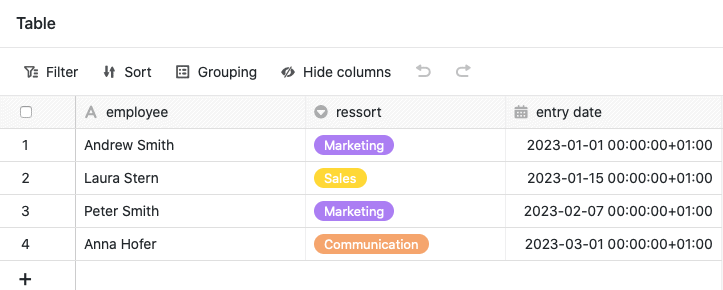

Im Bearbeitungsmodus der **Universellen App** stehen Ihnen verschiedene **Seitentypen** für die Gestaltung Ihrer App zur Auswahl. Die meisten Seitentypen kennen Sie in ähnlicher Form schon von anderen Stellen in SeaTable.

In diesem Übersichtsartikel lernen Sie die verfügbaren Seitentypen und ihre unterschiedlichen Verwendungszwecke kennen.

## Seitentypen in der Universellen App

Im Bearbeitungsmodus der Universellen App stehen Ihnen derzeit insgesamt **neun Seitentypen** zur Auswahl.

[Erfahren Sie hier, wie Sie neue Seiten in der Universellen App anlegen.]()

Um bestehende Seiten zu bearbeiten, klicken Sie in der Navigation auf das **Zahnrad-Symbol**  der entsprechenden Seite.

## Seitentyp: Tabelle

Mithilfe dieses Seitentyps können Sie eine beliebige **Tabelle** Ihrer Base als Seite zu Ihrer Universellen App hinzufügen. Über die [Seitenberechtigungen]() können Sie genau steuern, wer die Daten auf dieser Seite sehen und bearbeiten darf. Außerdem können Sie **voreingestellte Filter**, **Sortierungen**, **Gruppierungen** sowie **ausgeblendete und schreibgeschützte Spalten** definieren, um die angezeigten Daten exakt auf eine Nutzergruppe zuzuschneiden, einzugrenzen und zu ordnen.

[Erfahren Sie mehr über Tabellenseiten in Universellen Apps.]()

## Seitentyp: Formular

Mithilfe dieses Seitentyps können Sie unterschiedliche **Formulare** bauen, welche die Benutzer im Anschluss einreichen können. [Webformulare]() gibt es nicht nur in der Universellen App, sondern auch als separates Feature. Formularseiten in der Universellen App eignen sich hervorragend, um **Daten von vielen verschiedenen Nutzern** erfassen zu lassen. Ein möglicher Anwendungsfall ist die [Arbeitszeiterfassung Ihrer Mitarbeiter](https://seatable.io/arbeitszeiterfassung/).

[Erfahren Sie mehr über Formularseiten in Universellen Apps.](https://seatable.io/docs/seitentypen-in-universellen-apps/formularseiten-in-universellen-apps/)

## Seitentyp: Galerie

Mithilfe dieses Seitentyps können Sie **Bilder**, die Sie in einer [Bild-Spalte]() Ihrer Tabelle gespeichert haben, in Form einer **Galerie** anzeigen lassen. Andere **Daten** aus Ihrer Tabelle können Sie in der Galerie ebenfalls anzeigen lassen. Eine Galerieseite könnten Sie zum Beispiel für übersichtliche **Steckbriefe Ihrer Mitarbeiter** verwenden.

 [Erfahren Sie mehr über Galerieseiten in Universellen Apps.](https://seatable.io/docs/seitentypen-in-universellen-apps/galerieseiten-in-universellen-apps/)

## Seitentyp: Kalender

Dieser Seitentyp funktioniert so ähnlich wie das [Kalender-Plugin](
) und ermöglicht es Ihnen, die Einträge aus einer oder zwei [Datum-Spalten](die-datum-spalte/) Ihrer Tabelle in einem **Kalender** anzeigen zu lassen. Ein konkreter Anwendungsfall könnte beispielsweise die kalendarische Darstellung von bevorstehenden **Meetings** sein.

[Erfahren Sie mehr über Kalenderseiten in Universellen Apps.](https://seatable.io/docs/seitentypen-in-universellen-apps/kalenderseiten-in-universellen-apps/)

## Seitentyp: Individuelle Seite

Mit diesem Seitentyp können Sie Ihrer Kreativität freien Lauf lassen und eine **individuelle Seite** ganz nach Ihren Wünschen bauen. Fügen Sie **Texte** und **Bilder** in Ihre Seite ein oder nutzen Sie [Statistiken](https://seatable.io/docs/plugins/anleitung-zum-statistik-plugin/), um mit den Daten aus Ihrer Base aussagekräftige **Dashboards** zu erstellen.

[Erfahren Sie mehr über individuelle Seiten in Universellen Apps.]()

## Seitentyp: Kanban

Dieser Seitentyp funktioniert ähnlich wie das [Kanban-Plugin](https://seatable.io/docs/plugins/anleitung-zum-kanban-plugin/) und bietet Ihnen die Möglichkeit, Einträge als Karteikarten auf einem **Kanban-Board** darzustellen. Legen Sie dazu fest, nach welcher Spalte die Einträge **gruppiert** werden sollen. Ein konkreter Anwendungsfall könnte beispielsweise die **Visualisierung von Workflows und Projektfortschritten** sein.

[Erfahren Sie mehr über Kanbanseiten in Universellen Apps.](https://seatable.io/docs/seitentypen-in-universellen-apps/kanbanseiten-in-universellen-apps/)

## Seitentyp: Zeitstrahl

Dieser Seitentyp weist große Ähnlichkeit zum [Timeline-Plugin](https://seatable.io/docs/plugins/anleitung-zum-timeline-plugin/) auf und ermöglicht Ihnen die Darstellung verschiedener Zeitspannen in Form eines **Zeitstrahls**. Ein konkreter Anwendungsfall könnte beispielsweise die **Urlaubsplanung in einem Unternehmen** sein.

[Erfahren Sie mehr über Zeitstrahlseiten in Universellen Apps.](https://seatable.io/docs/seitentypen-in-universellen-apps/zeitstrahlseiten-in-universellen-apps/)

## Seitentyp: Abfrage

Mithilfe dieses Seitentyps, der ähnlich wie die [Datenabfrage-App]() funktioniert, können Sie Ihre Datensätze über bestimmte Felder hinweg nach spezifischen Werten durchsuchen. Der Seitentyp erweist sich besonders bei **umfangreichen Datensätzen** wie Produktkatalogen oder Bibliotheken als hilfreich. Ein konkreter Anwendungsfall könnte beispielsweise die Abfrage von Identifikationsnummern sein.

[Erfahren Sie mehr über Abfrageseiten in Universellen Apps.]()

## Seitentyp: Einzelner Datensatz

Mit diesem Seitentyp haben Sie die Möglichkeit, eine Seite mit statischen Elementen, dynamischen Tabellenfeldern, Farben, Rahmen etc. zu designen, um die in einer Zeile gespeicherten Daten optisch aufzubereiten. Damit ähnelt dieser Seitentyp dem [Seitendesign-Plugin](), das Sie bereits aus der Base kennen.

Die Nutzer der App können auf dieser Seite die einzelnen Datensätze durchblättern, suchen oder bearbeiten. Somit eignet sich dieser Seitentyp zum Beispiel, um die Daten in einer Mitarbeiterdatenbank als **persönliche Steckbriefe** anzuzeigen.

[Erfahren Sie mehr über Seiten des Typs Einzelner Datensatz in Universellen Apps.](https://seatable.io/docs/seitentypen-in-universellen-apps/seiten-vom-typ-einzelner-datensatz-in-universellen-apps/)
