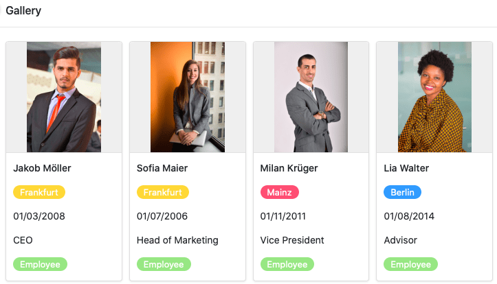

In the edit mode of the **Universal App** you can choose between different **page types** for the design of your app. Most of the page types you already know in a similar form from other places in SeaTable.

In this overview article, you will learn about the available page types and their different uses.

## Page types in the universal app

You can currently choose from a total of **nine page types** in the editing mode of the universal app.

[Learn how to create new pages in the Universal App here.]()

To edit existing pages, click on the **gear icon**  of the corresponding page in the navigation.

## Page type: Table

You can use this page type to add any **table** from your base as a page to your universal app. You can use the [page permissions]() to control exactly who can see and edit the data on this page. You can also define **preset filters**, **sorting**, **grouping** and **hidden and read-only columns** to tailor, limit and organize the displayed data precisely to a user group.

[Learn more about table pages in universal apps.]()

## Page type: Form

You can use this page type to build different **forms** that users can then submit. [Web forms]() are not only available in the universal app, but also as a separate feature. Form pages in the universal app are ideal for collecting **data from many different users**. One possible use case is [recording your employees' working hours](https://seatable.io/en/arbeitszeiterfassung/).

[Learn more about form pages in universal apps.](https://seatable.io/en/docs/seitentypen-in-universellen-apps/formularseiten-in-universellen-apps/)

## Page type: Gallery

Using this page type you can display **images** that you have saved in an [image column]() of your table in the form of a **gallery**. Other **data** from your table can also be displayed in the gallery. For example, you could use a gallery page for clear **profiles of your employees**.

  
[Learn more about gallery pages in universal apps.](https://seatable.io/en/docs/seitentypen-in-universellen-apps/galerieseiten-in-universellen-apps/)

## Page type: Calendar

This page type works something like the [calendar plugin](https://seatable.io/en/docs/plugins/anleitung-zum-kalender-plugin/) and allows you to display the entries from one or two [date columns of](https://seatable.io/en/docs/datum-dauer-und-personen/die-datum-spalte/) your table in a **calendar**. For example, a concrete use case could be the calendar display of upcoming **meetings**.

[Find out more about calendar pages in universal apps.](https://seatable.io/en/docs/seitentypen-in-universellen-apps/kalenderseiten-in-universellen-apps/)

## Page type: Custom page

With this page type, you can let your creativity run wild and build a **custom page** just the way you want it. Add **text** and **images** to your page or use [statistics](https://seatable.io/en/docs/plugins/anleitung-zum-statistik-plugin/) to create meaningful **dashboards** with the data from your base.

[Find out more about individual pages in universal apps.]()

## Page type: Kanban

This page type works in a similar way to the [Kanban plugin](https://seatable.io/en/docs/plugins/anleitung-zum-kanban-plugin/) and allows you to display entries as index cards on a **Kanban board**. To do this, specify the column by which the entries should be **grouped**. A specific use case could be the **visualization of workflows and project progress**, for example.

[Learn more about Kanban pages in Universal Apps.](https://seatable.io/en/docs/seitentypen-in-universellen-apps/kanbanseiten-in-universellen-apps/)

## Page type: Timeline

This page type has great similarity to the [Timeline plugin](https://seatable.io/en/docs/plugins/anleitung-zum-timeline-plugin/) and allows you to display different time spans in the form of a **timeline**. For example, a concrete use case could be **vacation planning in a company**.

[Learn more about timeline pages in universal apps.](https://seatable.io/en/docs/seitentypen-in-universellen-apps/zeitstrahlseiten-in-universellen-apps/)

## Page type: Query

Using this page type, which works similarly to the [Data Query app](), you can search your records across specific fields for specific values. The page type proves particularly useful for **large datasets** such as product catalogs or libraries. For example, a specific use case could be querying identification numbers.

[Learn more about query pages in universal apps.]()

## Page type: Single data record

This page type allows you to design a page with static elements, dynamic table fields, colors, frames, etc. in order to visually prepare the data stored in a row . This page type is therefore similar to the [page design plugin](https://seatable.io/en/docs/seitendesign-plugin/anleitung-zum-seitendesign-plugin/) that you already know from Base.

Users of the app can browse, search or edit the individual data records on this page. This type of page is therefore suitable for displaying the data in an employee database as **personal profiles**, for example.

[Learn more about pages of the Single data set type in Universal apps.](https://seatable.io/en/docs/seitentypen-in-universellen-apps/seiten-vom-typ-einzelner-datensatz-in-universellen-apps/)
